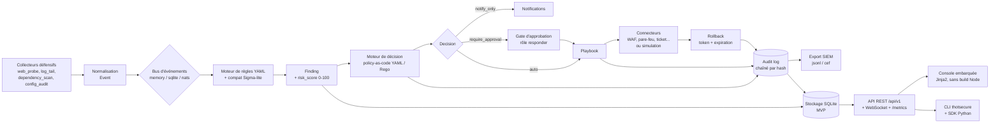

```yaml
canal: Blog du projet (site Thot Secure) + relais GitHub Discussions
langue: fr
format: article de fond markdown, avec diagramme Mermaid et blocs de code
objectif: >
  Annoncer la sortie du MVP v0.1.0, poser la thèse « sûr avant puissant », expliquer les
  4 garanties et l'architecture, montrer un parcours de bout en bout réel, assumer les
  compromis, et convertir en contributions (règles, connecteurs, traduction).
mot_cle_principal: SOAR open source
mots_cles_secondaires: [SOAR défensif, policy-as-code, audit log chaîné, dry-run, réponse à incident, Apache-2.0]
longueur: 1800–2400 mots (hors blocs de code)
public_cible: ingénieurs sécurité, RSSI, équipes SOC/blue team, MSP, admin sys auto-hébergeurs
date_de_publication_cible: S1 — mardi, 10:00 CET
appel_a_action: lire le contrat d'interface, lancer `thotsecure demo`, ouvrir une issue « bonne première contribution »
mention_de_dons: uniquement en toute fin d'article, section dédiée
```

# Thot Secure v0.1.0 : un SOAR open source qui simule avant d'agir, et dont l'audit se vérifie

**Chapô.** Thot Secure est un SOAR/CSPM **défensif** open source (Python/FastAPI, multi-tenant, Apache-2.0). Sa thèse tient en une phrase : *un outil capable de bloquer, d'isoler ou de révoquer doit d'abord prouver qu'il sait défaire ce qu'il a fait, et journaliser chaque décision de façon vérifiable.* Cet article décrit le problème réel, les quatre garanties du projet, l'architecture du MVP v0.1.0, un parcours complet de la règle YAML au rollback, et — surtout — ce qu'Thot Secure **ne fait pas**.

## Sommaire

1. [Le problème : trois jours de retard, des actions non tracées, des règles jamais testées](#1-le-problème)
2. [La thèse : un SOAR doit être sûr avant d'être puissant](#2-la-thèse)
3. [Les quatre garanties](#3-les-quatre-garanties)
4. [L'architecture en étapes](#4-larchitecture-en-étapes)
5. [De bout en bout : règle → finding → politique → action → rollback](#5-de-bout-en-bout)
6. [Ce qu'Thot Secure ne fait pas](#6-ce-quthotsecure-ne-fait-pas)
7. [Les compromis assumés du MVP](#7-les-compromis-assumés)
8. [Appel à contribution](#8-appel-à-contribution)

---

## 1. Le problème

Le scénario ci-dessous est un **scénario composite**, construit à partir de situations banales en exploitation. Les durées sont des **ordres de grandeur**, pas des mesures : remplacez-les par les vôtres.

Un prestataire gère l'infrastructure de plusieurs clients. Le lundi matin, il découvre qu'un des serveurs web d'un client répond à un chemin qui n'a jamais été déployé. En remontant les journaux, la première trace de l'activité anormale date du **vendredi précédent, 22 h 14** — soit environ trois jours plus tôt. Personne ne l'a vue passer. Non pas parce que la donnée manquait : elle était dans les logs. Mais parce que rien n'a transformé cette donnée en *décision*, et rien n'a rendu cette décision *traçable*.

Trois défauts se cumulent presque toujours.

**Le premier est le délai de détection.** Un flux de logs n'est pas une détection. Entre l'événement brut et le *finding* exploitable, il faut normaliser, corréler, scorer, dédupliquer, et éviter le bruit. Sans cette chaîne, l'équipe ne découvre l'incident que par un symptôme visible — un defacement, un pic de facture, un appel du client. Le délai se compte alors en jours. La métrique qui compte ici est le MTTD, puis le MTTR ; le contrat d'interface expose d'ailleurs les compteurs 24 h / 7 j et les MTTA/MTTR via `GET /api/v1/stats/overview`.

**Le deuxième est l'action manuelle non tracée.** Quand l'alerte arrive enfin, quelqu'un se connecte au pare-feu, ajoute un blocage, ouvre une session SSH, redémarre un service. Cela fonctionne — mais qui a fait quoi, quand, pourquoi, et sur quelle base ? Le plus souvent : personne ne peut le dire. Le blocage reste en place des semaines après la fin de l'incident, et personne ne sait s'il peut être retiré sans risque. L'action a été prise ; elle n'est pas *réversible* au sens opérationnel : personne n'en connaît l'inverse exact.

**Le troisième est la règle de détection que personne ne teste.** Des règles copiées d'un dépôt public, activées telles quelles, jamais passées sur un corpus réel, avec une liste de faux positifs vide. Le résultat est prévisible : soit elles crient en permanence et l'équipe les désactive, soit elles sont silencieuses et l'équipe les croit efficaces. Une règle non testée est une hypothèse déguisée en contrôle.

Ces trois défauts ne se corrigent pas en ajoutant de la puissance. Ils se corrigent en ajoutant de la **discipline** : un format de règle vérifiable, une politique de décision explicite, un cycle d'action avec inverse, et un journal qu'on peut auditer.

## 2. La thèse

> **Un SOAR doit être sûr avant d'être puissant.**

Un outil de réponse à incident qui peut modifier votre infrastructure est, par construction, un outil à haut privilège. Chaque euro de complexité ajouté à l'automatisation augmente le rayon d'impact d'une erreur. Un faux positif qui envoie une notification est une nuisance. Le même faux positif qui isole un hôte de production est un incident, causé par l'outil censé traiter les incidents.

Thot Secure part donc d'une contrainte inverse de l'intuition du marché : **par défaut, il ne fait rien.** `THOT_DRY_RUN=true` est le défaut, et `THOT_AUTONOMY=supervised` aussi. Aucune action réelle n'est exécutée sans levée explicite du mode simulation. C'est le comportement par défaut du MVP, et c'est délibéré : Thot Secure doit être **sûr à brancher avant d'avoir des identifiants de production**.

## 3. Les quatre garanties

Le projet ne promet pas « une plateforme complète ». Il engage quatre propriétés vérifiables. Les voici, avec la preuve correspondante — pas un slogan, un mécanisme.

### 3.1 Réversibilité totale

**Promesse :** toute action est accompagnée d'un rollback, et `POST /api/v1/actions/{id}/rollback` doit réussir tant que le rollback n'a pas expiré.

**Mécanisme :** chaque playbook est déclaré avec `reversible: true` et un bloc `rollback` explicite. Un playbook sans inverse n'est pas exécutable comme contre-mesure. L'objet `Action` porte `status` (`planned | pending_approval | approved | rejected | executing | succeeded | failed | expired | rolled_back`) et un sous-objet `rollback` indiquant sa disponibilité, son jeton et son horodatage. Une action déjà `rolled_back` renvoie `409` sur un second rollback : l'opération est idempotente, pas cumulative.

### 3.2 Audit chaîné par hash

**Promesse :** les décisions et les actions sont journalisées dans un journal *append-only* chaîné, et l'intégrité de la chaîne est vérifiable à la demande.

**Mécanisme :** chaque enregistrement contient `prev_hash` et `hash`, où

```
hash = sha256( f"{seq}|{ts}|{tenant_id}|{actor}|{actor_role}|{action}|{canonical(target)}|"
        f"{canonical(before)}|{canonical(after)}|{prev_hash}" )
```

`canonical()` étant un JSON trié, à séparateurs compacts, en UTF-8. Le premier enregistrement a `prev_hash = "sha256:genesis"`. La vérification est exposée : `GET /api/v1/audit/verify` renvoie `{"valid": true, "records": n, "broken_at": null}`, et `thotsecure audit verify` renvoie le code de sortie `3` si la chaîne est rompue. Modifier un enregistrement passé invalide tous les suivants. L'export `jsonl` / `cef` (`GET /api/v1/audit/export`) permet de pousser la chaîne vers un SIEM.

### 3.3 Isolation multi-tenant

**Promesse :** un appelant ne voit jamais les données d'un autre tenant. C'est testé en CI.

**Mécanisme :** tout objet porte un `tenant_id` ; toute requête SQL filtre dessus ; le `tenant_id` d'une ingestion est **forcé depuis la clé API**, jamais lu dans le corps de la requête. Le RBAC est appliqué par dépendance FastAPI *et* vérifié dans le core, avec quatre rôles : `viewer`, `analyst`, `responder`, `admin`. Les clés API sont stockées hachées (`scrypt`), affichées une seule fois à la création, et révocables immédiatement.

### 3.4 Dry-run par défaut

**Promesse :** `DRY_RUN=true` par défaut ; aucune action réelle sans levée explicite.

**Mécanisme :** le `dry_run` global est **prioritaire sur toute politique** — une politique ne peut pas le contourner. Les garde-fous d'exécution, appliqués par le moteur de décision et non modifiables par une politique, sont les suivants :

1. `max_actions_per_hour` par tenant (défaut **20**) ;
2. `cooldown` par `(tenant, playbook, cible)` ;
3. **jamais** d'action sur une cible protégée de l'`autonomy_allowlist` (votre propre infrastructure) ;
4. `dry_run` global prioritaire sur toute politique ;
5. toute action sur une cible **hors périmètre déclaré** du tenant → `require_approval`.

Un connecteur non configuré fonctionne en mode simulé : il retourne un jeton de rollback et journalise `simulated: true`. Autrement dit, Thot Secure peut tourner en production, en observation, avec zéro identifiant, avant qu'on lui donne le droit de toucher à quoi que ce soit.

## 4. L'architecture en étapes



Trois propriétés de conception méritent d'être explicitées.

**Le bus est pluggable.** `THOT_BUS` accepte `memory` (défaut), `sqlite` (durabilité locale) ou `nats` (bus distribué, client embarqué dans la stdlib). On peut démarrer seul sur un nœud, puis distribuer sans réécrire la logique. Le choix n'est pas idéologique : il est dicté par ce qu'on veut démontrer à chaque étape.

**Le core est volontairement pauvre.** `thotsecure.core` ne dépend que de la **stdlib** plus `pydantic` et `PyYAML`. FastAPI, Jinja2 et uvicorn sont des dépendances de la couche API. Conséquence pratique : la logique de détection, le scoring, la décision et l'audit sont utilisables **en bibliothèque** (`thotsecure.sdk`), sans serveur HTTP, et restent testables sans infrastructure.

**La décision est du code, pas de la configuration cachée.** Une politique est un fichier YAML versionnable, relu à chaud (`POST /api/v1/policies/reload`), avec un ordre de priorité explicite. Si **aucune** politique ne correspond à un finding, la décision est `notify_only` — le silence exige une politique `ignore` écrite explicitement. On ne peut donc pas « oublier » de traiter un cas : l'oubli produit une notification, pas un silence.

## 5. De bout en bout

Voici le parcours complet, sur des données d'exemple utilisant les plages d'adressage de documentation (`203.0.113.0/24`).

**Étape 1 — une règle de détection (YAML).** Extraite de la bibliothèque livrée dans `rules/` :

```yaml
id: AO-WEB-001
title: SQL injection attempt in query string
description: Détecte les motifs d'injection SQL dans les paramètres de requête.
status: stable            # draft | test | stable | deprecated
severity: high            # info | low | medium | high | critical
confidence: 0.85          # 0.0 → 1.0
enabled: true
tags: [web, owasp:a03, mitre:T1190]
source_types: [web_probe, log_tail]
kinds: [http.request]
match:
  all:
    - field: labels.path
      op: regex
      value: "(?i)(union[\\s/*]+select|or\\s+1=1|sleep\\(\\d+\\)|benchmark\\()"
  any: []
  not: []
  threshold:
    count: 3
    window_seconds: 60
    group_by: [labels.src_ip, labels.path]
dedup:
  key: [rule_id, labels.src_ip]
  ttl_seconds: 900
risk:
  base: 60
  asset_criticality: 1.0
false_positives:
  - Requêtes contenant le mot "union" dans un champ de recherche libre.
remediation: Bloquer l'IP source au WAF 1 h, vérifier les logs applicatifs, patcher l'entrée.
```

Deux points à noter. Le champ `false_positives` n'est pas décoratif : il documente le bruit attendu, ce qui oblige l'auteur de la règle à y penser. Et `status: draft | test | stable | deprecated` donne un chemin de maturité explicite : une règle sortie d'un dépôt public arrive en `draft`, pas en `stable`.

**Étape 2 — l'événement normalisé (JSON).** L'ingestion accepte un événement ou un lot (`{"events": [...]}`, ≤ 500) :

```json
{
  "event_id": "e6f0f0c4-4f0a-4a4f-9c9a-2b0f1f6b7a11",
  "schema_version": "1",
  "tenant_id": "acme",
  "ts": "2026-02-14T10:00:00.123Z",
  "kind": "http.request",
  "source": { "type": "web_probe", "name": "prod-edge", "host": "shop.acme.fr" },
  "severity_hint": "info",
  "labels": { "src_ip": "203.0.113.9", "path": "/login", "method": "POST" },
  "payload": { "status": 403, "bytes": 512, "user_agent": "curl/8.5" },
  "raw_ref": null
}
```

L'appel renvoie `202` avec `accepted`, `rejected`, et la liste des findings produits avec leur score et la décision associée — c'est-à-dire que l'ingestion répond déjà « voici ce que j'ai détecté et ce que je compte faire ».

**Étape 3 — le finding.** Le seuil (`count: 3` en 60 s, groupé par `labels.src_ip` et `labels.path`) est atteint : le moteur produit un finding `AO-WEB-001`, `severity: high`, avec un `risk_score` calculé à partir de `risk.base`, de la sévérité, de la confiance et de la criticité de l'actif, borné 0–100. Sept occurrences sont regroupées (`count: 7`) sur une fenêtre de quatre minutes, avec `first_seen` / `last_seen` et les `event_ids` en preuve.

**Étape 4 — la politique de décision (YAML).** C'est ici que l'organisation écrit *sa* règle du jeu, en clair et versionnée :

```yaml
version: 1
id: auto-block-high-web
priority: 100              # plus grand = évalué d'abord
description: Blocage automatique des attaques web à fort score.
when:
  finding.severity: [critical, high]
  finding.risk_score: { gte: 70 }
  finding.tags_any: [web, exploit-attempt]
  tenant.mode: [auto]
  environment: [prod, staging]
then:
  decision: auto           # auto | require_approval | notify_only | ignore
  playbook: block-source-ip
  params:
    target: labels.src_ip
    duration_seconds: 3600
  dry_run: false
  cooldown_seconds: 300
  max_actions_per_hour: 10
rollback:
  playbook: unblock-source-ip
  auto_after_seconds: 3600
```

Sémantique : `when` est un ET entre les clés ; une liste est un OU d'égalités ; un mapping porte des comparateurs (`gt`, `gte`, `lt`, `lte`, `in`, `not_in`, `matches`). Un mode Rego est disponible si `THOT_OPA_BIN` est défini et que le binaire est présent.

**Étape 5 — la décision.** Elle est matérialisée, avec sa justification :

```json
{
  "decision": "auto",
  "policy_id": "auto-block-high-web",
  "playbook": "block-source-ip",
  "params": { "target": "labels.src_ip", "duration_seconds": 3600 },
  "reason": "severity=high risk=78.5 tags∈{web} tenant.mode=auto",
  "risk_score": 78.5,
  "expires_at": "2026-02-14T11:04:12Z",
  "cooldown_seconds": 300,
  "dry_run": false
}
```

Le champ `reason` est là pour l'humain qui relira dans six mois : la décision explique *pourquoi* elle a été prise, avec les valeurs qui l'ont déclenchée.

**Étape 6 — le playbook et son inverse.** Chaque playbook déclare son schéma de paramètres et son rollback :

```yaml
name: block-source-ip
description: Bloque une IP source au niveau du connecteur WAF/pare-feu configuré.
reversible: true
dry_run_capable: true
connectors: [cloudflare, aws-waf, modsecurity, nginx-local, null]
params:
  target: { type: ip, required: true, description: "IP ou CIDR à bloquer" }
  duration_seconds: { type: integer, default: 3600, min: 60, max: 604800 }
  reason: { type: string, default: "Thot Secure auto-mitigation" }
execute:
  - connector: waf
    call: block_ip
    with: { ip: "${params.target}", ttl: "${params.duration_seconds}", note: "${params.reason}" }
rollback:
  - connector: waf
    call: unblock_ip
    with: { ip: "${params.target}" }
```

**Étape 7 — la séquence opérateur (CLI).**

```console
$ thotsecure init-db
$ thotsecure tenant create --id acme --name "ACME SAS" --mode supervised
$ thotsecure key create --tenant acme --role responder --label ci

$ thotsecure ingest --tenant acme --file events.jsonl
$ thotsecure findings list --tenant acme --severity high --min-risk 70

$ thotsecure actions plan --finding f1c2a9 --playbook block-source-ip
plan: action a91b34 status=planned dry_run=true (aucun effet de bord)

$ thotsecure actions approve a91b34
$ thotsecure actions execute a91b34
$ thotsecure audit verify
audit: 1284 enregistrements, chaîne valide (valid=true, broken_at=null)
```

`actions plan` est la commande à montrer à votre comité de sécurité : elle produit un objet `Action` en statut `planned` **sans aucun effet de bord**. On peut donc répéter la répétition générale autant de fois qu'on veut. Si un tenant est en mode `supervised` — le défaut — la décision `auto` d'une politique ne suffit pas : l'action reste `pending_approval` jusqu'à ce qu'un rôle `responder` l'approuve. `execute` refuse une action non approuvée avec `409`.

**Étape 8 — le rollback.** `thotsecure actions rollback a91b34` exécute l'inverse déclaré. Si le connecteur était en mode simulé, l'action a de toute façon retourné un jeton de rollback : le cycle complet est exerçable même sans credentials, ce qui permet de **tester le rollback avant de donner à l'outil le droit d'agir pour de vrai**. Une action déjà annulée renvoie `409` — jamais de double annulation silencieuse.

**Étape 9 — l'audit.** Chaque étape a laissé une trace chaînée :

```json
{
  "seq": 42,
  "ts": "2026-02-14T10:00:02.331Z",
  "tenant_id": "acme",
  "actor": "api-key:ci",
  "actor_role": "responder",
  "action": "action.approve",
  "target": { "type": "action", "id": "a91b34" },
  "before": { "status": "pending_approval" },
  "after": { "status": "approved" },
  "prev_hash": "sha256:…",
  "hash": "sha256:…"
}
```

On retrouve, dans un seul enregistrement : qui, avec quel rôle, a fait quoi, sur quoi, et la transition d'état exacte (`before` / `after`). C'est cette structure qui rend un audit répondable six mois plus tard, et c'est elle qui permet `GET /api/v1/audit/verify`.

## 6. Ce qu'Thot Secure ne fait pas

> **Encadré — limites par conception.**
>
> - **Aucune capacité offensive.** Pas de scan agressif, pas de brute force, pas de DoS, pas de hack-back, pas d'exploitation de tiers. Ce n'est pas une limite technique temporaire, c'est un choix de conception du produit.
> - **Pas de contre-attaque.** Un outil défensif qui riposte devient un outil offensif non maîtrisé, avec un risque juridique et opérationnel majeur. Thot Secure bloque, isole, révoque — il ne « rend pas la pareille ».
> - **`thotsecure probe` n'audite que vos propres cibles**, déclarées dans `THOT_TARGETS_FILE` (`./config/targets.yaml`), avec opt-in explicite. Il n'existe aucun mode « scan d'une cible arbitraire ».
> - **Pas de verdict magique.** Le scoring est déterministe et explicable (`risk.base`, sévérité, confiance, criticité, borné 0–100) : pas de modèle opaque qui décide à votre place.
> - **Pas de fusion automatique de code.** Le playbook `patch-dependency` **ouvre une pull request, jamais de merge automatique**.
> - **Thot Secure n'est pas un SIEM.** Il consomme des événements et produit des décisions et des actions. Il exporte son audit (`jsonl`, `cef`) vers votre SIEM, il ne le remplace pas.
> - **Ce n'est pas un outil de conformité.** Il produit des preuves utiles à un audit ; il ne certifie rien et ne remplace ni un avis juridique ni un DPO.

## 7. Les compromis assumés

Un MVP honnête dit ce qu'il n'est pas encore.

**SQLite par défaut.** `THOT_DB_URL=sqlite:///./data/thotsecure.db`. C'est un choix de MVP : zéro dépendance, démarrage immédiat, sauvegarde triviale, et suffisant pour un labo, une PME ou une démonstration. Les DDL PostgreSQL/TimescaleDB sont documentées dans le dépôt, mais **le support PostgreSQL/TimescaleDB de première classe reste roadmap** : ne déployez pas ce MVP comme base de données centrale d'un SOC multi-sites sans le tester vous-même à votre échelle.

**Tout n'est pas encore branché sur du réel.** Les playbooks livrés (`block-source-ip` + `unblock-source-ip`, `rate-limit-source`, `quarantine-artifact`, `revoke-session`, `rotate-secret`, `isolate-host`, `patch-dependency`, `harden-endpoint`, `notify`, `open-ticket`) existent avec leur schéma et leur rollback, mais **certains connecteurs restent à écrire** : un connecteur non configuré fonctionne en mode simulé. L'intégration réelle dépend de votre environnement (quel WAF, quel pare-feu, quel hyperviseur, quel gestionnaire de secrets). C'est exactement là que les contributions sont les plus utiles.

**Mode simulation par défaut.** Cela veut dire que le premier lancement ne bloque rien, ne révoque rien, n'isole rien. C'est voulu, et il faut le savoir : si vous cherchez un outil qui agit immédiatement, il faudra lever explicitement le dry-run et assumer la décision au niveau du tenant.

**Pas de blockchain.** L'audit utilise une chaîne de hash locale, vérifiable hors ligne, sans consensus distribué. C'est plus simple, plus rapide, auditable sans dépendance externe — et cela ne protège pas contre un attaquant qui dispose d'un accès root et réécrit toute la chaîne. Cet article-là mérite d'être développé séparément : export SIEM, ancrage horodaté, sauvegardes hors ligne sont les contre-mesures, pas la magie.

**Interface.** La console embarquée (Jinja2 + JS, **sans build Node**) est livrée et suffit à observer flux, findings, actions, audit et règles. Un dashboard React+TS est prévu dans l'arborescence cible, en option : **roadmap**.

## 8. Appel à contribution

Le code du MVP v0.1.0 est publié sous **Apache-2.0**. Les tests s'exécutent sans dépendance externe :

```console
$ python -m unittest discover -s tests -t . -v
```

Trois chantiers ont un rapport valeur/effort particulièrement favorable. Ils ne demandent pas de comprendre toute la base.

**1. Des règles de détection.** Le format est du YAML documenté, avec `false_positives` obligatoire dans l'esprit et un `status` de maturité. Une bonne contribution de règle contient : la règle, un événement d'exemple qui la déclenche, un exemple de faux positif connu, et une note sur le seuil retenu (`threshold.count`, `window_seconds`, `group_by`). Une règle sans faux positif documenté est une règle qu'on désactivera en production.

**2. Des connecteurs de playbook, avec leur rollback.** Un connecteur utile est un couple : `execute` **et** `rollback`. Si vous écrivez un blocage dans un système, la première question posée en revue sera : « quelle est la commande exacte qui défait ça, et que se passe-t-il si elle échoue ? » Les contributions qui répondent à cette question sont mergées plus vite que les autres.

**3. De la traduction et de la documentation.** Le français et l'anglais sont le socle ; l'interface, les messages d'erreur, la documentation et les diagnostics de règle invalide gagnent à exister dans d'autres langues. Une règle invalide ne casse pas le chargement : elle est rejetée avec un diagnostic — un diagnostic compréhensible dans la langue de l'opérateur a une valeur opérationnelle réelle.

Pour commencer : clonez, lancez `thotsecure init-db`, puis `thotsecure demo --tenant demo` — jeu de données, findings et actions générés — et `thotsecure doctor`. Le contrat d'interface (`docs/architecture/api-contract.md`) est **gelé pour le sprint en cours** et fait foi : toute divergence doit être discutée avant merge. Les issues étiquetées « bonne première contribution » sont là pour ça, et une revue qui dit « non, voilà pourquoi » est une contribution en soi.

---

## Soutenir le projet

Thot Secure est développé sur du temps bénévole. Le projet accepte des dons volontaires :

- **Bitcoin (BTC, réseau Bitcoin mainnet)** : `33cDzgvVe7m9P4X58pW3rsMKuxrRXFmPBR`
- **Solana (SOL, réseau Solana mainnet)** : `95s8JxNzLbre9nopbdxakkc4dtNCzkzA2JUTDFQnM7Hi`

Dons volontaires, aucune contrepartie attendue. Vérifiez toujours l'adresse depuis le dépôt officiel.

⚠️ **Anti-arnaque** : seule la source officielle — le dépôt Git et le site du projet — fait foi. Le projet ne demande **jamais** de clé privée ni de phrase de récupération, et ne contactera jamais personne en message privé pour proposer un investissement, un jeton ou un support prioritaire en échange d'un paiement. Toute demande de ce type est une tentative de fraude.

Les autres façons d'aider, gratuites et plus utiles qu'un don : ouvrir une issue reproductible, proposer une règle avec ses faux positifs, relire le contrat d'interface, ou tester Thot Secure dans votre labo et raconter ce qui casse.
