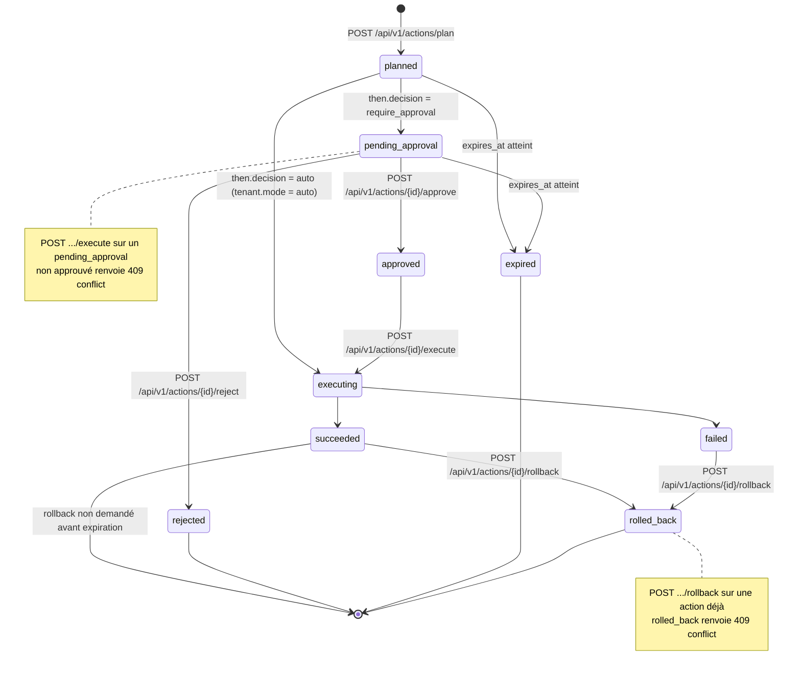

# Playbooks, connecteurs et réversibilité

*Une contre-mesure n'est acceptable que si elle est nommée, bornée, journalisée et réversible.*

Cette page décrit le cycle de vie d'une `Action`, le format des playbooks, les playbooks livrés, le branchement des connecteurs, le mode simulation par défaut, les garanties de rollback, l'idempotence et l'expiration. Références normatives : [`docs/architecture/api-contract.md`](../architecture/api-contract.md) §1, §3.4, §4.6, §7, §8, §9 et §10. La partie amont (politique → `Decision`) est traitée dans [`../decision/policies.md`](../decision/policies.md).

---

## 1. Cycle de vie d'une Action

Une `Action` est l'**instance d'exécution** d'un playbook sur un finding. Elle porte un statut, un mode, une trace d'audit (`audit_seq`) et une fenêtre de validité (`expires_at`).



| Statut | Signification | Transitions possibles | Opérateur (capacité) |
|---|---|---|---|
| `planned` | Action créée par `POST /actions/plan` — **aucun effet de bord**. | → `pending_approval`, → `executing`, → `expired` | `execute:actions` (`responder`, `admin`) |
| `pending_approval` | Action planifiée, immobilisée en attente d'un humain. | → `approved`, → `rejected`, → `expired` | `approve:actions` (`responder`, `admin`) |
| `approved` | Approbation enregistrée (`approved_by`, `approved_at`). | → `executing`, → `expired` | `execute:actions` |
| `rejected` | Refus explicite — **terminal**. | aucune | `approve:actions` |
| `executing` | Exécution en cours auprès du connecteur. | → `succeeded`, → `failed` | `execute:actions` |
| `succeeded` | Contre-mesure appliquée (ou simulée) ; `result` renseigné. | → `rolled_back` | `execute:actions` |
| `failed` | Échec d'exécution ; `result` porte l'erreur. | → `rolled_back` | `execute:actions` |
| `expired` | Fenêtre de validité dépassée avant exécution — **terminal**. | aucune | automatique (`expires_at`) |
| `rolled_back` | Retour arrière effectué ; `rollback.performed_at` renseigné. | aucune | `execute:actions` |

Routes et erreurs (§4.6) :

| Route | Capacité | Effet sur le statut | Refus |
|---|---|---|---|
| `POST /api/v1/actions/plan` | `execute:actions` | crée l'action en `planned` | `400 validation_error`, `404 not_found` (finding/playbook inconnu) |
| `POST /api/v1/actions/{id}/approve` | `approve:actions` | `pending_approval` → `approved` | `409 conflict` possible si l'état de l'action ne le permet pas (le §4.6 ne fige explicitement que les cas `execute` et `rollback`) |
| `POST /api/v1/actions/{id}/reject` | `approve:actions` | `pending_approval` → `rejected` (terminal) | idem : un rejet sur une action déjà terminale doit être refusé |
| `POST /api/v1/actions/{id}/execute` | `execute:actions` | `approved` → `executing` → `succeeded`/`failed` | **`409 conflict` si `pending_approval` non approuvé** |
| `POST /api/v1/actions/{id}/rollback` | `execute:actions` | `succeeded`/`failed` → `rolled_back` | **`409 conflict` si déjà `rolled_back`**, ou si le rollback a expiré |

!!! danger "Le `409` est une garantie, pas une contrariété"
    `execute` sur une action `pending_approval` non approuvée et `rollback` sur une action déjà `rolled_back` sont **refusés** par le moteur. Aucun client, aucune automatisation et aucune API ne peuvent court-circuiter l'approbation humaine ni rejouer un retour arrière déjà effectué.

---

## 2. Format d'un playbook

Un playbook est un fichier YAML chargé depuis `THOT_PLAYBOOKS_DIR` (défaut `./playbooks`, §9). Exemple de référence (§7 du contrat) :

```yaml
name: block-source-ip
description: Bloque une IP source au niveau du connecteur WAF/pare-feu configuré.
reversible: true
dry_run_capable: true
connectors: [cloudflare, aws-waf, modsecurity, nginx-local, null]
params:
  target: { type: ip, required: true, description: "IP ou CIDR à bloquer" }
  duration_seconds: { type: integer, default: 3600, min: 60, max: 604800 }
  reason: { type: string, default: "Thot Secure auto-mitigation" }
execute:
  - connector: waf
    call: block_ip
    with: { ip: "${params.target}", ttl: "${params.duration_seconds}", note: "${params.reason}" }
rollback:
  - connector: waf
    call: unblock_ip
    with: { ip: "${params.target}" }
audit:
  severity: high
  notify: [webhook, ticket]
```

| Champ | Rôle | Contraintes observées |
|---|---|---|
| `name` | Identifiant du playbook, référencé par `Decision.playbook` et `Action.playbook`. | unique dans le répertoire chargé |
| `description` | Résumé lisible, exposé par `GET /api/v1/playbooks`. | texte libre |
| `reversible` | Déclare l'existence d'un retour arrière. | invariant §1.3 : toute action doit pouvoir être annulée tant que le rollback n'a pas expiré |
| `dry_run_capable` | Le playbook peut être exécuté sans effet réel. | `true` attendu pour tout playbook livré |
| `connectors` | Connecteurs acceptés par ce playbook. | liste d'identifiants, terminée par `null` (mode simulé) quand le contrat l'explicite |
| `params` | Schéma des paramètres : `type`, `required`, `default`, `min`, `max`, `description`. | `duration_seconds` : `type: integer`, `default: 3600`, `min: 60`, `max: 604800` |
| `execute` | Étapes d'application : `connector`, `call`, `with` (substitution `${params.…}`). | au moins une étape |
| `rollback` | Étapes de retour arrière du playbook lui-même. | les paramètres de `rollback` dépendent de `execute` (le playbook doit être autonome sur son undo) |
| `audit` | `severity` de journalisation et `notify` (canaux de notification). | exemple : `severity: high`, `notify: [webhook, ticket]` |

!!! note "Bornes et valeurs par défaut"
    Le §7 ne détaille les bornes que pour `block-source-ip` (`duration_seconds` entre **60** et **604800** secondes, défaut **3600**). Pour les autres playbooks, la source de vérité est le champ `params_schema` exposé par `GET /api/v1/playbooks` (§4.5) : lisez-le plutôt que de supposer une borne.

---

## 3. Playbooks livrés

Le MVP livre **onze** playbooks. Réversibilité : l'invariant §1.3 (« toute action est réversible ») impose un bloc `rollback` dans chaque playbook ; la colonne indique le retour arrière attendu.

| Playbook | Objectif | Réversible | Paramètres (type, requis, défaut, bornes) | Connecteurs | Garde-fous particuliers |
|---|---|---|---|---|---|
| `block-source-ip` | Bloquer une IP source au niveau du connecteur WAF/pare-feu configuré. | oui (`unblock-source-ip`) | `target` (ip/CIDR, **requis**) ; `duration_seconds` (integer, défaut `3600`, `min: 60`, `max: 604800`) ; `reason` (string, défaut `Thot Secure auto-mitigation`) | `cloudflare`, `aws-waf`, `modsecurity`, `nginx-local`, `null` | Refus sur cible de l'`autonomy_allowlist` ; cible hors périmètre → `require_approval` ; `cooldown` par `(tenant, playbook, cible)` |
| `unblock-source-ip` | Retirer un blocage posé par `block-source-ip` — c'est le `rollback.playbook` documenté au §6. | oui (blocage réappliquable) | `target` (ip/CIDR, **requis**) ; paramètres de rollback alignés sur `block-source-ip` | mêmes que `block-source-ip` | Ne s'applique qu'à un blocage connu ; refus `409` si l'action visée est déjà `rolled_back` |
| `rate-limit-source` | Limiter le débit d'une source plutôt que la bloquer : riposte graduée et proportionnée. | oui (retrait de la limitation) | `target` (ip/CIDR, **requis**) ; `duration_seconds` (integer, défaut `3600`, bornes non énumérées au §7 pour ce playbook) ; seuils de débit : **noms non énumérés au §7** → lire `params_schema` | Non nommés au §7 (famille WAF/pare-feu) | Fenêtre courte recommandée ; ne remplace pas un blocage sur un cas critique |
| `quarantine-artifact` | Isoler un artefact suspect dans un espace de quarantaine **sans le supprimer**. | oui (remise en circulation contrôlée) | Cible de type artefact (fichier/paquet) — **nom exact non énuméré au §7** → `params_schema` | Non nommé au §7 (famille EDR/antivirus) | Aucune destruction : l'artefact est conservé pour analyse et preuve |
| `revoke-session` | Révoquer une session utilisateur active. | oui (nouvelle authentification requise) | Identifiant de session ou d'utilisateur — **non énuméré au §7** → `params_schema` | Non nommé au §7 (famille IAM) | Impact utilisateur direct : à réserver au `require_approval` en production |
| `rotate-secret` | Déclencher la rotation d'un secret (clé, jeton, mot de passe). | oui (bloc `rollback` requis par §7) | Identifiant du secret et périmètre de rotation — **non énumérés au §7** | Non nommé au §7 (famille IAM/Vault) | Suppose une double validité pendant la bascule ; l'ancien secret ne doit pas être diffusé dans les journaux |
| `isolate-host` | Isoler un hôte du réseau (confinement). | oui (réintégration de l'hôte) | Identifiant d'hôte — **non énuméré au §7** | Non nommé au §7 (famille EDR) | Action à fort impact opérationnel : `require_approval` attendu en production |
| `patch-dependency` | Corriger une dépendance vulnérable en **ouvrant une pull request**. | oui (annulation de la proposition) | Paquet, version cible, écosystème — **non énumérés au §7** | Non nommé au §7 (famille forge/dépôts) | **Ouvre une PR et ne merge jamais automatiquement** : la revue humaine et la CI du dépôt restent seules décisionnaires |
| `harden-endpoint` | Appliquer un **profil de durcissement** à un endpoint ou un poste. | oui (retrait du profil) | Cible et profil de durcissement — **non énumérés au §7** | Non nommé au §7 (famille EDR/config) | Modification de configuration : bornée au profil déclaré, jamais de personnalisation ad hoc |
| `notify` | Émettre une notification (webhook, ticket) sans contre-mesure. | oui (notification sans effet technique) | Cible et message — **non énumérés au §7** | `webhook`, `ticket` (canaux cités par `audit.notify` au §7) | Aucune modification d'état : utilisable en `notify_only` |
| `open-ticket` | Ouvrir un ticket dans l'outil de ticketing du tenant. | oui (fermeture du ticket) | Titre, priorité, assignation — **non énumérés au §7** | Non nommé au §7 (famille ticketing) | Aucune contre-mesure technique ; sert la traçabilité process |

!!! note "Ce que « réversible » veut dire ici"
    Réversible ne signifie pas « sans conséquence » : cela signifie qu'un chemin de retour existe et que `POST /api/v1/actions/{id}/rollback` doit réussir tant que le rollback n'a pas expiré (§1.3). Un playbook dont le retour arrière n'est pas démontrable ne doit pas être livré activable.

!!! warning "Lacune assumée du contrat gelé"
    Le §7 nomme les playbooks livrés et détaille **un seul** exemple complet (`block-source-ip`). Pour tous les autres, les noms de paramètres, les bornes et les identifiants de connecteurs ne sont pas figés par le contrat : ils appartiennent à `params_schema` et au champ `connectors` renvoyés par `GET /api/v1/playbooks`. Les entrées marquées « non énuméré au §7 » ci-dessus sont à confirmer par cette route ou par lecture du code, jamais à supposer.

---

## 4. Connecteurs

Un connecteur est l'adaptateur qui traduit une étape `execute`/`rollback` en appel réel (ou simulé) vers une technologie. Le §7 n'énumère les identifiants que pour `block-source-ip` : **`cloudflare`, `aws-waf`, `modsecurity`, `nginx-local`, `null`**.

| Famille | Ce que le connecteur fait dans Thot Secure | Identifiants documentés au §7 | Playbooks concernés |
|---|---|---|---|
| Cloudflare | Blocage / déblocage d'IP, règle WAF, limitation de débit en périphérie. | `cloudflare` | `block-source-ip`, `unblock-source-ip`, `rate-limit-source` |
| AWS WAF | Blocage / déblocage d'IP, règle WAF, limitation de débit. | `aws-waf` | `block-source-ip`, `unblock-source-ip`, `rate-limit-source` |
| ModSecurity | Blocage / déblocage d'IP, règle applicative. | `modsecurity` | `block-source-ip`, `unblock-source-ip` |
| Nginx local | Blocage / déblocage d'IP sur le reverse-proxy du tenant. | `nginx-local` | `block-source-ip`, `unblock-source-ip` |
| EDR | Quarantaine d'artefact, isolation d'hôte. | Non nommé au §7 | `quarantine-artifact`, `isolate-host` |
| IAM / Vault | Révocation de session, rotation de secret. | Non nommé au §7 | `revoke-session`, `rotate-secret` |
| Ticketing | Ouverture et fermeture de ticket. | Non nommé au §7 (`ticket` cité comme canal de `audit.notify`) | `open-ticket`, `notify` |
| Mode simulé | Aucun appel externe : retourne un `rollback_token` et journalise `simulated: true`. | `null` (aussi appelé `simulation`) | tous |

### 4.1 Credentials : ce qu'il faut, génériquement

| Famille | Identifiants typiquement nécessaires | Bonnes pratiques |
|---|---|---|
| Cloudflare | Jeton d'API, identifiant de compte et/ou de zone, URL d'API si proxy. | Jeton **dédié** à Thot Secure, portée limitée aux zones concernées (édition de règles WAF/IP), rotation planifiée. |
| AWS WAF | Clé d'accès / clé secrète (ou rôle), région, identifiant d'ACL. | Rôle à privilèges minimaux plutôt que clé racine ; portée restreinte aux ACL ciblées ; rotation. |
| ModSecurity | Chemin de configuration/API locale, éventuellement jeton d'administration local. | Compte de service local, droits d'écriture limités aux règles concernées. |
| Nginx local | Chemin du fichier de configuration, droits d'écriture, commande de rechargement. | Utilisateur système dédié, `sudo` borné au rechargement, pas de shell général. |
| EDR | URL d'API, jeton ou paire clé/secret, identifiant d'organisation. | Jeton de service avec portée « réponse » uniquement ; journalisation de chaque appel. |
| IAM / Vault | URL d'API, jeton, chemin de politique, éventuellement rôle de service. | Jeton à durée de vie courte, portée limitée aux secrets traités ; jamais de jeton administrateur global. |
| Ticketing | URL d'API, jeton ou clé, identifiant de projet/file. | Jeton dédié à l'automatisation, portée limitée à la file utilisée. |

**Principe du moindre privilège**, appliqué partout :

1. **un jeton dédié par usage et par tenant**, jamais un compte partagé avec un humain ;
2. **une portée limitée** à ce que les playbooks activés utilisent réellement ;
3. **une rotation** planifiée, et une révocation immédiate en cas de doute (`POST /api/v1/keys/{key_id}` concerne les clés Thot Secure, pas les jetons tiers — ces derniers se révoquent côté fournisseur) ;
4. **aucun secret dans le dépôt** : ni dans les fichiers de politique, ni dans les playbooks, ni dans une variable de workflow.

!!! warning "Les credentials ne sont pas des variables `THOT_*` documentées"
    Le contrat gelé (§9) **ne définit aucune variable d'environnement par connecteur** : il n'existe pas de `THOT_CLOUDFLARE_TOKEN` ou équivalent dans la spécification v0.1.0. Leur emplacement exact doit être **confirmé par lecture du code** (le module de configuration du dépôt référence un fichier de connecteurs, `./config/connectors.yaml`) avant toute mise en production. Par défaut, considérez les connecteurs comme non configurés : Thot Secure fonctionne alors en mode simulé (§5), ce qui est le comportement attendu. Ne stockez jamais ces identifiants dans le dépôt, et n'ajoutez pas de variable inventée à votre déploiement en supposant qu'elle sera lue.

---

## 5. Mode simulation : le comportement par défaut du MVP

> Un connecteur non configuré fonctionne en **mode simulé** (`null` / `simulation`) : il retourne un `rollback_token` et journalise `simulated: true`. **C'est le comportement par défaut du MVP** : Thot Secure est sûr à brancher avant d'avoir des credentials. *(§7)*

Concrètement :

| Aspect | Comportement en mode simulé |
|---|---|
| Effet externe | Aucun appel réseau vers la technologie cible |
| Retour d'exécution | Un `rollback_token` est produit, comme avec un connecteur réel — le chemin de rollback est donc testable |
| Journalisation | Les enregistrements portent `simulated: true` : la simulation est **explicite**, jamais confondue avec une action réelle |
| Cycle de vie | Identique à une exécution réelle : `planned` → … → `executing` → `succeeded`/`failed`, puis `rolled_back` le cas échéant |
| Audit | Chaîne de hash, `actor`, `policy_id`, `before`/`after` : rien n'est omis |

Ce mode se combine avec les deux protections globales :

| Mécanisme | Portée | Défaut | Effet |
|---|---|---|---|
| Connecteur `null` / `simulation` | Par playbook / par connecteur | actif tant qu'aucun credential n'est configuré | aucun effet réel, `rollback_token` retourné, `simulated: true` journalisé |
| `THOT_DRY_RUN` (§9) | Global, toute la plateforme | `true` | **Sécurité** : aucune action réelle n'est exécutée |
| Garde-fou `dry_run` de décision (§6) | Global, prioritaire sur toute politique | hérite de `THOT_DRY_RUN` | Une politique ne peut pas le désactiver : elle ne peut que demander une simulation supplémentaire |

!!! tip "Brancher Thot Secure sans risque"
    Démarrage recommandé : laisser `THOT_DRY_RUN=true` **et** les connecteurs non configurés. Vous obtenez alors des détections réelles, des décisions réelles, des actions planifiées et des rollbacks exerçables — sans aucun effet sur la production. C'est le mode à utiliser pour dérouler [`../quickstart.md`](../quickstart.md) et comprendre vos volumes avant d'ouvrir quoi que ce soit.

!!! note "Roadmap"
    En v0.1.0, le mode simulé est le mode par défaut et il n'existe pas de « bac à sable » distinct permettant de rejouer un playbook réel sur une cible de test. Voir §10.

---

## 6. Garanties de rollback

Invariant §1.3 : **`POST /api/v1/actions/{id}/rollback` doit réussir tant que le rollback n'a pas expiré.**

| Élément | Rôle |
|---|---|
| `reversible: true` | Déclaré par le playbook (§7) et exposé par `GET /api/v1/playbooks`. Sans lui, l'action ne devrait pas être planifiée. |
| `POST /api/v1/actions/{id}/rollback` | Déclenche le retour arrière. Capacité `execute:actions`. |
| Refus `409 conflict` | Si l'action est **déjà `rolled_back`** (le rollback n'est pas rejouable). |
| `rollback.available` | `true` tant que l'annulation reste possible. |
| `rollback.token` | Jeton rendu par le connecteur (y compris simulé), nécessaire au retour arrière. |
| `rollback.performed_at` | Horodatage du retour arrière effectué. |
| `rollback.result` | Résultat détaillé (y compris `simulated: true`). |
| `expires_at` | Fin de fenêtre de validité de l'action et de son rollback. |
| `rollback.auto_after_seconds` | Délai de déclenchement automatique, déclaré par la **politique** (§6) — par exemple `3600` pour débloquer après une heure. |

### 6.1 Que se passe-t-il si…

| Situation | Comportement attendu | À vérifier |
|---|---|---|
| **Connecteur indisponible** au moment de l'exécution | L'action bascule en `failed` avec l'erreur dans `result` ; aucun succès n'est revendiqué. Le rollback reste appelable sur une action en échec. | Le message d'erreur doit être exploitable (code, cible) et ne pas contenir de secret. |
| **Rollback déjà effectué** | `POST .../rollback` renvoie `409 conflict` : le moteur refuse le rejeu. | `rollback.available` doit être passé à `false` et `rollback.performed_at` renseigné. |
| **Token expiré** (au-delà de `expires_at`) | La fenêtre d'annulation est close : l'action ne peut plus être annulée par Thot Secure. Le retour à l'état nominal doit alors être traité **manuellement côté connecteur**, en s'appuyant sur la trace d'audit. | La cohérence entre `expires_at` et `duration_seconds` du playbook doit être vérifiée à la planification. |
| **Rollback partiel** (plusieurs étapes, l'une échoue) | Le résultat du rollback est journalisé avec le détail de ce qui a été annulé et de ce qui ne l'a pas été. | Après un rollback partiel, l'état réel doit être vérifié auprès du connecteur avant de considérer l'incident clos. |
| **Exécution déjà en échec** | `failed` → `rolled_back` reste possible : le rollback nettoie ce qui a pu être appliqué avant l'échec. | Le playbook doit tolérer l'absence d'effet (rollback idempotent). |
| **Action `pending_approval` jamais approuvée** | L'action n'est jamais exécutée ; elle finit en `expired` au-delà de sa fenêtre. Rien à annuler. | Le délai d'approbation doit être compatible avec vos astreintes. |

!!! danger "Jamais d'action destructive sans filet"
    Aucun playbook ne doit être exécuté sans `require_approval` (ou mode `auto` explicitement activé par le tenant) ni sans que la cible soit dans le périmètre autorisé. Le moteur **refuse** les cibles de l'`autonomy_allowlist` protégée (infra propre) et force `require_approval` pour toute cible hors du périmètre déclaré du tenant (`THOT_TARGETS_FILE`). Ces refus ne se contournent pas depuis une politique ni depuis un appel API.

---

## 7. Idempotence

L'`Action` porte une clé d'idempotence (§3.4) :

```json
"idempotency_key": "acme:block-source-ip:203.0.113.9:1739527200"
```

| Segment | Signification |
|---|---|
| `acme` | tenant |
| `block-source-ip` | playbook |
| `203.0.113.9` | cible |
| `1739527200` | borne temporelle (horodatage de la fenêtre d'action) |

Conséquences garanties :

* **un `execute` rejoué sans changement de clé ne produit pas de double effet** — la même intention donne la même action, pas deux blocages ;
* la clé rend le rejeu d'une requête après un timeout réseau **sans danger** : l'appelant peut réessayer ;
* l'`idempotency_key` figure dans l'objet `Action` retourné, ce qui permet à un client de vérifier qu'il retrouve bien son action et non une nouvelle ;
* le couple `idempotency_key` + `cooldown` par `(tenant, playbook, cible)` (§6) couvre les deux échelles : le rejeu technique immédiat et la répétition fonctionnelle dans le temps.

!!! tip "Rejouer un `execute` ne rejoue pas la contre-mesure"
    Un `POST /api/v1/actions/{id}/execute` rejoué avec la même `idempotency_key` n'applique pas une seconde fois la contre-mesure : le moteur retrouve l'action et son résultat. C'est ce qui rend sûr le réessai après un timeout réseau. Ce comportement est couvert par `tests/test_actions_rollback.py` (§11) : dry-run sans effet, exécution, rollback, **idempotence**, expiration.

---

## 8. Expiration

Trois horloges distinctes, à ne pas confondre :

| Horloge | Où elle est déclarée | Ce qu'elle borne |
|---|---|---|
| `expires_at` (action) | Calculée à la planification, portée par l'`Action` (§3.4) | La validité de l'action : au-delà, elle ne s'exécute plus et son rollback n'est plus garanti par la plateforme → statut `expired`. |
| `duration_seconds` (playbook) | Paramètre du playbook (§7) | La durée de la contre-mesure **chez le connecteur** (ex. TTL du blocage), `min: 60`, `max: 604800`, défaut `3600` pour `block-source-ip`. |
| `auto_after_seconds` (politique) | Bloc `rollback` de la politique (§6) | Le déclenchement automatique du retour arrière, ex. `3600` : un blocage d'une heure est levé au bout d'une heure. |

```yaml
# Cohérence attendue dans une politique bien réglée
then:
  params:
    duration_seconds: 3600      # le connecteur bloque 1 h
rollback:
  auto_after_seconds: 3600      # Thot Secure débloque au bout d'1 h
```

!!! warning "Incohérence classique"
    `duration_seconds: 604800` (sept jours côté connecteur) avec `auto_after_seconds: 3600` (une heure) produit une action « annulée » dont l'effet persiste six jours et vingt-trois heures. Alignez les deux valeurs, et vérifiez `expires_at` sur l'`Action` créée.

---

## 9. Exemple de bout en bout : blocage d'IP puis rollback automatique après 1 h

### 9.1 Détection

Règle `AO-WEB-001` (§5) — extrait : `severity: high`, `confidence: 0.85`, `tags: [web, owasp:a03, mitre:T1190]`, `risk.base: 60`.

Événement d'entrée (§3.1) :

```json
{
  "event_id": "e6f0f0c4-4f0a-4a4f-9c9a-2b0f1f6b7a11",
  "schema_version": "1",
  "tenant_id": "acme",
  "ts": "2026-02-14T10:00:00.123Z",
  "kind": "http.request",
  "source": { "type": "web_probe", "name": "prod-edge", "host": "shop.acme.fr" },
  "severity_hint": "info",
  "labels": { "src_ip": "203.0.113.9", "path": "/login", "method": "POST" },
  "payload": { "status": 403, "bytes": 512, "user_agent": "curl/8.5" },
  "raw_ref": null
}
```

Finding produit (§3.2) :

```json
{
  "finding_id": "f1c2…",
  "tenant_id": "acme",
  "rule_id": "AO-WEB-001",
  "rule_name": "SQL injection attempt in query string",
  "severity": "high",
  "risk_score": 78.5,
  "confidence": 0.85,
  "status": "open",
  "title": "Tentative d'injection SQL depuis 203.0.113.9",
  "tags": ["web", "owasp:a03", "mitre:T1190"],
  "first_seen": "2026-02-14T10:00:00Z",
  "last_seen": "2026-02-14T10:04:12Z",
  "count": 7,
  "created_at": "2026-02-14T10:00:01Z",
  "updated_at": "2026-02-14T10:04:13Z"
}
```

Politique `auto-block-high-web` (voir [`../decision/policies.md`](../decision/policies.md) §9.1) : `priority: 100`, `finding.severity: [critical, high]`, `finding.risk_score: { gte: 70 }`, `finding.tags_any: [web, exploit-attempt]`, `then.playbook: block-source-ip`, `rollback.playbook: unblock-source-ip`, `rollback.auto_after_seconds: 3600`.

!!! note "Pourquoi cette démonstration passe par l'approbation"
    Le tenant `acme` est en `mode: manual` : le moteur produit `require_approval`. L'exécution exige donc `POST /api/v1/actions/{id}/approve` par un porteur de `approve:actions`. C'est le chemin le plus sûr — et celui qui illustre la transition d'audit `pending_approval` → `approved`.

### 9.2 `Decision` produite (§3.3)

```json
{
  "decision": "require_approval",
  "policy_id": "auto-block-high-web",
  "playbook": "block-source-ip",
  "params": { "target": "labels.src_ip", "duration_seconds": 3600 },
  "reason": "severity=high risk=78.5 tags∈{web} tenant.mode=manual",
  "risk_score": 78.5,
  "expires_at": "2026-02-14T11:04:12Z",
  "cooldown_seconds": 300,
  "dry_run": false
}
```

### 9.3 `Action` (§3.4) — planification

```json
{
  "action_id": "a91b…",
  "tenant_id": "acme",
  "finding_id": "f1c2…",
  "policy_id": "auto-block-high-web",
  "playbook": "block-source-ip",
  "status": "pending_approval",
  "mode": "manual",
  "dry_run": false,
  "params": { "target": "203.0.113.9", "duration_seconds": 3600 },
  "target": { "type": "ip", "value": "203.0.113.9" },
  "requested_by": "api-key:ci",
  "requested_at": "2026-02-14T10:00:02Z",
  "approved_by": null,
  "approved_at": null,
  "executed_at": null,
  "expires_at": "2026-02-14T11:00:02Z",
  "result": null,
  "rollback": { "available": true, "token": null, "performed_at": null, "result": null },
  "idempotency_key": "acme:block-source-ip:203.0.113.9:1739527200",
  "audit_seq": 42
}
```

Noter que `params.target` porte la **valeur résolue** (`203.0.113.9`), là où la `Decision` portait la **référence** (`labels.src_ip`).

### 9.4 `Action` — état final après rollback

```json
{
  "action_id": "a91b…",
  "status": "rolled_back",
  "approved_by": "api-key:oncall",
  "approved_at": "2026-02-14T10:02:31Z",
  "executed_at": "2026-02-14T10:02:35Z",
  "expires_at": "2026-02-14T11:00:02Z",
  "result": { "connector": "null", "simulated": true, "applied": "block_ip", "ttl": 3600 },
  "rollback": {
    "available": false,
    "token": "rb_2f7c…",
    "performed_at": "2026-02-14T11:04:12Z",
    "result": { "connector": "null", "simulated": true, "applied": "unblock_ip" }
  },
  "audit_seq": 47
}
```

!!! note "`simulated: true` dans cet exemple"
    Aucun connecteur n'étant configuré, l'exécution passe par le mode simulé (§5) : un `rollback_token` est bien retourné, mais aucun pare-feu n'a réellement changé d'état. C'est exactement le comportement par défaut du MVP.

### 9.5 Commandes CLI (§8)

```bash
# Planifier l'action (aucun effet de bord) — renvoie l'Action en `planned`
thotsecure actions plan --finding f1c2… --playbook block-source-ip

# Approuver (capacité approve:actions ; rôle responder ou admin)
thotsecure actions approve a91b…

# Exécuter
thotsecure actions execute a91b…

# Revenir en arrière (manuellement, ou laisser faire rollback.auto_after_seconds)
thotsecure actions rollback a91b…

# Contrôler
thotsecure actions list --json
thotsecure findings show f1c2…
thotsecure audit tail
thotsecure audit verify
```

`--json` est disponible sur toutes les commandes pour l'automatisation (§8).

### 9.6 Appels REST équivalents (§4.6)

```bash
# 1. Planifier
curl -s -X POST http://127.0.0.1:8080/api/v1/actions/plan \
  -H "X-API-Key: ao_…" -H "Content-Type: application/json" \
  -d '{"finding_id":"f1c2…","playbook":"block-source-ip","params":{"target":"203.0.113.9","duration_seconds":3600},"dry_run":false}'

# 2. Approuver (approve:actions)
curl -s -X POST http://127.0.0.1:8080/api/v1/actions/a91b…/approve \
  -H "X-API-Key: ao_…" -H "Content-Type: application/json" \
  -d '{"comment":"TP confirmé, IP hostile, blocage 1 h"}'

# 3. Exécuter (execute:actions) — 409 si l'action n'est pas approuvée
curl -s -X POST http://127.0.0.1:8080/api/v1/actions/a91b…/execute \
  -H "X-API-Key: ao_…" -H "Content-Type: application/json" -d '{}'

# 4. Revenir en arrière — 409 si déjà `rolled_back`
curl -s -X POST http://127.0.0.1:8080/api/v1/actions/a91b…/rollback \
  -H "X-API-Key: ao_…" -H "Content-Type: application/json" -d '{}'

# 5. Relire l'action et sa trace
curl -s http://127.0.0.1:8080/api/v1/actions/a91b… -H "X-API-Key: ao_…"
curl -s "http://127.0.0.1:8080/api/v1/audit?action=action.approve&limit=50" -H "X-API-Key: ao_…"
```

Rejet d'une action (également possible, terminal) :

```bash
curl -s -X POST http://127.0.0.1:8080/api/v1/actions/a91b…/reject \
  -H "X-API-Key: ao_…" -H "Content-Type: application/json" \
  -d '{"reason":"faux positif probable : plage de sortie du partenaire"}'
```

### 9.7 Trace d'audit (§3.5)

Extrait JSONL de six enregistrements couvrant le cycle complet. Les `hash` sont **illustratifs et tronqués**, mais la chaîne est cohérente : `prev_hash` de chaque enregistrement est le `hash` du précédent.

```json
{"seq":42,"ts":"2026-02-14T10:00:02.331Z","tenant_id":"acme","actor":"api-key:ci","actor_role":"responder","action":"action.plan","target":{"type":"action","id":"a91b…"},"before":{},"after":{"status":"planned","playbook":"block-source-ip","policy_id":"auto-block-high-web"},"prev_hash":"sha256:7d41…c0","hash":"sha256:0a17…e1"}
{"seq":43,"ts":"2026-02-14T10:00:02.344Z","tenant_id":"acme","actor":"api-key:ci","actor_role":"responder","action":"action.plan","target":{"type":"action","id":"a91b…"},"before":{"status":"planned"},"after":{"status":"pending_approval","mode":"manual"},"prev_hash":"sha256:0a17…e1","hash":"sha256:5b93…2f"}
{"seq":44,"ts":"2026-02-14T10:02:31.008Z","tenant_id":"acme","actor":"api-key:oncall","actor_role":"responder","action":"action.approve","target":{"type":"action","id":"a91b…"},"before":{"status":"pending_approval"},"after":{"status":"approved","approved_by":"api-key:oncall"},"prev_hash":"sha256:5b93…2f","hash":"sha256:c4e8…7a"}
{"seq":45,"ts":"2026-02-14T10:02:35.117Z","tenant_id":"acme","actor":"api-key:ci","actor_role":"responder","action":"action.execute","target":{"type":"action","id":"a91b…"},"before":{"status":"approved"},"after":{"status":"executing"},"prev_hash":"sha256:c4e8…7a","hash":"sha256:1f60…9b"}
{"seq":46,"ts":"2026-02-14T10:02:35.402Z","tenant_id":"acme","actor":"api-key:ci","actor_role":"responder","action":"action.execute","target":{"type":"action","id":"a91b…"},"before":{"status":"executing"},"after":{"status":"succeeded","result":{"connector":"null","simulated":true}},"prev_hash":"sha256:1f60…9b","hash":"sha256:8ad3…54"}
{"seq":47,"ts":"2026-02-14T11:04:12.006Z","tenant_id":"acme","actor":"system:auto-rollback","actor_role":"responder","action":"action.rollback","target":{"type":"action","id":"a91b…"},"before":{"status":"succeeded","rollback":{"available":true,"performed_at":null}},"after":{"status":"rolled_back","rollback":{"available":false,"performed_at":"2026-02-14T11:04:12Z"}},"prev_hash":"sha256:8ad3…54","hash":"sha256:e27b…06"}
```

!!! note "Valeurs illustratives"
    Le contrat fixe les **champs** de l'`AuditRecord`, pas la liste de leurs valeurs : `api-key:ci`, `api-key:oncall` et `system:auto-rollback` sont des valeurs d'exemple, à remplacer par celles de votre déploiement. Les `hash` tronqués montrent la **structure de chaînage** (`hash = sha256(seq|ts|tenant_id|actor|actor_role|action|canonical(target)|canonical(before)|canonical(after)|prev_hash)`), pas une empreinte calculable.

### 9.8 Vérification de la chaîne

```bash
thotsecure audit verify
# Cas nominal
# → chaîne valide, records: 6 (ou plus), sortie : 0

# Restitution REST équivalente (capacité read:audit)
curl -s http://127.0.0.1:8080/api/v1/audit/verify -H "X-API-Key: ao_…"
# → {"valid": true, "records": 6, "broken_at": null}
```

**Code de sortie `3`** : `thotsecure audit verify` renvoie `3` lorsque la vérification est **négative** (chaîne cassée, journal altéré). Dans ce cas, la réponse REST porte `"valid": false` et `"broken_at"` indique la position de la rupture.

| Code | Signification |
|---|---|
| `0` | succès |
| `1` | erreur |
| `2` | usage |
| `3` | **vérification négative** (ex. audit corrompu) |

Un journal cassé est un incident de sécurité à part entière : voir [`../operations/runbook.md`](../operations/runbook.md) et [`../architecture/threat-model.md`](../architecture/threat-model.md). Les exigences de preuve pour l'audit sont décrites dans [`../compliance/soc2-iso27001.md`](../compliance/soc2-iso27001.md).

---

## 10. Roadmap

!!! info "Roadmap"
    Non disponibles en v0.1.0 (MVP) :

    * **orchestration multi-playbooks en parallèle** : une `Action` exécute **un** playbook ; enchaîner plusieurs playbooks sur un même finding (ou les exécuter en parallèle) n'est pas pris en charge. Utilisez plusieurs politiques et plusieurs actions distinctes ;
    * **connecteurs supplémentaires** : seuls les connecteurs rattachés aux playbooks livrés (§7) sont prévus. L'ajout d'un connecteur passe par l'écriture d'un playbook + adaptateur, et le mode simulé (`null`) reste le repli sûr ;
    * **bac à sable de répétition** : rejouer un playbook « pour de vrai » sur une cible de test n'existe pas ; l'équivalent disponible est le mode simulé (§5) et `THOT_DRY_RUN=true` ;
    * **rollback planifié par l'opérateur** : le retour arrière est manuel (`POST .../rollback`) ou automatique via `rollback.auto_after_seconds` d'une politique ; il n'existe pas de fenêtre de replanification interactive.

    Voir [`../roadmap.md`](../roadmap.md) pour l'ordre de livraison prévu et [`../changelog.md`](../changelog.md) pour l'historique.

<!-- Métadonnées: statut=stable, version=0.1.0 (MVP), dernière revue=2026-09-13 -->
