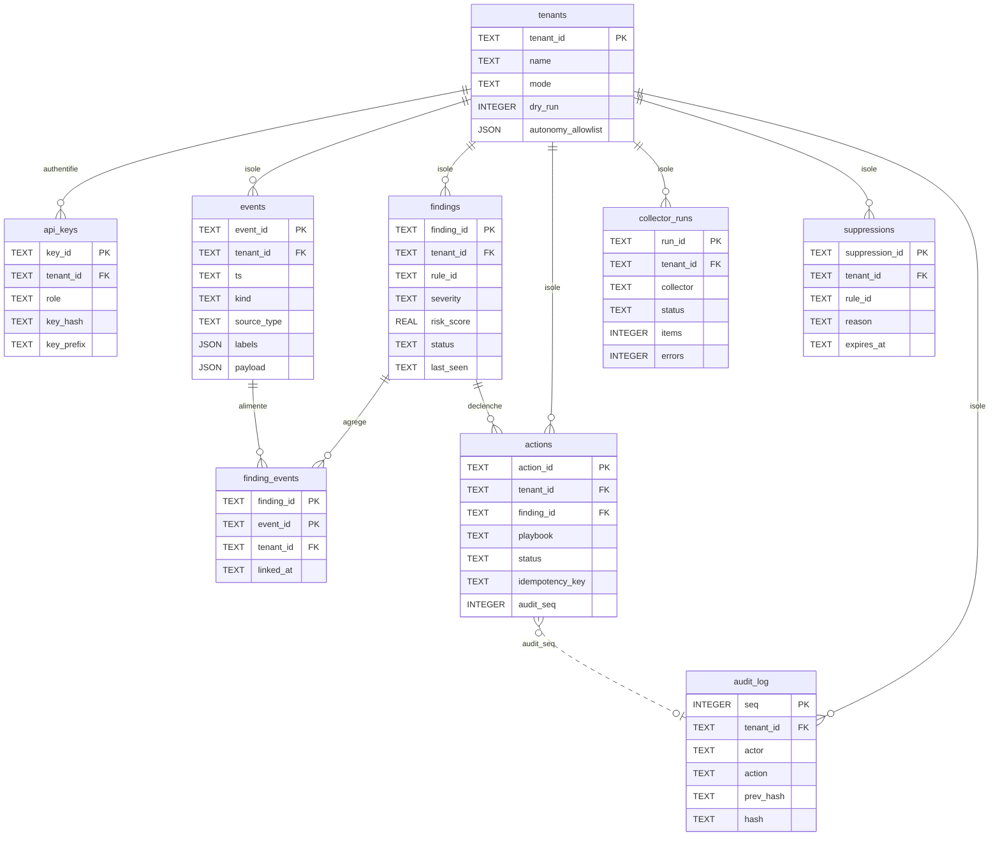

# Thot Secure — Modèle de données (v0.1.0, MVP)

*Modèle physique de persistance d'Thot Secure : SQLite pour le MVP, PostgreSQL/TimescaleDB comme cible de production, isolation stricte par `tenant_id`, journal d'audit append-only chaîné par hash et événements immuables.*

Ce document décrit **exactement** les tables du MVP. Il est subordonné au
[contrat d'interface](api-contract.md) (§3 schémas JSON, §4 routes, §6 garde-fous, §9 variables, §10 sécurité) :
en cas de divergence, le contrat fait foi. Pour la place de la base dans l'architecture, voir
[overview.md](overview.md) et [threat-model.md](threat-model.md).

---

## 1. Principes et périmètre

### 1.1 Deux moteurs, un seul contrat

| Contexte | Moteur | Statut |
|---|---|---|
| MVP v0.1.0 (dev, labo, MSP de petite taille) | **SQLite** (`THOT_DB_URL=sqlite:///./data/thotsecure.db`) | implémenté |
| Production (volume, concurrence, rétention longue) | **PostgreSQL + TimescaleDB** | cible, DDL fourni au §8 de ce document |

!!! info "Roadmap"
    **PostgreSQL/TimescaleDB n'est pas implémenté dans le MVP v0.1.0.** Le MVP persiste en SQLite
    derrière `THOT_DB_URL` (défaut `sqlite:///./data/thotsecure.db`, §9 du contrat). Le DDL
    PostgreSQL du §8 ci-dessous est une **cible de portage** : il est fourni pour figer les choix de
    types et les politiques de rétention/compression, et **reste à valider** contre
    `src/thotsecure/storage/`. Le contrat mentionne bien « persistance SQLite (+ DDL
    PostgreSQL/TimescaleDB) » au §2, et `thotsecure.core.config` accepte déjà une URL
    `postgresql://` ; le chemin SQLite du MVP refuse en revanche une URL non SQLite.

### 1.2 Trois invariants de persistance

1. **Isolation multi-tenant** — toute table métier porte `tenant_id` et toute requête filtre dessus
   (contrat §1 invariant 4, §10). Aucune table métier n'est globale.
2. **Audit append-only** — `audit_log` n'est jamais modifiée ni supprimée par l'application ; chaque
   enregistrement chaîne le précédent par `prev_hash` / `hash` (contrat §3.5, §10).
3. **Événements immuables** — un `events` inséré n'est jamais mis à jour (contrat §1). La seule
   opération de masse autorisée est la **purge par rétention** (§6 de ce document).

### 1.3 Ce que ce document ne fige pas

* La **forme détaillée** de `evidence` (finding), `result` (action), `labels` / `payload` (event) et
  `raw_ref` : le contrat §3 définit leur *enveloppe* JSON, pas leur schéma interne →
  forme exacte à confirmer par `src/thotsecure/storage/`.
* Les **valeurs de statut** de `collector_runs.status` : le contrat §4.8 expose « dernier run, items,
  erreurs » sans énumérer les états → à confirmer par `src/thotsecure/collectors/`.
* L'**outillage de migration** (§10 de ce document) et la **purge planifiée** (§6).

---

## 2. Vue d'ensemble

Diagramme simplifié (colonnes principales ; les tableaux du §4 font foi).



Relations résumées :

| Relation | Cardinalité | Sens |
|---|---|---|
| `tenants` → `api_keys` | 1-N | une clé appartient à un tenant, révocable (§4.2) |
| `tenants` → `events`, `findings`, `actions`, `collector_runs`, `suppressions`, `audit_log` | 1-N | frontière d'isolation (§1 invariant 4) |
| `findings` → `finding_events` ← `events` | N-N | un finding agrège *n* événements, un événement peut nourrir *n* findings (§3.2 `event_ids`) |
| `findings` → `actions` | 1-N | un finding peut déclencher plusieurs actions (plan, exécution, rollback) (§4.6) |
| `actions` → `audit_log` | référence logique | `audit_seq` pointe l'enregistrement d'audit de l'action (§3.4, §10) |

---

## 3. Conventions

| Sujet | Convention retenue | Motif |
|---|---|---|
| Types | `TEXT`, `INTEGER`, `REAL`, `BLOB` uniquement | SQLite n'expose que 5 classes de stockage ; aucun type `boolean`, `timestamp` ou `json` natif |
| Horodatages | `TEXT` **ISO-8601 UTC** avec millisecondes et suffixe `Z` (`2026-02-14T10:00:00.123Z`, §3.1) | format canonique du contrat, comparable lexicographiquement → `ORDER BY ts` et `since`/`until` (§4.3, §4.4, §4.7) sont des comparaisons de chaînes |
| Identifiants | `TEXT` — **UUID v4** (forme canonique à tirets, cf. `event_id` du §3.1) | portabilité directe vers `uuid` en PostgreSQL ; certains identifiants du contrat sont abrégés dans la doc (`f1c2…`, `a91b…`) et désignent des UUID complets |
| Booléens | `INTEGER` 0/1 + `CHECK (col IN (0,1))` | pas de type booléen SQLite |
| JSON | `TEXT` contenant du JSON **sérialisé** (`labels`, `payload`, `params`, `target`, `evidence`, `result`) | SQLite n'a pas de type document |
| Champs obligatoires | `NOT NULL` dès que le §3 ne prévoit pas `null` | `null` explicite dans le contrat ⇒ colonne nullable (`raw_ref`, `approved_by`, `result`, `severity_hint`…) |
| Clés étrangères | `REFERENCES … ON DELETE CASCADE` de l'enfant vers `tenants`, `findings`, `events` | supprimer la racine ne doit jamais laisser de ligne orpheline |
| Unicité | `PRIMARY KEY` sur l'identifiant métier ; `UNIQUE` là où le contrat impose un seul enregistrement logique (`idempotency_key` §3.4/§4.6, `audit_log.hash`) | l'unicité est une garantie de sûreté, pas un confort |
| Types **non stricts** | SQLite applique une **affinité de type**, pas un typage strict : `TEXT` accepte un entier, `INTEGER` accepte une chaîne numérique | la validation réelle est faite par les **modèles pydantic** du core (`thotsecure.core`) *avant* l'écriture ; les `CHECK` SQL sont une seconde barrière, pas la principale |
| Réglages de connexion | `PRAGMA foreign_keys = ON;` **et** `PRAGMA journal_mode = WAL;` à chaque ouverture | SQLite désactive les FK par défaut ; sans WAL, un lecteur bloque l'écrivain. Ces deux `PRAGMA` doivent être posés **hors transaction** (un `PRAGMA` de connexion est un no-op dans une transaction) |

!!! warning "Taille et troncature de `payload`"
    `payload` est plafonné à **32 Kio sérialisés** (§3.1). Au-delà, le contenu est tronqué par la
    couche collecteur et `raw_ref` est renseigné pour pointer l'artefact d'origine. La colonne est
    donc `NOT NULL` avec une contrainte de taille, jamais `BLOB` : les preuves restent du texte
    inspectable et exportable (CEF/SIEM, §4.7).

!!! tip "Assainissement avant écriture"
    Les champs libres qui recopient des données observées (`title`, `description`, `evidence`,
    `labels`, `payload`) traversent une surface XSS et de fuite de secrets réelle : ils doivent être
    assainis **avant persistance** (le core fournit cet assainissement, à réutiliser tel quel).

---

## 4. Tables

### tenants

Frontière d'isolation et porteur du **mode d'autonomie** (`manual|supervised|auto`) et du
`dry_run` par tenant (§4.2, §9 `THOT_AUTONOMY`, §6 garde-fou 4).

| Colonne | Type | Contrainte | Rôle | Source dans le contrat |
|---|---|---|---|---|
| `tenant_id` | TEXT | `PRIMARY KEY` | slug d'isolation (`acme`) | §4.2 (création), §3.1 `tenant_id` |
| `name` | TEXT | `NOT NULL` | libellé lisible (« ACME SAS ») | §4.2 (`name`), §8 `tenant create --name` |
| `mode` | TEXT | `NOT NULL`, `DEFAULT 'supervised'`, `CHECK IN ('manual','supervised','auto')` | autonomie du tenant, surcharge du défaut global | §4.2 (`"mode"`), §9 `THOT_AUTONOMY` |
| `dry_run` | INTEGER | `NOT NULL`, `DEFAULT 1`, `CHECK IN (0,1)` | **sûreté** : aucune action réelle pour ce tenant | §4.2 (`PATCH {"mode":"auto","dry_run":false}`), §1 invariant 1 |
| `autonomy_allowlist` | TEXT | `NOT NULL`, `DEFAULT '[]'` (JSON *array* de CIDR/hôtes) | cibles **protégées** (infra propre) sur lesquelles aucune action n'est jamais prise | §4.2 (`"autonomy_allowlist":["10.0.0.0/8"]`), §6 garde-fou 3 |
| `created_at` | TEXT | `NOT NULL` | création (ISO-8601 UTC) | §4.2 (objet `Tenant`) |
| `updated_at` | TEXT | `NOT NULL` | dernière modification de `mode`/`dry_run`/`name` | §4.2 (objet `Tenant`) |

**Index**

| Index | Colonnes | Pourquoi |
|---|---|---|
| *(PK)* | `tenant_id` | résolution de la clé API → tenant à chaque requête authentifiée (§4.2) |
| `idx_tenants_mode` | `mode` | comptage « mode d'autonomie » de `GET /api/v1/stats/overview` (§4.8) |

```sql
CREATE TABLE tenants (
    tenant_id          TEXT    NOT NULL PRIMARY KEY,
    name               TEXT    NOT NULL,
    mode               TEXT    NOT NULL DEFAULT 'supervised'
                               CHECK (mode IN ('manual','supervised','auto')),
    dry_run            INTEGER NOT NULL DEFAULT 1
                               CHECK (dry_run IN (0, 1)),
    autonomy_allowlist TEXT    NOT NULL DEFAULT '[]',
    created_at         TEXT    NOT NULL,
    updated_at         TEXT    NOT NULL
);

CREATE INDEX idx_tenants_mode ON tenants (mode);
```

!!! note "Garde-fous non persistés par tenant"
    Les garde-fous d'exécution du §6 (`max_actions_per_hour`, `cooldown` par
    `(tenant, playbook, cible)`) sont appliqués par le moteur de décision. Le contrat ne définit
    **aucune colonne par tenant** pour les surcharger, et `PATCH /api/v1/tenants/{id}` (§4.2)
    n'accepte que `mode` et `dry_run` → ces valeurs viennent de la configuration globale.

### api_keys

Clés API hachées, **jamais stockées en clair** (§10). `GET /api/v1/tenants/{id}/keys` (§4.2) expose
`key_id, label, role, created_at, last_used_at, revoked_at` — la matérialisation du secret n'existe
que dans la réponse de création (`{"key_id","api_key":"ao_…"}`), **affichée une seule fois**.

| Colonne | Type | Contrainte | Rôle | Source dans le contrat |
|---|---|---|---|---|
| `key_id` | TEXT | `PRIMARY KEY` | identifiant public de la clé (révocation, listing) | §4.2 (`key_id`), §8 `key revoke --key-id` |
| `tenant_id` | TEXT | `NOT NULL`, `REFERENCES tenants(tenant_id) ON DELETE CASCADE` | propriétaire de la clé | §4.2, §10 |
| `label` | TEXT | `NOT NULL`, `DEFAULT ''` | libellé humain (`ci`) | §4.2 (`"label":"ci"`) |
| `role` | TEXT | `NOT NULL`, `CHECK IN ('viewer','analyst','responder','admin')` | base du RBAC et des capacités | §4.1 (table des rôles), §4.2 |
| `key_hash` | TEXT | `NOT NULL`, `UNIQUE` | empreinte **scrypt** de la clé (pepper `THOT_SECRET_KEY`) ; aucune colonne ne contient la clé en clair | §10 (clés API hachées `scrypt`), §9 `THOT_SECRET_KEY` |
| `key_prefix` | TEXT | `NOT NULL` | préfixe public de la clé (`ao_…`) pour l'affichage et le lookup d'authentification sans révéler le secret | §4.1 (`X-API-Key: ao_…`), §4.2 (`api_key":"ao_…"`) |
| `created_at` | TEXT | `NOT NULL` | date d'émission | §4.2 (listing des clés) |
| `last_used_at` | TEXT | NULL | dernière authentification réussie (détection de clé dormante) | §4.2 (listing des clés) |
| `revoked_at` | TEXT | NULL | révocation immédiate (`DELETE /api/v1/keys/{key_id}` → `204`) | §4.2, §8 `key revoke` |

**Index**

| Index | Colonnes | Pourquoi |
|---|---|---|
| `idx_api_keys_hash` (UNIQUE) | `key_hash` | vérification d'une clé présentée ; garantit qu'une même empreinte ne peut pas être enregistrée deux fois |
| `idx_api_keys_prefix` | `key_prefix` | retrouver la bonne ligne avant vérification du hash (scrypt est coûteux : on ne le calcule pas sur toute la table) |
| `idx_api_keys_tenant` | `(tenant_id, revoked_at)` | listing `GET /api/v1/tenants/{id}/keys` et filtre des clés actives |

```sql
CREATE TABLE api_keys (
    key_id       TEXT    NOT NULL PRIMARY KEY,
    tenant_id    TEXT    NOT NULL REFERENCES tenants (tenant_id) ON DELETE CASCADE,
    label        TEXT    NOT NULL DEFAULT '',
    role         TEXT    NOT NULL
                         CHECK (role IN ('viewer', 'analyst', 'responder', 'admin')),
    key_hash     TEXT    NOT NULL,
    key_prefix   TEXT    NOT NULL,
    created_at   TEXT    NOT NULL,
    last_used_at TEXT,
    revoked_at   TEXT
);

CREATE UNIQUE INDEX idx_api_keys_hash   ON api_keys (key_hash);
CREATE INDEX        idx_api_keys_prefix ON api_keys (key_prefix);
CREATE INDEX        idx_api_keys_tenant ON api_keys (tenant_id, revoked_at);
```

!!! warning "Révocation ≠ suppression"
    `DELETE /api/v1/keys/{key_id}` renseigne `revoked_at` et **ne supprime pas la ligne** : l'historique
    des accès doit rester corrélable avec `audit_log`. Toute requête d'authentification doit donc
    filtrer `revoked_at IS NULL`.

!!! note "Forme de `key_hash`"
    Le contrat impose le hachage `scrypt` (§10 sans préciser le format d'encodage). La forme exacte
    (sel, paramètres `n`/`r`/`p`, encodage du sel et du digest) → à confirmer par
    `src/thotsecure/storage/`. `key_prefix` n'apparaît pas dans la réponse du §4.2 : il est dérivé de
    la forme `ao_…` documentée au §4.1 et §4.2.

### events

Fait brut normalisé, **immuable**, émis par un collecteur (§3.1). `source.*` est **aplati** en trois
colonnes pour être indexable ; `labels` et `payload` restent du JSON.

| Colonne | Type | Contrainte | Rôle | Source dans le contrat |
|---|---|---|---|---|
| `event_id` | TEXT | `PRIMARY KEY` | UUID v4 de l'événement | §3.1 `event_id`, §4.3 `GET /events/{event_id}` |
| `schema_version` | TEXT | `NOT NULL`, `DEFAULT '1'` | version du schéma `Event` pour les évolutions | §3.1 `schema_version` |
| `tenant_id` | TEXT | `NOT NULL`, `REFERENCES tenants(tenant_id) ON DELETE CASCADE` | isolation ; **forcé depuis la clé API**, jamais depuis le corps | §3.1, §4.3 (« `tenant_id` forcé depuis la clé »), §10 |
| `ts` | TEXT | `NOT NULL` | horodatage de l'observation (`2026-02-14T10:00:00.123Z`) | §3.1 `ts` |
| `kind` | TEXT | `NOT NULL`, `CHECK IN (8 valeurs)` | nature normalisée de l'événement | §3.1 `kind` : `http.request`, `http.response`, `log.line`, `tls.cert`, `dependency`, `config.audit`, `syslog`, `generic` |
| `source_type` | TEXT | `NOT NULL` | type de collecteur (`web_probe`, `log_tail`, …) — pilote `source_types` des règles | §3.1 `source.type`, §4.3 filtre `source_type`, §5 `source_types` |
| `source_name` | TEXT | NULL | instance du collecteur (`prod-edge`) | §3.1 `source.name` |
| `source_host` | TEXT | NULL | hôte/actif concerné (`shop.acme.fr`), utilisé par les règles via `source.host` | §3.1 `source.host`, §5 (`field: source.host`) |
| `severity_hint` | TEXT | NULL, `CHECK (NULL OR IN (5 valeurs))` | indice de sévérité fourni par la source (le scoring final est sur le finding) | §3.1 `severity_hint` ∈ `info`, `low`, `medium`, `high`, `critical` ou `null` |
| `labels` | TEXT | `NOT NULL`, `DEFAULT '{}'` (JSON **plat**, valeurs scalaires) | espace de nommage des règles (`labels.src_ip`, `labels.path`) | §3.1 `labels` ; §5 (`field: labels.path`) |
| `payload` | TEXT | `NOT NULL`, `DEFAULT '{}'`, `CHECK (taille ≤ 32768 octets)` | charge utile observée (`status`, `bytes`, `user_agent`) | §3.1 `payload` ≤ 32 Kio |
| `raw_ref` | TEXT | NULL | référence de l'artefact brut quand `payload` a été tronqué | §3.1 `raw_ref` |
| `created_at` | TEXT | `NOT NULL` | horodatage d'**ingestion** en base (tri technique, fenêtre de purge) | *dérivé* — absent du JSON §3.1 |

**Index**

| Index | Colonnes | Pourquoi |
|---|---|---|
| `idx_events_tenant_ts` | `(tenant_id, ts DESC)` | filtre principal de `GET /api/v1/events` (`since`, `until`, `cursor`) et fenêtres 24 h/7 j de `GET /api/v1/stats/overview` (§4.3, §4.8) |
| `idx_events_tenant_kind` | `(tenant_id, kind)` | filtre `kind` de `GET /api/v1/events` (§4.3) |
| `idx_events_tenant_source_type` | `(tenant_id, source_type)` | filtre `source_type` de `GET /api/v1/events` (§4.3) |

```sql
CREATE TABLE events (
    event_id       TEXT    NOT NULL PRIMARY KEY,
    schema_version TEXT    NOT NULL DEFAULT '1',
    tenant_id      TEXT    NOT NULL REFERENCES tenants (tenant_id) ON DELETE CASCADE,
    ts             TEXT    NOT NULL,
    kind           TEXT    NOT NULL CHECK (kind IN (
                       'http.request', 'http.response', 'log.line', 'tls.cert',
                       'dependency', 'config.audit', 'syslog', 'generic')),
    source_type    TEXT    NOT NULL,
    source_name    TEXT,
    source_host    TEXT,
    severity_hint  TEXT    CHECK (severity_hint IS NULL OR severity_hint IN (
                       'info', 'low', 'medium', 'high', 'critical')),
    labels         TEXT    NOT NULL DEFAULT '{}',
    payload        TEXT    NOT NULL DEFAULT '{}'
                           CHECK (length(CAST(payload AS BLOB)) <= 32768),
    raw_ref        TEXT,
    created_at     TEXT    NOT NULL
);

CREATE INDEX idx_events_tenant_ts     ON events (tenant_id, ts DESC);
CREATE INDEX idx_events_tenant_kind   ON events (tenant_id, kind);
CREATE INDEX idx_events_tenant_source ON events (tenant_id, source_type);
```

!!! note "Contrainte de taille et troncature"
    `length()` sur du texte compte des **caractères** ; la contrainte porte donc sur
    `CAST(payload AS BLOB)` pour garantir la borne de **32 Kio** du §3.1. La troncature est faite en
    amont par la couche collecteur (qui renseigne `raw_ref`), la contrainte SQL n'étant qu'un filet
    de sécurité : elle rejette une écriture non conforme au lieu de la corriger silencieusement.

!!! warning "Pas d'index plein-texte dans le MVP"
    `GET /api/v1/events` accepte un paramètre `q` (§4.3). Le contrat n'en définit ni le champ
    d'application exact ni un index FTS5 : aucune table virtuelle de recherche n'est créée ici, et
    la sémantique de `q` reste → à confirmer par `src/thotsecure/storage/`.

### findings

Agrégat d'événements produit par une règle de détection, porteur du `risk_score` et de la décision
(§3.2). `evidence` et les références d'événements sont la mémoire de l'agrégat.

| Colonne | Type | Contrainte | Rôle | Source dans le contrat |
|---|---|---|---|---|
| `finding_id` | TEXT | `PRIMARY KEY` | UUID du finding | §3.2 `finding_id`, §4.4 |
| `tenant_id` | TEXT | `NOT NULL`, `REFERENCES tenants(tenant_id) ON DELETE CASCADE` | isolation | §3.2, §1 invariant 4 |
| `rule_id` | TEXT | `NOT NULL` | règle déclenchante (`AO-WEB-001`) | §3.2, §4.4 filtre `rule_id`, §5 `id` |
| `rule_name` | TEXT | `NOT NULL` | titre de la règle au moment du déclenchement | §3.2 `rule_name` |
| `severity` | TEXT | `NOT NULL`, `CHECK IN ('info','low','medium','high','critical')` | sévérité normalisée | §3.2, §4.4 filtre `severity` |
| `risk_score` | REAL | `NOT NULL`, `DEFAULT 0`, `CHECK BETWEEN 0 AND 100` | score de risque borné 0-100 | §3.2 `risk_score`, §4.4 `min_risk`/`sort=risk_score`, §11 `test_risk_scoring` |
| `confidence` | REAL | `NOT NULL`, `DEFAULT 0`, `CHECK BETWEEN 0 AND 1` | confiance de la règle (0.0-1.0) | §3.2 `confidence`, §5 `confidence` |
| `status` | TEXT | `NOT NULL`, `DEFAULT 'open'`, `CHECK IN ('open','acked','closed','suppressed')` | cycle de vie | §3.2 `status`, §4.4 (`ack`, `close`, `suppress`) |
| `title` | TEXT | `NOT NULL` | titre lisible du finding | §3.2 `title` |
| `description` | TEXT | `NOT NULL`, `DEFAULT ''` | description détaillée | §3.2 `description` |
| `remediation` | TEXT | `NOT NULL`, `DEFAULT ''` | remédiation issue de la règle | §3.2 `remediation`, §5 `remediation` |
| `tags` | TEXT | `NOT NULL`, `DEFAULT '[]'` (JSON *array*) | étiquettes (`web`, `owasp:a03`, `mitre:T1190`) | §3.2 `tags`, §6 `finding.tags_any` |
| `mitre` | TEXT | `NOT NULL`, `DEFAULT '[]'` (JSON *array*) | techniques MITRE ATT&CK | §3.2 `mitre` |
| `evidence` | TEXT | `NOT NULL`, `DEFAULT '{}'` (JSON) | échantillons de preuve | §3.2 `evidence` |
| `first_seen` | TEXT | `NOT NULL` | premier événement de l'agrégat | §3.2 `first_seen` |
| `last_seen` | TEXT | `NOT NULL` | dernier événement (pilote `sort=last_seen` et la fenêtre de déduplication) | §3.2 `last_seen`, §4.4 `sort=last_seen`, §5 `dedup.ttl_seconds` |
| `count` | INTEGER | `NOT NULL`, `DEFAULT 1` | nombre d'événements agrégés | §3.2 `count`, §6 `finding.count` |
| `first_seen_event_id` | TEXT | NULL | ancrage de l'agrégat sur son premier événement | *dérivé* — absent du §3.2 (§3.2 expose `event_ids`) |
| `resolution` | TEXT | NULL, `CHECK (NULL OR IN ('true_positive','false_positive','mitigated'))` | qualification à la clôture | *dérivé* de `POST /api/v1/findings/{id}/close` (§4.4) |
| `created_at` | TEXT | `NOT NULL` | création du finding | §3.2 `created_at` |
| `updated_at` | TEXT | `NOT NULL` | dernière mise à jour (statut, agrégation) | §3.2 `updated_at` |

**Index**

| Index | Colonnes | Pourquoi |
|---|---|---|
| `idx_findings_tenant_status` | `(tenant_id, status)` | filtre `status` de `GET /api/v1/findings` et compteurs « ouverts » (§4.4, §4.8, §4.9) |
| `idx_findings_tenant_severity` | `(tenant_id, severity)` | filtre `severity` et répartition par sévérité de `GET /api/v1/stats/overview` (§4.4, §4.8) |
| `idx_findings_tenant_risk` | `(tenant_id, risk_score DESC)` | filtre `min_risk` et `sort=risk_score` (§4.4), seuil `critical_score_threshold` du moteur de décision |
| `idx_findings_tenant_last_seen` | `(tenant_id, last_seen DESC)` | `sort=last_seen`, `since`/`until`, fenêtre de déduplication (§4.4, §5 `dedup`) |
| `idx_findings_tenant_rule` | `(tenant_id, rule_id)` | filtre `rule_id` (§4.4) et rapprochement avec `suppressions` |

```sql
CREATE TABLE findings (
    finding_id           TEXT    NOT NULL PRIMARY KEY,
    tenant_id            TEXT    NOT NULL REFERENCES tenants (tenant_id) ON DELETE CASCADE,
    rule_id              TEXT    NOT NULL,
    rule_name            TEXT    NOT NULL,
    severity             TEXT    NOT NULL
                                 CHECK (severity IN ('info', 'low', 'medium', 'high', 'critical')),
    risk_score           REAL    NOT NULL DEFAULT 0
                                 CHECK (risk_score BETWEEN 0 AND 100),
    confidence           REAL    NOT NULL DEFAULT 0
                                 CHECK (confidence BETWEEN 0 AND 1),
    status               TEXT    NOT NULL DEFAULT 'open'
                                 CHECK (status IN ('open', 'acked', 'closed', 'suppressed')),
    title                TEXT    NOT NULL,
    description          TEXT    NOT NULL DEFAULT '',
    remediation          TEXT    NOT NULL DEFAULT '',
    tags                 TEXT    NOT NULL DEFAULT '[]',
    mitre                TEXT    NOT NULL DEFAULT '[]',
    evidence             TEXT    NOT NULL DEFAULT '{}',
    first_seen           TEXT    NOT NULL,
    last_seen            TEXT    NOT NULL,
    count                INTEGER NOT NULL DEFAULT 1,
    first_seen_event_id  TEXT,
    resolution           TEXT    CHECK (resolution IS NULL OR resolution IN (
                                 'true_positive', 'false_positive', 'mitigated')),
    created_at           TEXT    NOT NULL,
    updated_at           TEXT    NOT NULL
);

CREATE INDEX idx_findings_tenant_status    ON findings (tenant_id, status);
CREATE INDEX idx_findings_tenant_severity  ON findings (tenant_id, severity);
CREATE INDEX idx_findings_tenant_risk      ON findings (tenant_id, risk_score DESC);
CREATE INDEX idx_findings_tenant_last_seen ON findings (tenant_id, last_seen DESC);
CREATE INDEX idx_findings_tenant_rule      ON findings (tenant_id, rule_id);
```

!!! note "`resolution` et `first_seen_event_id`"
    Aucun des deux n'apparaît dans le JSON `Finding` du §3.2. `resolution` est **dérivée** du corps de
    `POST /api/v1/findings/{id}/close` (§4.4 : `true_positive|false_positive|mitigated`), qui doit
    bien être persisté pour survivre au redémarrage. `first_seen_event_id` ancre l'agrégat sans
    dépendre du JSON `evidence`. Les deux doivent être exposés (ou non) selon le modèle pydantic →
    à confirmer par `src/thotsecure/storage/`.

    Les corps `{"comment":"…"}` de `POST /findings/{id}/ack` et `POST /findings/{id}/close` (§4.4)
    n'ont de colonne dans aucune des neuf tables retenues : ils sont présumés journalisés dans
    `audit_log` (`before` / `after`) → à confirmer par `src/thotsecure/storage/`.

!!! warning "`event_ids` n'est pas une colonne"
    Le §3.2 expose `Finding.event_ids`. Il est **reconstruit par jointure** sur `finding_events`
    (table suivante) — jamais stocké en JSON, sinon la cohérence avec les événements purgés serait
    impossible à maintenir.

### finding_events

Table de liaison N-N entre un finding et les événements qu'il agrège ; source unique de
`Finding.event_ids` (§3.2).

| Colonne | Type | Contrainte | Rôle | Source dans le contrat |
|---|---|---|---|---|
| `finding_id` | TEXT | `NOT NULL`, `REFERENCES findings(finding_id) ON DELETE CASCADE`, PK composite | côté finding de la liaison | §3.2 `event_ids` (agrégat), §4.4 `GET /findings/{id}` |
| `event_id` | TEXT | `NOT NULL`, `REFERENCES events(event_id) ON DELETE CASCADE`, PK composite | côté événement de la liaison | §3.2 `event_ids` (`["e6f0…"]`), §3.1 `event_id` |
| `tenant_id` | TEXT | `NOT NULL` | isolation **dénormalisée** : permet de filtrer sans jointure et d'auditer l'isolation en CI | §1 invariant 4, §10 (« toute requête SQL filtre `tenant_id` ») |
| `linked_at` | TEXT | `NOT NULL` | date de rattachement (ordre de constitution de l'agrégat) | *dérivé* — nécessaire pour reconstruire `event_ids` de façon déterministe |

**Index**

| Index | Colonnes | Pourquoi |
|---|---|---|
| *(PK)* | `(finding_id, event_id)` | unicité de la liaison (un événement n'est rattaché qu'une fois à un finding) |
| `idx_finding_events_tenant_event` | `(tenant_id, event_id)` | purge de rétention (§6) et recherche « quels findings citent cet événement ? » |
| `idx_finding_events_tenant_finding` | `(tenant_id, finding_id)` | reconstitution de `event_ids` pour `GET /api/v1/findings/{id}` (§4.4) |

```sql
CREATE TABLE finding_events (
    finding_id TEXT NOT NULL REFERENCES findings (finding_id) ON DELETE CASCADE,
    event_id   TEXT NOT NULL REFERENCES events (event_id)     ON DELETE CASCADE,
    tenant_id  TEXT NOT NULL,
    linked_at  TEXT NOT NULL,
    PRIMARY KEY (finding_id, event_id)
);

CREATE INDEX idx_finding_events_tenant_event   ON finding_events (tenant_id, event_id);
CREATE INDEX idx_finding_events_tenant_finding ON finding_events (tenant_id, finding_id);
```

!!! warning "Double protection contre les liaisons orphelines"
    `ON DELETE CASCADE` vers `events` évite qu'une purge d'événements laisse des liaisons
    fantômes. La purge du §6 supprime malgré tout `finding_events` **avant** `events`, pour rendre
    l'ordre explicite et testable.

### actions

Instance d'exécution d'un playbook sur un finding : cycle de vie complet, réversibilité et
idempotence (§3.4, §4.6). `target.*` et `rollback.*` sont **aplatis** pour être indexables et
directement interrogeables par les garde-fous du §6.

| Colonne | Type | Contrainte | Rôle | Source dans le contrat |
|---|---|---|---|---|
| `action_id` | TEXT | `PRIMARY KEY` | UUID de l'action | §3.4 `action_id`, §4.6 |
| `tenant_id` | TEXT | `NOT NULL`, `REFERENCES tenants(tenant_id) ON DELETE CASCADE` | isolation | §3.4, §1 invariant 4 |
| `finding_id` | TEXT | `NOT NULL`, `REFERENCES findings(finding_id) ON DELETE CASCADE` | finding à l'origine de l'action | §3.4 `finding_id`, §4.6 (`plan` exige `finding_id`, `GET /actions` filtre dessus) |
| `policy_id` | TEXT | NULL | politique ayant produit la décision (`auto-block-high-web`) | §3.4 `policy_id`, §3.3, §6, §10 (`Traçabilité`) |
| `playbook` | TEXT | `NOT NULL` | playbook exécuté (`block-source-ip`) | §3.4 `playbook`, §4.6 filtre `playbook`, §7 |
| `status` | TEXT | `NOT NULL`, `CHECK IN (9 valeurs)` | cycle de vie | §3.4 : `planned`, `pending_approval`, `approved`, `rejected`, `executing`, `succeeded`, `failed`, `expired`, `rolled_back` |
| `mode` | TEXT | `NOT NULL`, `CHECK IN ('manual','supervised','auto')` | mode d'autonomie au moment de la décision | §3.4 `mode` (`"manual"`), §3.3 `decision`, §9 `THOT_AUTONOMY` |
| `dry_run` | INTEGER | `NOT NULL`, `DEFAULT 1`, `CHECK IN (0,1)` | l'action n'a eu **aucun effet réel** | §3.4 `dry_run`, §1 invariant 1, §11 `test_actions_rollback` |
| `params` | TEXT | `NOT NULL`, `DEFAULT '{}'` (JSON) | paramètres effectifs (`target`, `duration_seconds`) | §3.4 `params`, §3.3 `params`, §7 `params` |
| `target_type` | TEXT | NULL | type de cible (`ip`) | §3.4 `target.type` (aplati) |
| `target_value` | TEXT | NULL | valeur de cible (`203.0.113.9`) | §3.4 `target.value` (aplati) |
| `requested_by` | TEXT | `NOT NULL` | acteur demandeur (`api-key:ci`) | §3.4 `requested_by`, §1 invariant 2 |
| `requested_at` | TEXT | `NOT NULL` | date de la demande (fait aussi office de date de création) | §3.4 `requested_at` |
| `approved_by` | TEXT | NULL | approbateur (garde-fou `require_approval`, §6) | §3.4 `approved_by`, §1 invariant 2 |
| `approved_at` | TEXT | NULL | date d'approbation | §3.4 `approved_at` |
| `executed_at` | TEXT | NULL | date d'exécution | §3.4 `executed_at` |
| `expires_at` | TEXT | NULL | fin de validité (approbation/effet) | §3.4 `expires_at`, §3.3 `expires_at`, §6 `rollback.auto_after_seconds` |
| `result` | TEXT | NULL | résultat d'exécution (JSON) | §3.4 `result` |
| `rollback_available` | INTEGER | `NOT NULL`, `DEFAULT 0`, `CHECK IN (0,1)` | la contre-mesure est-elle réversible ? | §3.4 `rollback.available`, §1 invariant 3, §7 `reversible` |
| `rollback_token` | TEXT | NULL | jeton d'annulation retourné par le connecteur (ou en mode simulé) | §3.4 `rollback.token`, §7 (« retourne un `rollback_token` ») |
| `rollback_performed_at` | TEXT | NULL | date du rollback effectif | §3.4 `rollback.performed_at`, §4.6 `rollback` |
| `rollback_result` | TEXT | NULL | résultat du rollback (JSON) | §3.4 `rollback.result` |
| `idempotency_key` | TEXT | `NOT NULL`, **`UNIQUE`** | rejouer `POST /actions/{id}/execute` ne produit pas de double effet | §3.4 `idempotency_key` (`acme:block-source-ip:203.0.113.9:1739527200`), §4.6 (« Idempotent via `idempotency_key` ») |
| `audit_seq` | INTEGER | NULL | pointeur vers l'enregistrement d'audit de l'action | §3.4 `audit_seq`, §10 (`chaque action audit_seq`) |

**Index**

| Index | Colonnes | Pourquoi |
|---|---|---|
| `idx_actions_tenant_status` | `(tenant_id, status)` | filtre `status` de `GET /api/v1/actions` (§4.6) et compteurs `succeeded`/`rolled_back` (§4.8) |
| `idx_actions_tenant_playbook` | `(tenant_id, playbook)` | filtre `playbook` (§4.6) et cooldown par `(tenant, playbook, cible)` (§6 garde-fou 2) |
| `idx_actions_tenant_finding` | `(tenant_id, finding_id)` | filtre `finding_id` (§4.6) et `Finding` + `actions` liées de `GET /api/v1/findings/{id}` (§4.4) |
| `idx_actions_idempotency` (UNIQUE) | `idempotency_key` | garantie d'idempotence au niveau base, pas seulement applicatif (§4.6) |
| `idx_actions_tenant_expires` | `(tenant_id, expires_at)` | balayage d'expiration (`status = 'expired'`, §3.4) et plafond `max_actions_per_hour` (§6 garde-fou 1) |
| `idx_actions_audit_seq` | `audit_seq` | retrouver l'action depuis un enregistrement d'audit et inversement (§4.7) |

```sql
CREATE TABLE actions (
    action_id             TEXT    NOT NULL PRIMARY KEY,
    tenant_id             TEXT    NOT NULL REFERENCES tenants (tenant_id) ON DELETE CASCADE,
    finding_id            TEXT    NOT NULL REFERENCES findings (finding_id) ON DELETE CASCADE,
    policy_id             TEXT,
    playbook              TEXT    NOT NULL,
    status                TEXT    NOT NULL CHECK (status IN (
                              'planned', 'pending_approval', 'approved', 'rejected', 'executing',
                              'succeeded', 'failed', 'expired', 'rolled_back')),
    mode                  TEXT    NOT NULL CHECK (mode IN ('manual', 'supervised', 'auto')),
    dry_run               INTEGER NOT NULL DEFAULT 1 CHECK (dry_run IN (0, 1)),
    params                TEXT    NOT NULL DEFAULT '{}',
    target_type           TEXT,
    target_value          TEXT,
    requested_by          TEXT    NOT NULL,
    requested_at          TEXT    NOT NULL,
    approved_by           TEXT,
    approved_at           TEXT,
    executed_at           TEXT,
    expires_at            TEXT,
    result                TEXT,
    rollback_available    INTEGER NOT NULL DEFAULT 0 CHECK (rollback_available IN (0, 1)),
    rollback_token        TEXT,
    rollback_performed_at TEXT,
    rollback_result       TEXT,
    idempotency_key       TEXT    NOT NULL,
    audit_seq             INTEGER
);

CREATE INDEX idx_actions_tenant_status   ON actions (tenant_id, status);
CREATE INDEX idx_actions_tenant_playbook ON actions (tenant_id, playbook);
CREATE INDEX idx_actions_tenant_finding  ON actions (tenant_id, finding_id);
CREATE INDEX idx_actions_tenant_expires  ON actions (tenant_id, expires_at);
CREATE INDEX idx_actions_audit_seq       ON actions (audit_seq);
CREATE UNIQUE INDEX idx_actions_idempotency ON actions (idempotency_key);
```

!!! note "`policy_id` et `audit_seq` peuvent être nuls"
    `POST /api/v1/actions/plan` (§4.6) accepte un plan manuel sans politique → `policy_id` est
    nullable. `audit_seq` est renseigné lorsque l'enregistrement d'audit correspondant est écrit :
    c'est une **référence logique sans clé étrangère**, pour ne pas imposer d'ordre d'écriture entre
    `actions` et `audit_log` (append-only) dans la même transaction.

### audit_log

Journal **append-only** chaîné par hash (§3.5, §10). Aucun `UPDATE` ni `DELETE` applicatif :
l'immuabilité est la propriété qui rend `GET /api/v1/audit/verify` et l'export SIEM utiles.

| Colonne | Type | Contrainte | Rôle | Source dans le contrat |
|---|---|---|---|---|
| `seq` | INTEGER | `PRIMARY KEY AUTOINCREMENT` | ordre total de la chaîne (monotone, jamais réutilisé) | §3.5 `seq` (`42`), §4.7 `verify` |
| `ts` | TEXT | `NOT NULL` | horodatage de l'écrit (avec millisecondes) | §3.5 `ts` (`2026-02-14T10:00:02.331Z`) |
| `tenant_id` | TEXT | `NOT NULL`, `REFERENCES tenants(tenant_id)` | isolation ; **entre dans le hash** | §3.5, §10 |
| `actor` | TEXT | `NOT NULL` | auteur (`api-key:ci`, `user:…`, `system:…`) | §3.5 `actor`, §1 invariant 2, §4.7 filtre `actor` |
| `actor_role` | TEXT | `NOT NULL`, `CHECK IN ('viewer','analyst','responder','admin')` | rôle effectif au moment de l'acte | §3.5 `actor_role`, §4.1 (rôles), §10 (RBAC) |
| `action` | TEXT | `NOT NULL` | verbe audité (`action.approve`, `action.execute`, `finding.close`, …) | §3.5 `action`, §4.7 filtre `action` |
| `target` | TEXT | `NOT NULL`, `DEFAULT '{}'` (JSON) | objet visé (`{"type":"action","id":"a91b…"}`) | §3.5 `target` |
| `before` | TEXT | NULL (JSON) | état avant (`{"status":"pending_approval"}`) | §3.5 `before`, §1 invariant 2 |
| `after` | TEXT | NULL (JSON) | état après (`{"status":"approved"}`) | §3.5 `after`, §1 invariant 2 |
| `prev_hash` | TEXT | `NOT NULL` | empreinte de l'enregistrement `seq - 1` ; **genesis = `sha256:genesis`** | §3.5 `prev_hash` |
| `hash` | TEXT | `NOT NULL`, `UNIQUE` | empreinte de cet enregistrement (voir la formule ci-dessous) | §3.5 `hash` |

**Formule d'empreinte** (reprise **exacte** du §3.5) :

```text
hash = sha256(f"{seq}|{ts}|{tenant_id}|{actor}|{actor_role}|{action}|{canonical(target)}|"
              f"{canonical(before)}|{canonical(after)}|{prev_hash}")
```

`canonical()` = JSON **trié par clé**, séparateurs **compacts** (`","` et `":"`), encodé en **UTF-8**.
Le genesis a `prev_hash = "sha256:genesis"`. La valeur consommée par la formule est la chaîne
**stockée telle quelle**, préfixe `sha256:` compris ; l'encodage hexadécimal du digest et son
préfixage exact → à confirmer par `src/thotsecure/audit/`.

**Index**

| Index | Colonnes | Pourquoi |
|---|---|---|
| *(PK)* | `seq` | relecture strictement ordonnée de la chaîne (`GET /api/v1/audit/verify`, `audit tail` §8) |
| `idx_audit_tenant_seq` | `(tenant_id, seq)` | pagination de `GET /api/v1/audit` (`cursor`) et unicité logique par tenant (§4.7) |
| `idx_audit_tenant_ts` | `(tenant_id, ts)` | filtres `since`/`until` (§4.7) |
| `idx_audit_tenant_action` | `(tenant_id, action)` | filtre `action` (§4.7), corrélation avec `actions.audit_seq` (§4.6) |
| `idx_audit_actor` | `(actor)` | filtre `actor` (§4.7), enquête « qui a fait quoi » |
| `idx_audit_hash` (UNIQUE) | `hash` | deux enregistrements ne peuvent pas porter la même empreinte |

```sql
CREATE TABLE audit_log (
    seq        INTEGER NOT NULL PRIMARY KEY AUTOINCREMENT,
    ts         TEXT    NOT NULL,
    tenant_id  TEXT    NOT NULL REFERENCES tenants (tenant_id),
    actor      TEXT    NOT NULL,
    actor_role TEXT    NOT NULL
                       CHECK (actor_role IN ('viewer', 'analyst', 'responder', 'admin')),
    action     TEXT    NOT NULL,
    target     TEXT    NOT NULL DEFAULT '{}',
    before     TEXT,
    after      TEXT,
    prev_hash  TEXT    NOT NULL,
    hash       TEXT    NOT NULL
);

CREATE UNIQUE INDEX idx_audit_hash         ON audit_log (hash);
CREATE INDEX        idx_audit_tenant_seq   ON audit_log (tenant_id, seq);
CREATE INDEX        idx_audit_tenant_ts    ON audit_log (tenant_id, ts);
CREATE INDEX        idx_audit_tenant_action ON audit_log (tenant_id, action);
CREATE INDEX        idx_audit_actor        ON audit_log (actor);
```

**Immuabilité en profondeur** — triggers `RAISE(ABORT)` (aucun `UPDATE`, aucun `DELETE`) :

```sql
CREATE TRIGGER trg_audit_log_no_update
BEFORE UPDATE ON audit_log
BEGIN
    SELECT RAISE(ABORT, 'audit_log est append-only : UPDATE interdit');
END;

CREATE TRIGGER trg_audit_log_no_delete
BEFORE DELETE ON audit_log
BEGIN
    SELECT RAISE(ABORT, 'audit_log est append-only : DELETE interdit');
END;
```

!!! note "`AUTOINCREMENT` n'est pas décoratif"
    `INTEGER PRIMARY KEY AUTOINCREMENT` garantit que `seq` n'est **jamais réutilisé**, même après une
    suppression de lignes (comportement `sqlite_sequence`). Un `rowid` recyclé réintroduirait un
    « trou » exploitable dans la chaîne.

!!! warning "La chaîne est globale à la base, pas par tenant"
    `seq` est un compteur unique pour toute la base : la chaîne d'audit est **une seule chaîne**, tous
    tenants confondus, et `prev_hash` pointe l'enregistrement `seq - 1` **quel que soit** son tenant.
    C'est cohérent avec `GET /api/v1/audit/verify` (§4.7, qui retourne un `records` global) mais
    implique qu'un opérateur multi-tenant partage un maillon de chaîne commun. En PostgreSQL, la clé
    primaire devient `(tenant_id, seq)` (§8) → unicité logique par tenant, `seq` restant globalement
    unique.

!!! danger "Trigger = défense applicative, pas garantie cryptographique"
    Un attaquant disposant d'un accès **écriture au fichier** (ou au serveur PostgreSQL) peut
    supprimer les triggers, ou réécrire `audit_log` avec `PRAGMA writable_schema` / un outil
    externe. Les triggers protègent contre un bug applicatif ou une requête maladroite, **pas**
    contre un adversaire ayant la main sur le disque. Cet écart et ses contre-mesures (export
    externe, horodatage, sauvegardes hors ligne) sont traités dans
    [threat-model.md](threat-model.md).

### collector_runs

Historique d'exécution des collecteurs, exploité par `GET /api/v1/collectors` (dernier run, items,
erreurs) et par le déclenchement manuel `POST /api/v1/collectors/{name}/run` (§4.8).

| Colonne | Type | Contrainte | Rôle | Source dans le contrat |
|---|---|---|---|---|
| `run_id` | TEXT | `PRIMARY KEY` | UUID du run | *dérivé* — identifiant nécessaire pour historiser un run (§4.8) |
| `tenant_id` | TEXT | `NOT NULL`, `REFERENCES tenants(tenant_id) ON DELETE CASCADE` | isolation ; un run manuel est exécuté « sur les cibles déclarées du tenant » | §4.8 (`POST /collectors/{name}/run`), §1 invariant 4 |
| `collector` | TEXT | `NOT NULL` | nom du collecteur (`{name}` de la route) | §4.8 `POST /api/v1/collectors/{name}/run`, `GET /api/v1/collectors` |
| `started_at` | TEXT | `NOT NULL` | début du run | *dérivé* — « dernier run » du §4.8 |
| `finished_at` | TEXT | NULL | fin du run (NULL tant que le run est en cours) | *dérivé* — « dernier run » du §4.8 |
| `status` | TEXT | `NOT NULL` | état du run (en cours / succès / échec) | §4.8 (`dernier run`, `erreurs`) ; **valeurs non énumérées par le contrat** → à confirmer par `src/thotsecure/collectors/` |
| `items` | INTEGER | `NOT NULL`, `DEFAULT 0` | nombre d'éléments collectés | §4.8 (`items`) |
| `errors` | INTEGER | `NOT NULL`, `DEFAULT 0` | nombre d'erreurs rencontrées | §4.8 (`erreurs`) |
| `error_detail` | TEXT | NULL | détail de la dernière erreur (tronqué, assaini) | §4.8 (`erreurs`) |

**Index**

| Index | Colonnes | Pourquoi |
|---|---|---|
| `idx_collector_runs_latest` | `(tenant_id, collector, started_at DESC)` | « dernier run » par collecteur pour `GET /api/v1/collectors` (§4.8) |
| `idx_collector_runs_status` | `(tenant_id, status)` | détecter les runs en échec ou bloqués (§4.8) |

```sql
CREATE TABLE collector_runs (
    run_id      TEXT    NOT NULL PRIMARY KEY,
    tenant_id   TEXT    NOT NULL REFERENCES tenants (tenant_id) ON DELETE CASCADE,
    collector   TEXT    NOT NULL,
    started_at  TEXT    NOT NULL,
    finished_at TEXT,
    status      TEXT    NOT NULL,
    items       INTEGER NOT NULL DEFAULT 0,
    errors      INTEGER NOT NULL DEFAULT 0,
    error_detail TEXT
);

CREATE INDEX idx_collector_runs_latest ON collector_runs (tenant_id, collector, started_at DESC);
CREATE INDEX idx_collector_runs_status ON collector_runs (tenant_id, status);
```

!!! note "`status` non contraint"
    Le contrat n'énumère pas les valeurs de `collector_runs.status` : aucune contrainte `CHECK` n'est
    posée pour ne pas figer un vocabulaire non contractualisé. Les valeurs admises → à confirmer par
    `src/thotsecure/collectors/`.

### suppressions

Exceptions de détection créées par `POST /api/v1/findings/{id}/suppress` (§4.4), qui accepte
`duration_seconds` et `reason`. Une suppression porte sur une **règle** d'un tenant.

| Colonne | Type | Contrainte | Rôle | Source dans le contrat |
|---|---|---|---|---|
| `suppression_id` | TEXT | `PRIMARY KEY` | UUID de l'exception | *dérivé* — identifiant nécessaire pour lister/révoquer une exception |
| `tenant_id` | TEXT | `NOT NULL`, `REFERENCES tenants(tenant_id) ON DELETE CASCADE` | isolation | §1 invariant 4, §4.4 |
| `rule_id` | TEXT | `NOT NULL` | règle mise en silence (la route « crée une exception sur la règle ») | §4.4 (`POST /findings/{id}/suppress`), §5 `id` |
| `reason` | TEXT | `NOT NULL` | justification obligatoire (traçabilité d'un silence) | §4.4 (`"reason"`) |
| `created_by` | TEXT | `NOT NULL` | acteur ayant posé l'exception (capacité `write:findings`) | *dérivé* — même convention que `requested_by` (§3.4) ; §4.1 (RBAC) |
| `created_at` | TEXT | `NOT NULL` | date de création | *dérivé* — nécessaire pour tracer le silence |
| `expires_at` | TEXT | `NOT NULL` | fin du silence = `created_at + duration_seconds` | §4.4 (`"duration_seconds":86400`), §3.2 `status = suppressed` |

**Index**

| Index | Colonnes | Pourquoi |
|---|---|---|
| `idx_suppressions_lookup` | `(tenant_id, rule_id, expires_at)` | à chaque évaluation de règle : « cette règle est-elle en silence et non expirée ? » (§4.4, §5) |
| `idx_suppressions_expiry` | `(tenant_id, expires_at)` | expiration et purge des exceptions périmées (§4.4) |

```sql
CREATE TABLE suppressions (
    suppression_id TEXT NOT NULL PRIMARY KEY,
    tenant_id      TEXT NOT NULL REFERENCES tenants (tenant_id) ON DELETE CASCADE,
    rule_id        TEXT NOT NULL,
    reason         TEXT NOT NULL,
    created_by     TEXT NOT NULL,
    created_at     TEXT NOT NULL,
    expires_at     TEXT NOT NULL
);

CREATE INDEX idx_suppressions_lookup ON suppressions (tenant_id, rule_id, expires_at);
CREATE INDEX idx_suppressions_expiry ON suppressions (tenant_id, expires_at);
```

!!! warning "Portée d'une suppression"
    `POST /api/v1/findings/{id}/suppress` est appelé sur **un finding** mais crée une exception sur la
    **règle** (§4.4) : la suppression couvre donc toutes les cibles de ce tenant pour cette règle,
    jusqu'à `expires_at`. Le contrat ne définit pas de suppression ciblée par actif → la granularité
    reste à confirmer par `src/thotsecure/detection/`.

---

## 5. Schéma SQLite complet du MVP

Bloc unique, exécutable par `thotsecure init-db` (§8), dans l'ordre des dépendances de clés
étrangères : `tenants` → `api_keys` / `events` / `findings` / `audit_log` / `collector_runs` /
`suppressions` → `finding_events` / `actions`.

!!! tip "Pourquoi les `PRAGMA` sont hors transaction"
    `PRAGMA foreign_keys` et `PRAGMA journal_mode` sont des réglages **de connexion** : ils sont
    silencieusement ignorés s'ils sont exécutés dans une transaction ouverte. Ils doivent donc être
    posés avant `BEGIN`.

```sql
PRAGMA foreign_keys = ON;
PRAGMA journal_mode = WAL;

BEGIN;

-- 1. Frontière d'isolation -------------------------------------------------------------
CREATE TABLE tenants (
    tenant_id          TEXT    NOT NULL PRIMARY KEY,
    name               TEXT    NOT NULL,
    mode               TEXT    NOT NULL DEFAULT 'supervised'
                               CHECK (mode IN ('manual', 'supervised', 'auto')),
    dry_run            INTEGER NOT NULL DEFAULT 1 CHECK (dry_run IN (0, 1)),
    autonomy_allowlist TEXT    NOT NULL DEFAULT '[]',
    created_at         TEXT    NOT NULL,
    updated_at         TEXT    NOT NULL
);
CREATE INDEX idx_tenants_mode ON tenants (mode);

-- 2. Authentification / RBAC -----------------------------------------------------------
CREATE TABLE api_keys (
    key_id       TEXT    NOT NULL PRIMARY KEY,
    tenant_id    TEXT    NOT NULL REFERENCES tenants (tenant_id) ON DELETE CASCADE,
    label        TEXT    NOT NULL DEFAULT '',
    role         TEXT    NOT NULL
                         CHECK (role IN ('viewer', 'analyst', 'responder', 'admin')),
    key_hash     TEXT    NOT NULL,
    key_prefix   TEXT    NOT NULL,
    created_at   TEXT    NOT NULL,
    last_used_at TEXT,
    revoked_at   TEXT
);
CREATE UNIQUE INDEX idx_api_keys_hash   ON api_keys (key_hash);
CREATE INDEX        idx_api_keys_prefix ON api_keys (key_prefix);
CREATE INDEX        idx_api_keys_tenant ON api_keys (tenant_id, revoked_at);

-- 3. Événements (immuables) -------------------------------------------------------------
CREATE TABLE events (
    event_id       TEXT    NOT NULL PRIMARY KEY,
    schema_version TEXT    NOT NULL DEFAULT '1',
    tenant_id      TEXT    NOT NULL REFERENCES tenants (tenant_id) ON DELETE CASCADE,
    ts             TEXT    NOT NULL,
    kind           TEXT    NOT NULL CHECK (kind IN (
                       'http.request', 'http.response', 'log.line', 'tls.cert',
                       'dependency', 'config.audit', 'syslog', 'generic')),
    source_type    TEXT    NOT NULL,
    source_name    TEXT,
    source_host    TEXT,
    severity_hint  TEXT    CHECK (severity_hint IS NULL OR severity_hint IN (
                       'info', 'low', 'medium', 'high', 'critical')),
    labels         TEXT    NOT NULL DEFAULT '{}',
    payload        TEXT    NOT NULL DEFAULT '{}'
                           CHECK (length(CAST(payload AS BLOB)) <= 32768),
    raw_ref        TEXT,
    created_at     TEXT    NOT NULL
);
CREATE INDEX idx_events_tenant_ts     ON events (tenant_id, ts DESC);
CREATE INDEX idx_events_tenant_kind   ON events (tenant_id, kind);
CREATE INDEX idx_events_tenant_source ON events (tenant_id, source_type);

-- 4. Findings (agrégats) ----------------------------------------------------------------
CREATE TABLE findings (
    finding_id          TEXT    NOT NULL PRIMARY KEY,
    tenant_id           TEXT    NOT NULL REFERENCES tenants (tenant_id) ON DELETE CASCADE,
    rule_id             TEXT    NOT NULL,
    rule_name           TEXT    NOT NULL,
    severity            TEXT    NOT NULL
                                CHECK (severity IN ('info', 'low', 'medium', 'high', 'critical')),
    risk_score          REAL    NOT NULL DEFAULT 0 CHECK (risk_score BETWEEN 0 AND 100),
    confidence          REAL    NOT NULL DEFAULT 0 CHECK (confidence BETWEEN 0 AND 1),
    status              TEXT    NOT NULL DEFAULT 'open'
                                CHECK (status IN ('open', 'acked', 'closed', 'suppressed')),
    title               TEXT    NOT NULL,
    description         TEXT    NOT NULL DEFAULT '',
    remediation         TEXT    NOT NULL DEFAULT '',
    tags                TEXT    NOT NULL DEFAULT '[]',
    mitre               TEXT    NOT NULL DEFAULT '[]',
    evidence            TEXT    NOT NULL DEFAULT '{}',
    first_seen          TEXT    NOT NULL,
    last_seen           TEXT    NOT NULL,
    count               INTEGER NOT NULL DEFAULT 1,
    first_seen_event_id TEXT,
    resolution          TEXT    CHECK (resolution IS NULL OR resolution IN (
                                'true_positive', 'false_positive', 'mitigated')),
    created_at          TEXT    NOT NULL,
    updated_at          TEXT    NOT NULL
);
CREATE INDEX idx_findings_tenant_status    ON findings (tenant_id, status);
CREATE INDEX idx_findings_tenant_severity  ON findings (tenant_id, severity);
CREATE INDEX idx_findings_tenant_risk      ON findings (tenant_id, risk_score DESC);
CREATE INDEX idx_findings_tenant_last_seen ON findings (tenant_id, last_seen DESC);
CREATE INDEX idx_findings_tenant_rule      ON findings (tenant_id, rule_id);

-- 5. Liaison finding <-> événement ------------------------------------------------------
CREATE TABLE finding_events (
    finding_id TEXT NOT NULL REFERENCES findings (finding_id) ON DELETE CASCADE,
    event_id   TEXT NOT NULL REFERENCES events (event_id)     ON DELETE CASCADE,
    tenant_id  TEXT NOT NULL,
    linked_at  TEXT NOT NULL,
    PRIMARY KEY (finding_id, event_id)
);
CREATE INDEX idx_finding_events_tenant_event   ON finding_events (tenant_id, event_id);
CREATE INDEX idx_finding_events_tenant_finding ON finding_events (tenant_id, finding_id);

-- 6. Actions (SOAR) ---------------------------------------------------------------------
CREATE TABLE actions (
    action_id             TEXT    NOT NULL PRIMARY KEY,
    tenant_id             TEXT    NOT NULL REFERENCES tenants (tenant_id) ON DELETE CASCADE,
    finding_id            TEXT    NOT NULL REFERENCES findings (finding_id) ON DELETE CASCADE,
    policy_id             TEXT,
    playbook              TEXT    NOT NULL,
    status                TEXT    NOT NULL CHECK (status IN (
                              'planned', 'pending_approval', 'approved', 'rejected', 'executing',
                              'succeeded', 'failed', 'expired', 'rolled_back')),
    mode                  TEXT    NOT NULL CHECK (mode IN ('manual', 'supervised', 'auto')),
    dry_run               INTEGER NOT NULL DEFAULT 1 CHECK (dry_run IN (0, 1)),
    params                TEXT    NOT NULL DEFAULT '{}',
    target_type           TEXT,
    target_value          TEXT,
    requested_by          TEXT    NOT NULL,
    requested_at          TEXT    NOT NULL,
    approved_by           TEXT,
    approved_at           TEXT,
    executed_at           TEXT,
    expires_at            TEXT,
    result                TEXT,
    rollback_available    INTEGER NOT NULL DEFAULT 0 CHECK (rollback_available IN (0, 1)),
    rollback_token        TEXT,
    rollback_performed_at TEXT,
    rollback_result       TEXT,
    idempotency_key       TEXT    NOT NULL,
    audit_seq             INTEGER
);
CREATE INDEX idx_actions_tenant_status   ON actions (tenant_id, status);
CREATE INDEX idx_actions_tenant_playbook ON actions (tenant_id, playbook);
CREATE INDEX idx_actions_tenant_finding  ON actions (tenant_id, finding_id);
CREATE INDEX idx_actions_tenant_expires  ON actions (tenant_id, expires_at);
CREATE INDEX idx_actions_audit_seq       ON actions (audit_seq);
CREATE UNIQUE INDEX idx_actions_idempotency ON actions (idempotency_key);

-- 7. Runs de collecteurs ----------------------------------------------------------------
CREATE TABLE collector_runs (
    run_id       TEXT    NOT NULL PRIMARY KEY,
    tenant_id    TEXT    NOT NULL REFERENCES tenants (tenant_id) ON DELETE CASCADE,
    collector    TEXT    NOT NULL,
    started_at   TEXT    NOT NULL,
    finished_at  TEXT,
    status       TEXT    NOT NULL,
    items        INTEGER NOT NULL DEFAULT 0,
    errors       INTEGER NOT NULL DEFAULT 0,
    error_detail TEXT
);
CREATE INDEX idx_collector_runs_latest ON collector_runs (tenant_id, collector, started_at DESC);
CREATE INDEX idx_collector_runs_status ON collector_runs (tenant_id, status);

-- 8. Suppressions (exceptions de règles) ------------------------------------------------
CREATE TABLE suppressions (
    suppression_id TEXT NOT NULL PRIMARY KEY,
    tenant_id      TEXT NOT NULL REFERENCES tenants (tenant_id) ON DELETE CASCADE,
    rule_id        TEXT NOT NULL,
    reason         TEXT NOT NULL,
    created_by     TEXT NOT NULL,
    created_at     TEXT NOT NULL,
    expires_at     TEXT NOT NULL
);
CREATE INDEX idx_suppressions_lookup ON suppressions (tenant_id, rule_id, expires_at);
CREATE INDEX idx_suppressions_expiry ON suppressions (tenant_id, expires_at);

-- 9. Journal d'audit append-only chaîné --------------------------------------------------
CREATE TABLE audit_log (
    seq        INTEGER NOT NULL PRIMARY KEY AUTOINCREMENT,
    ts         TEXT    NOT NULL,
    tenant_id  TEXT    NOT NULL REFERENCES tenants (tenant_id),
    actor      TEXT    NOT NULL,
    actor_role TEXT    NOT NULL
                       CHECK (actor_role IN ('viewer', 'analyst', 'responder', 'admin')),
    action     TEXT    NOT NULL,
    target     TEXT    NOT NULL DEFAULT '{}',
    before     TEXT,
    after      TEXT,
    prev_hash  TEXT    NOT NULL,
    hash       TEXT    NOT NULL
);
CREATE UNIQUE INDEX idx_audit_hash          ON audit_log (hash);
CREATE INDEX        idx_audit_tenant_seq    ON audit_log (tenant_id, seq);
CREATE INDEX        idx_audit_tenant_ts     ON audit_log (tenant_id, ts);
CREATE INDEX        idx_audit_tenant_action ON audit_log (tenant_id, action);
CREATE INDEX        idx_audit_actor         ON audit_log (actor);

CREATE TRIGGER trg_audit_log_no_update
BEFORE UPDATE ON audit_log
BEGIN
    SELECT RAISE(ABORT, 'audit_log est append-only : UPDATE interdit');
END;

CREATE TRIGGER trg_audit_log_no_delete
BEFORE DELETE ON audit_log
BEGIN
    SELECT RAISE(ABORT, 'audit_log est append-only : DELETE interdit');
END;

COMMIT;
```

!!! example "Vérifier le schéma après création"
    ```bash
    sqlite3 ./data/thotsecure.db ".tables"
    sqlite3 ./data/thotsecure.db "PRAGMA foreign_keys;"
    sqlite3 ./data/thotsecure.db "PRAGMA journal_mode;"
    sqlite3 ./data/thotsecure.db "PRAGMA integrity_check;"
    sqlite3 ./data/thotsecure.db "PRAGMA foreign_key_check;"
    ```

---

## 6. Rétention et purge

`THOT_RETENTION_DAYS` (défaut **30**, §9) pilote la purge des **événements** — et d'eux seuls.

| Donnée | Purgeable ? | Règle |
|---|---|---|
| `events` | **oui** | plus vieux que `now - THOT_RETENTION_DAYS`, sur `ts` |
| `finding_events` | **oui, en premier** | liaisons des événements purgés (intégrité référentielle) |
| `findings` | non | le contrat §9 ne parle que de « purge événements » : un finding reste, même si ses événements ont disparu |
| `actions`, `collector_runs`, `suppressions` | non | historiques et garde-fous |
| `audit_log` | **jamais** | l'immuabilité prime (§3.5, §10, `GET /api/v1/audit/verify`) |
| `api_keys`, `tenants` | non | révocation (`revoked_at`) au lieu de suppression |

**Ordre de purge** (dans **une seule** transaction) :

1. supprimer les liaisons `finding_events` qui référencent un événement éligible ;
2. supprimer les `events` éligibles ;
3. ne rien faire d'autre : `findings.count` et `evidence` restent tels quels (l'agrégat est un
   constat historique, pas une vue dérivable) ;
4. compacter (hors transaction applicative).

```sql
BEGIN;

DELETE FROM finding_events
WHERE tenant_id = :tenant_id
  AND event_id IN (
      SELECT event_id FROM events
      WHERE tenant_id = :tenant_id
        AND ts < :cutoff_iso
  );

DELETE FROM events
WHERE tenant_id = :tenant_id
  AND ts < :cutoff_iso;

COMMIT;
```

!!! warning "Effet de bord assumé : `event_ids` devient partiel"
    Après purge, `Finding.event_ids` (§3.2) ne liste plus que les événements conservés, tandis que
    `count` reste le total historique. C'est le compromis retenu par le contrat (purge des
    événements, conservation des findings). Un rapport produit après purge ne peut donc plus
    reconstituer les preuves brutes : c'est un argument pour **exporter** avant purge (§4.7).

**Compaction SQLite** (hors transaction, avec un `journal_mode=WAL`) :

```bash
# 1) replier le WAL dans la base et le tronquer
sqlite3 ./data/thotsecure.db "PRAGMA wal_checkpoint(TRUNCATE);"

# 2) rendre l'espace libéré au système de fichiers
sqlite3 ./data/thotsecure.db "VACUUM;"

# 3) contrôler l'intégrité après compaction
sqlite3 ./data/thotsecure.db "PRAGMA integrity_check;"
```

!!! danger "`VACUUM` exige de l'espace disque libre"
    `VACUUM` reconstruit **intégralement** le fichier : prévoir temporairement l'équivalent de la
    taille de la base en espace libre, et ne pas le lancer pendant une ingestion de pointe
    (l'opération prend un verrou d'écriture exclusif). Sur un volume qui avoisine le disque
    disponible, le remplacement par un `VACUUM INTO` vers un nouveau fichier est le seul usage sûr
    — et c'est aussi le signe qu'il est temps de passer à PostgreSQL (§7, §8).

!!! info "Roadmap"
    Le contrat décrit la **règle** (`THOT_RETENTION_DAYS`, « purge événements », §9) et la
    couverture de test (`tests/test_storage.py` : « CRUD, isolation tenant, purge rétention », §11),
    mais ne décrit **aucune purge automatique planifiée** dans le MVP : le déclenchement (tâche de
    fond, `cron`, appel opérateur) n'est pas figé → à confirmer par `src/thotsecure/storage/`. En
    production PostgreSQL/TimescaleDB, la purge devient une politique de rétention native (§8).

!!! note "Audit et RGPD"
    Ne jamais purger `audit_log` crée une tension assumée avec le droit à l'effacement : le journal
    contient des identifiants d'acteurs et des différences d'état. L'articulation (base légale,
    minimisation, pseudonymisation des acteurs, durée de conservation) est traitée dans
    [../compliance/rgpd.md](../compliance/rgpd.md). À noter : `thotsecure.core.config` porte par
    ailleurs une valeur `audit_retention_days` (365 j), **non définie au §9 du contrat** — sa
    sémantique (si elle devait s'appliquer à `audit_log`) doit être arbitrée avec l'invariant
    d'append-only, et signalée comme telle → à confirmer par `src/thotsecure/storage/`.

---

## 7. Volumétrie estimée

!!! warning "Estimations de dimensionnement, pas des mesures"
    Les chiffres ci-dessous sont des **ordres de grandeur** issus d'hypothèses explicites, à valider
    par une campagne de charge sur le matériel cible. Aucune mesure n'a été faite pour ce document.

**Hypothèses de taille moyenne par ligne**

| Objet | Taille moyenne retenue | Détail |
|---|---|---|
| Événement | **≈ 1 Kio** | `labels` + `payload` JSON compacts (`payload` ⩽ 32 Kio par contrat, mais quelques centaines d'octets en pratique) |
| Finding | **≈ 4 Kio** | `evidence` (échantillons), `description`, `remediation` |
| Enregistrement d'audit | **≈ 500 octets** | `target`/`before`/`after` JSON courts |
| Surcoût index + en-têtes de pages | **≈ ×1,4** | nombreux index (dont composites) sur `events`, `findings`, `actions` |

**Événements — disque par profil**

| Profil | Débit | Événements / jour | Brut / jour | Avec index / jour | 30 jours (`THOT_RETENTION_DAYS`) | An (sans purge) |
|---|---|---|---|---|---|---|
| Labo / poste de dev | 5 ev/s | ≈ 432 000 | ≈ 0,43 Go | ≈ 0,6 Go | ≈ 18 Go | ≈ 220 Go |
| MSP / PME supervisée | 50 ev/s | ≈ 4,3 M | ≈ 4,3 Go | ≈ 6 Go | ≈ 180 Go | ≈ 2,2 To |
| ETI / SOC interne | 500 ev/s | ≈ 43 M | ≈ 43 Go | ≈ 60 Go | ≈ 1,8 To | ≈ 22 To |
| Grande plateforme | 5 000 ev/s | ≈ 432 M | ≈ 432 Go | ≈ 605 Go | ≈ 18 To | ≈ 221 To |

**Findings** — hypothèse : **1 finding pour 1 000 événements** (regroupement `dedup`, §5) et
4 Kio par finding. Les findings ne sont **pas** purgés par `THOT_RETENTION_DAYS` (§9) : leur
croissance est linéaire.

| Profil | Findings / jour | Disque / jour | / mois | / an |
|---|---|---|---|---|
| 5 ev/s | ≈ 432 | ≈ 1,7 Mo | ≈ 50 Mo | ≈ 0,6 Go |
| 50 ev/s | ≈ 4 300 | ≈ 17 Mo | ≈ 0,5 Go | ≈ 6 Go |
| 500 ev/s | ≈ 43 000 | ≈ 173 Mo | ≈ 5 Go | ≈ 62 Go |
| 5 000 ev/s | ≈ 432 000 | ≈ 1,7 Go | ≈ 50 Go | ≈ 620 Go |

**`audit_log`** — hypothèse : **≈ 4 enregistrements par action** (plan, approbation/rejet,
exécution, rollback éventuel) × ≈ 500 octets. Le journal n'étant jamais purgé, il croît
indéfiniment : c'est la table à surveiller sur le long terme.

| Actions / jour | Enregistrements / jour | Disque / jour | / mois | / an | 10 ans |
|---|---|---|---|---|---|
| 100 | 400 | ≈ 0,2 Mo | ≈ 6 Mo | ≈ 75 Mo | ≈ 0,75 Go |
| 1 000 | 4 000 | ≈ 2 Mo | ≈ 60 Mo | ≈ 0,7 Go | ≈ 7 Go |
| 10 000 | 40 000 | ≈ 20 Mo | ≈ 600 Mo | ≈ 7 Go | ≈ 73 Go |

**Limite pratique de SQLite**

* **Un seul écrivain à la fois.** WAL autorise *n* lecteurs concurrents mais **sérialise** les
  écritures : c'est la contrainte structurante, indépendante de la taille du disque.
* Une ingestion (`POST /api/v1/events`, lot ⩽ 500 événements, §4.3) doit donc tenir dans **une**
  transaction courte. Passé quelques centaines d'écritures/seconde, le temps passé à attendre le
  verrou domine.
* Les index composites du §4 amplifient chaque écriture (`events` en porte trois, plus la PK) : le
  coût d'insertion croît plus vite que la taille des lignes.
* `VACUUM` et les checkpoints WAL exigent un verrou exclusif (§6) : sur une base de plusieurs
  dizaines de Go, la fenêtre d'indisponibilité devient perceptible.

**Repères de bascule vers PostgreSQL** (à confirmer par une mesure sur votre matériel) :

| Signal | Seuil indicatif |
|---|---|
| Débit d'ingestion soutenu | > ≈ 100 ev/s (≈ 8,6 M/jour) |
| Taille du fichier de base | > ≈ 50 Go |
| Purge/rétention qui devient longue | compaction > quelques minutes |
| Besoin de plusieurs instances applicatives | > 1 écrivain concurrent |
| Rétention longue (au-delà de quelques mois) | `events` non purgés, ou besoin d'agrégats historiques |

Les procédures de sauvegarde, de supervision de taille et de bascule de moteur sont décrites dans
[../operations/deployment.md](../operations/deployment.md). Les variables de configuration
associées sont récapitulées dans [../configuration.md](../configuration.md).

---

## 8. Variante PostgreSQL / TimescaleDB (production)

!!! info "Roadmap"
    **Le MVP utilise SQLite** (§1.1). Ce DDL PostgreSQL/TimescaleDB est la **cible de production**
    mentionnée au §2 du contrat (« persistance SQLite (+ DDL PostgreSQL/TimescaleDB) ») : il est
    fourni pour figer les types, l'hypertable et les politiques, et **reste à valider** contre
    `src/thotsecure/storage/` ainsi qu'à confirmer sur la version de TimescaleDB déployée.

### 8.1 Ce qui change par rapport à SQLite

| Sujet | SQLite (MVP) | PostgreSQL (cible) |
|---|---|---|
| Identifiants | `TEXT` UUID v4 | `uuid` (`gen_random_uuid()`, natif depuis PG 13) |
| Horodatages | `TEXT` ISO-8601 UTC | `timestamptz` (stockage UTC, affichage selon le fuseau de session) |
| JSON | `TEXT` sérialisé | `jsonb` + index **GIN** (`jsonb_path_ops`) pour `labels`/`payload` |
| Booléens | `INTEGER` 0/1 | `boolean` |
| Compteurs | `INTEGER` | `bigint` (volumétrie), `bigint GENERATED ALWAYS AS IDENTITY` pour `audit_log.seq` |
| Scores | `REAL` | `numeric(5,2)` pour `risk_score`, `numeric(3,2)` pour `confidence` (bornes exactes) |
| Contraintes | `CHECK` + triggers | `CHECK`, `UNIQUE`, contraintes d'exclusion, triggers `plpgsql` |
| Partitionnement temporel | index `(tenant_id, ts)` | **hypertable** `events` sur `ts` (chunks) |
| Compaction | `VACUUM`, checkpoint WAL | autovacuum, compression de chunks |
| Rétention | purge applicative (§6) | `add_retention_policy` (natif) |
| Isolation | `WHERE tenant_id = …` applicatif | idem + **RLS en option** (non implémentée dans le MVP) |

### 8.2 Tables principales (portage)

```sql
CREATE EXTENSION IF NOT EXISTS timescaledb;

-- 1. Frontière d'isolation -------------------------------------------------------------
CREATE TABLE tenants (
    tenant_id          text        PRIMARY KEY,
    name               text        NOT NULL,
    mode               text        NOT NULL DEFAULT 'supervised'
                                   CHECK (mode IN ('manual', 'supervised', 'auto')),
    dry_run            boolean     NOT NULL DEFAULT true,
    autonomy_allowlist jsonb       NOT NULL DEFAULT '[]'::jsonb,
    created_at         timestamptz NOT NULL DEFAULT now(),
    updated_at         timestamptz NOT NULL DEFAULT now()
);

-- 2. Authentification / RBAC -----------------------------------------------------------
CREATE TABLE api_keys (
    key_id       uuid        PRIMARY KEY DEFAULT gen_random_uuid(),
    tenant_id    text        NOT NULL REFERENCES tenants (tenant_id) ON DELETE CASCADE,
    label        text        NOT NULL DEFAULT '',
    role         text        NOT NULL CHECK (role IN ('viewer', 'analyst', 'responder', 'admin')),
    key_hash     text        NOT NULL,
    key_prefix   text        NOT NULL,
    created_at   timestamptz NOT NULL DEFAULT now(),
    last_used_at timestamptz,
    revoked_at   timestamptz
);
CREATE UNIQUE INDEX api_keys_hash_key   ON api_keys (key_hash);
CREATE INDEX        api_keys_prefix_idx ON api_keys (key_prefix);
CREATE INDEX        api_keys_tenant_idx ON api_keys (tenant_id, revoked_at);

-- 4. Findings (agrégats) ---------------------------------------------------------------
CREATE TABLE findings (
    finding_id          uuid        PRIMARY KEY DEFAULT gen_random_uuid(),
    tenant_id           text        NOT NULL REFERENCES tenants (tenant_id) ON DELETE CASCADE,
    rule_id             text        NOT NULL,
    rule_name           text        NOT NULL,
    severity            text        NOT NULL
                                    CHECK (severity IN ('info','low','medium','high','critical')),
    risk_score          numeric(5,2) NOT NULL DEFAULT 0 CHECK (risk_score BETWEEN 0 AND 100),
    confidence          numeric(3,2) NOT NULL DEFAULT 0 CHECK (confidence BETWEEN 0 AND 1),
    status              text        NOT NULL DEFAULT 'open'
                                    CHECK (status IN ('open','acked','closed','suppressed')),
    title               text        NOT NULL,
    description         text        NOT NULL DEFAULT '',
    remediation         text        NOT NULL DEFAULT '',
    tags                jsonb       NOT NULL DEFAULT '[]'::jsonb,
    mitre               jsonb       NOT NULL DEFAULT '[]'::jsonb,
    evidence            jsonb       NOT NULL DEFAULT '{}'::jsonb,
    first_seen          timestamptz NOT NULL,
    last_seen           timestamptz NOT NULL,
    count               integer     NOT NULL DEFAULT 1,
    first_seen_event_id uuid,
    resolution          text        CHECK (resolution IS NULL OR resolution IN
                                    ('true_positive','false_positive','mitigated')),
    created_at          timestamptz NOT NULL DEFAULT now(),
    updated_at          timestamptz NOT NULL DEFAULT now()
);
CREATE INDEX findings_tenant_status_idx    ON findings (tenant_id, status);
CREATE INDEX findings_tenant_severity_idx  ON findings (tenant_id, severity);
CREATE INDEX findings_tenant_risk_idx      ON findings (tenant_id, risk_score DESC);
CREATE INDEX findings_tenant_last_seen_idx ON findings (tenant_id, last_seen DESC);
CREATE INDEX findings_tenant_rule_idx      ON findings (tenant_id, rule_id);
-- Index partiel : la file de travail « ouvert » est le chemin chaud de la console (§4.9).
CREATE INDEX findings_open_idx ON findings (tenant_id, severity, risk_score DESC)
    WHERE status = 'open';

-- 6. Actions (SOAR) --------------------------------------------------------------------
CREATE TABLE actions (
    action_id             uuid        PRIMARY KEY DEFAULT gen_random_uuid(),
    tenant_id             text        NOT NULL REFERENCES tenants (tenant_id) ON DELETE CASCADE,
    finding_id            uuid        NOT NULL REFERENCES findings (finding_id) ON DELETE CASCADE,
    policy_id             text,
    playbook              text        NOT NULL,
    status                text        NOT NULL CHECK (status IN (
                              'planned','pending_approval','approved','rejected','executing',
                              'succeeded','failed','expired','rolled_back')),
    mode                  text        NOT NULL CHECK (mode IN ('manual','supervised','auto')),
    dry_run               boolean     NOT NULL DEFAULT true,
    params                jsonb       NOT NULL DEFAULT '{}'::jsonb,
    target_type           text,
    target_value          text,
    requested_by          text        NOT NULL,
    requested_at          timestamptz NOT NULL DEFAULT now(),
    approved_by           text,
    approved_at           timestamptz,
    executed_at           timestamptz,
    expires_at            timestamptz,
    result                jsonb,
    rollback_available    boolean     NOT NULL DEFAULT false,
    rollback_token        text,
    rollback_performed_at timestamptz,
    rollback_result       jsonb,
    idempotency_key       text        NOT NULL UNIQUE,
    audit_seq             bigint
);
CREATE INDEX actions_tenant_status_idx   ON actions (tenant_id, status);
CREATE INDEX actions_tenant_playbook_idx ON actions (tenant_id, playbook);
CREATE INDEX actions_tenant_finding_idx  ON actions (tenant_id, finding_id);
CREATE INDEX actions_tenant_expires_idx  ON actions (tenant_id, expires_at);
CREATE INDEX actions_audit_seq_idx       ON actions (audit_seq);

-- 7. Runs de collecteurs ---------------------------------------------------------------
CREATE TABLE collector_runs (
    run_id       uuid        PRIMARY KEY DEFAULT gen_random_uuid(),
    tenant_id    text        NOT NULL REFERENCES tenants (tenant_id) ON DELETE CASCADE,
    collector    text        NOT NULL,
    started_at   timestamptz NOT NULL DEFAULT now(),
    finished_at  timestamptz,
    status       text        NOT NULL,
    items        integer     NOT NULL DEFAULT 0,
    errors       integer     NOT NULL DEFAULT 0,
    error_detail text
);
CREATE INDEX collector_runs_latest_idx ON collector_runs (tenant_id, collector, started_at DESC);
CREATE INDEX collector_runs_status_idx ON collector_runs (tenant_id, status);

-- 8. Suppressions ----------------------------------------------------------------------
CREATE TABLE suppressions (
    suppression_id uuid        PRIMARY KEY DEFAULT gen_random_uuid(),
    tenant_id      text        NOT NULL REFERENCES tenants (tenant_id) ON DELETE CASCADE,
    rule_id        text        NOT NULL,
    reason         text        NOT NULL,
    created_by     text        NOT NULL,
    created_at     timestamptz NOT NULL DEFAULT now(),
    expires_at     timestamptz NOT NULL
);
CREATE INDEX suppressions_lookup_idx ON suppressions (tenant_id, rule_id, expires_at);
CREATE INDEX suppressions_expiry_idx ON suppressions (tenant_id, expires_at);
```

!!! note "Une hypertable impose la colonne de temps dans les clés"
    TimescaleDB exige que toute clé primaire ou contrainte d'unicité d'une hypertable **contienne la
    colonne de partitionnement**. `events.event_id` ne peut donc pas être seule clé primaire : la PK
    devient `(event_id, ts)`. Conséquence directe sur `finding_events`, dont la clé étrangère vers
    `events` doit alors être **composite** `(event_id, ts)` — c'est le seul écart structurel du
    portage.

### 8.3 `events` : hypertable, index, compression, agrégats

```sql
CREATE TABLE events (
    event_id       uuid        NOT NULL,
    schema_version text        NOT NULL DEFAULT '1',
    tenant_id      text        NOT NULL REFERENCES tenants (tenant_id) ON DELETE CASCADE,
    ts             timestamptz NOT NULL,
    kind           text        NOT NULL CHECK (kind IN (
                       'http.request','http.response','log.line','tls.cert',
                       'dependency','config.audit','syslog','generic')),
    source_type    text        NOT NULL,
    source_name    text,
    source_host    text,
    severity_hint  text        CHECK (severity_hint IS NULL OR severity_hint IN
                       ('info','low','medium','high','critical')),
    labels         jsonb       NOT NULL DEFAULT '{}'::jsonb,
    payload        jsonb       NOT NULL DEFAULT '{}'::jsonb,
    raw_ref        text,
    created_at     timestamptz NOT NULL DEFAULT now(),
    PRIMARY KEY (event_id, ts),
    -- La borne de 32 Kio du §3.1, en octets réels côté serveur.
    CONSTRAINT events_payload_size CHECK (pg_column_size(payload) <= 32768)
);

-- TimescaleDB >= 2.13
SELECT create_hypertable('events', by_range('ts'), chunk_time_interval => INTERVAL '1 day');
-- TimescaleDB <= 2.12 : SELECT create_hypertable('events', 'ts', chunk_time_interval => INTERVAL '1 day');

CREATE INDEX events_tenant_ts_idx     ON events (tenant_id, ts DESC);
CREATE INDEX events_tenant_kind_idx   ON events (tenant_id, kind);
CREATE INDEX events_tenant_source_idx ON events (tenant_id, source_type);
-- Recherche structurelle dans les labels/payload des règles (§5 : labels.path, payload.status).
CREATE INDEX events_labels_gin_idx    ON events USING gin (labels jsonb_path_ops);
CREATE INDEX events_payload_gin_idx   ON events USING gin (payload jsonb_path_ops);

-- Compression des chunks anciens (les événements sont immuables : cas d'usage idéal).
ALTER TABLE events SET (
    timescaledb.compress,
    timescaledb.compress_segmentby = 'tenant_id, kind',
    timescaledb.compress_orderby   = 'ts DESC'
);
SELECT add_compression_policy('events', INTERVAL '7 days');

-- Agrégats continus alimentant GET /api/v1/stats/overview (§4.8).
CREATE MATERIALIZED VIEW events_hourly
WITH (timescaledb.continuous) AS
SELECT tenant_id,
       time_bucket(INTERVAL '1 hour', ts) AS bucket,
       kind,
       source_type,
       count(*) AS events
FROM events
GROUP BY tenant_id, bucket, kind, source_type
WITH NO DATA;

SELECT add_continuous_aggregate_policy('events_hourly',
    start_offset      => INTERVAL '30 days',
    end_offset        => INTERVAL '1 hour',
    schedule_interval => INTERVAL '10 minutes');

CREATE MATERIALIZED VIEW findings_daily
WITH (timescaledb.continuous) AS
SELECT tenant_id,
       time_bucket(INTERVAL '1 day', last_seen) AS bucket,
       severity,
       count(*)          AS findings,
       avg(risk_score)   AS risk_avg
FROM findings
GROUP BY tenant_id, bucket, severity
WITH NO DATA;

SELECT add_continuous_aggregate_policy('findings_daily',
    start_offset      => INTERVAL '365 days',
    end_offset        => INTERVAL '1 day',
    schedule_interval => INTERVAL '30 minutes');

CREATE MATERIALIZED VIEW actions_daily
WITH (timescaledb.continuous) AS
SELECT tenant_id,
       time_bucket(INTERVAL '1 day', requested_at) AS bucket,
       count(*) FILTER (WHERE status = 'succeeded')   AS succeeded,
       count(*) FILTER (WHERE status = 'rolled_back') AS rolled_back,
       avg(EXTRACT(EPOCH FROM (approved_at - requested_at))) AS mtta_seconds,
       avg(EXTRACT(EPOCH FROM (executed_at - approved_at)))  AS mttr_seconds
FROM actions
GROUP BY tenant_id, bucket
WITH NO DATA;

SELECT add_continuous_aggregate_policy('actions_daily',
    start_offset      => INTERVAL '365 days',
    end_offset        => INTERVAL '1 day',
    schedule_interval => INTERVAL '30 minutes');

-- Rétention native : remplace la purge applicative du §6.
SELECT add_retention_policy('events', INTERVAL '30 days');
```

!!! note "Formule de MTTA/MTTR"
    Le §4.8 expose « MTTA/MTTR » sans en fixer la définition exacte. L'agrégat `actions_daily`
    ci-dessus retient `approved_at - requested_at` (MTTA) et `executed_at - approved_at` (MTTR) :
    définition → à confirmer par `src/thotsecure/reports/`.

!!! tip "Compression et immuabilité vont ensemble"
    Un chunk compressé devient non modifiable : c'est exactement la propriété attendue des
    `events` (§1). La compression est donc sans risque fonctionnel — elle ne fait que retarder la
    fenêtre de 7 jours avant laquelle une correction de données serait encore possible.

### 8.4 `audit_log` : chaîne de hash en PostgreSQL

```sql
CREATE TABLE audit_log (
    seq        bigint      GENERATED ALWAYS AS IDENTITY,
    ts         timestamptz NOT NULL DEFAULT now(),
    tenant_id  text        NOT NULL REFERENCES tenants (tenant_id),
    actor      text        NOT NULL,
    actor_role text        NOT NULL CHECK (actor_role IN
                           ('viewer','analyst','responder','admin')),
    action     text        NOT NULL,
    target     jsonb       NOT NULL DEFAULT '{}'::jsonb,
    before     jsonb,
    after      jsonb,
    prev_hash  text        NOT NULL,
    hash       text        NOT NULL,
    PRIMARY KEY (tenant_id, seq),
    UNIQUE (hash)
);
CREATE INDEX audit_log_tenant_ts_idx     ON audit_log (tenant_id, ts);
CREATE INDEX audit_log_tenant_action_idx ON audit_log (tenant_id, action);
CREATE INDEX audit_log_actor_idx         ON audit_log (actor);

-- Immuabilité : append-only, au même titre que les triggers SQLite du §4.
CREATE OR REPLACE FUNCTION audit_log_append_only() RETURNS trigger
LANGUAGE plpgsql AS $$
BEGIN
    RAISE EXCEPTION 'audit_log est append-only : % interdit (seq=%)', TG_OP, OLD.seq;
END;
$$;

CREATE TRIGGER audit_log_no_update_delete
BEFORE UPDATE OR DELETE ON audit_log
FOR EACH ROW EXECUTE FUNCTION audit_log_append_only();
```

!!! note "`(tenant_id, seq)` et portée de la chaîne"
    `seq` reste une identité **globale** (une seule séquence), et la clé primaire `(tenant_id, seq)`
    matérialise l'unicité logique par tenant. La chaîne demeure globale, comme en SQLite (§4) : la
    vérification (`GET /api/v1/audit/verify`, §4.7) parcourt l'ensemble des enregistrements dans
    l'ordre de `seq`.

### 8.5 `finding_events` et partitionnement multi-tenant

```sql
CREATE TABLE finding_events (
    finding_id uuid        NOT NULL REFERENCES findings (finding_id) ON DELETE CASCADE,
    event_id   uuid        NOT NULL,
    event_ts   timestamptz NOT NULL,
    tenant_id  text        NOT NULL,
    linked_at  timestamptz NOT NULL DEFAULT now(),
    PRIMARY KEY (finding_id, event_id),
    FOREIGN KEY (event_id, event_ts) REFERENCES events (event_id, ts) ON DELETE CASCADE
);
CREATE INDEX finding_events_event_idx   ON finding_events (tenant_id, event_id);
CREATE INDEX finding_events_finding_idx ON finding_events (tenant_id, finding_id);
```

* **Partitionnement** : une hypertable ne se partitionne que **par le temps**. `tenant_id` sert donc
  d'axe de *segmentation* pour la compression (`compress_segmentby`), pas d'axe de partitionnement.
* **Row Level Security** (option, **non implémentée dans le MVP**) :

```sql
ALTER TABLE findings ENABLE ROW LEVEL SECURITY;
CREATE POLICY findings_tenant_isolation ON findings
    USING (tenant_id = current_setting('thotsecure.tenant_id', true));
```

!!! info "Roadmap"
    La **Row Level Security** est un durcissement *en option*, non implémenté dans le MVP v0.1.0 :
    l'isolation repose aujourd'hui sur le filtre applicatif `tenant_id` (§10 du contrat). Sa mise en
    œuvre suppose que l'application positionne `thotsecure.tenant_id` sur chaque connexion du pool —
    ce qui reste à concevoir et à tester (le test d'isolation de `tests/test_api.py` et
    `tests/test_storage.py`, §11, devra couvrir les deux modes).

---

## 9. Intégrité et vérification de la chaîne d'audit

`GET /api/v1/audit/verify` (§4.7) renvoie `{"valid":true,"records":n,"broken_at":null}`. La
reconstruction est déterministe :

1. **Relire** `audit_log` dans l'ordre strict de `seq` (`ORDER BY seq`), en filtrant `tenant_id` si
   l'appel est restreint à un tenant ;
2. pour chaque enregistrement, **recalculer** l'empreinte avec la formule du §3.5
   (`canonical()` = JSON trié, séparateurs compacts, UTF-8) puis **comparer** à `hash` stocké ;
3. **vérifier le chaînage** : `prev_hash` doit être égal au `hash` de l'enregistrement `seq - 1`, et
   le premier enregistrement de la chaîne doit porter `prev_hash = 'sha256:genesis'` ;
4. au premier écart, **s'arrêter** et renvoyer `{"valid":false,"records":n,"broken_at":<seq>}` :
   `broken_at` identifie le **premier** maillon invalide (rupture de chaîne ou empreinte recalculée
   différente) ;
5. `thotsecure audit verify` (§8) traduit ce résultat en code de sortie **`3`** (« vérification
   négative »), exploitable en CI et en supervision.

**Ce que la vérification couvre**

| Scénario | Détecté ? | Mécanisme |
|---|---|---|
| Modification d'un champ (`before`, `actor`, `ts`…) | **oui** | l'empreinte recalculée diffère du `hash` stocké |
| Suppression d'un enregistrement au milieu de la chaîne | **oui** | discontinuité de `seq` et `prev_hash` incohérent |
| Insertion d'un faux enregistrement | **oui** | son `hash` ne peut pas satisfaire le maillon suivant |
| Réécriture complète de la chaîne depuis le genesis | **non, par la seule vérification locale** | un attaquant qui recalcule tous les hashs produit une chaîne *auto-cohérente* : seule la comparaison avec un **export externe** (`GET /api/v1/audit/export`, formats `jsonl` et `cef`, §4.7) révèle l'écart |
| Troncature de la fin du journal (suppression des *n* derniers) | **non, sans ancre externe** | conserver hors ligne le dernier `hash` connu (ou un export signé) est indispensable pour détecter une amputation |
| Attaquant avec accès disque : triggers supprimés via `PRAGMA writable_schema` | **non** | un trigger est une protection applicative (§4) ; le durcissement est du ressort de l'exploitation |

**Tests attendus** (`tests/test_audit_chain.py`, §11) : chaîne valide, **détection de falsification**,
export CEF. `tests/test_storage.py` couvre de son côté CRUD, isolation tenant et purge de rétention ;
`tests/test_actions_rollback.py` couvre idempotence et expiration, qui s'appuient sur
`actions.idempotency_key` et `actions.expires_at`.

!!! danger "Le chaînage n'est pas une signature"
    Un hash chaîné détecte une altération **si** l'on dispose d'une référence externe fiable. Sans
    export hors ligne, un adversaire capable d'écrire dans la base peut réécrire une chaîne
    cohérente de bout en bout. La comparaison avec `actions.audit_seq`, les exports SIEM et
    l'horodatage externe sont les contre-mesures à combiner ; l'analyse complète des capacités de
    l'adversaire est dans [threat-model.md](threat-model.md).

---

## 10. Migrations et évolution du schéma

| Élément | État dans le MVP |
|---|---|
| Création du schéma | `thotsecure init-db` (§8) : création des tables, index et triggers du §5 |
| Versionnement des données | `events.schema_version` (§3.1) : seul champ de version **porté par une ligne** |
| Versionnement du schéma | non figé par le contrat (aucune table de suivi de version n'y est définie) |
| Outil de migration | non figé par le contrat (aucune dépendance de migration n'apparaît au §2 ni au §9) |
| Migration de moteur SQLite → PostgreSQL | portage par DDL (§8), à valider |

!!! info "Roadmap"
    Aucun outillage de migration n'est arrêté dans le MVP v0.1.0 : ni table de version de schéma, ni
    chaîne de migrations, ni commande `upgrade`. La commande contractualisée est `thotsecure init-db`
    (§8), et la purge de rétention est couverte par `tests/test_storage.py` (§11). L'outillage retenu
    (migrations idempotentes, rétro-compatibilité, stratégie de changement de `schema_version`) est
    donc **à figer**, et l'état réel → à confirmer par `src/thotsecure/storage/`. Les procédures de
    déploiement et de mise à jour sont décrites dans
    [../operations/deployment.md](../operations/deployment.md).

!!! tip "Règles de compatibilité à respecter dès maintenant"
    * Une nouvelle colonne est **nullable** ou dotée d'un `DEFAULT` : le §5 doit rester rejouable sur
      une base existante sans perte.
    * Ne jamais renommer `event_id`, `finding_id`, `action_id`, `seq` : ces identifiants sont exposés
      par les routes du §4 et par les exports du §4.7.
    * Toute évolution de l'**ordre des champs** ou du **format de `ts`** casserait la chaîne d'audit
      (§9) : les champs entrant dans `hash` sont gelés par le §3.5.
    * Ajouter un `CHECK` sur une colonne existante exige de vérifier d'abord que les données
      actuelles le satisfont (SQLite ne sait pas ajouter une contrainte à une table existante sans
      reconstruction).

<!-- Métadonnées: statut=stable, version=0.1.0 (MVP), dernière revue=2026-09-13 -->
