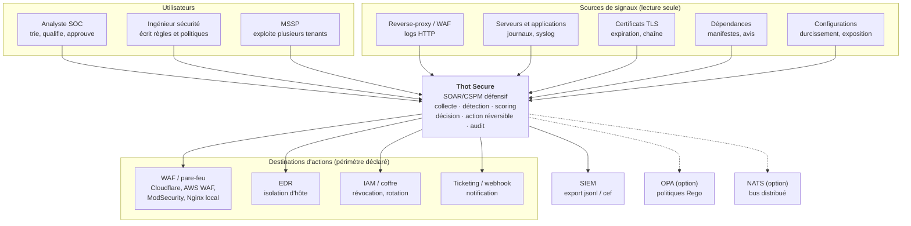
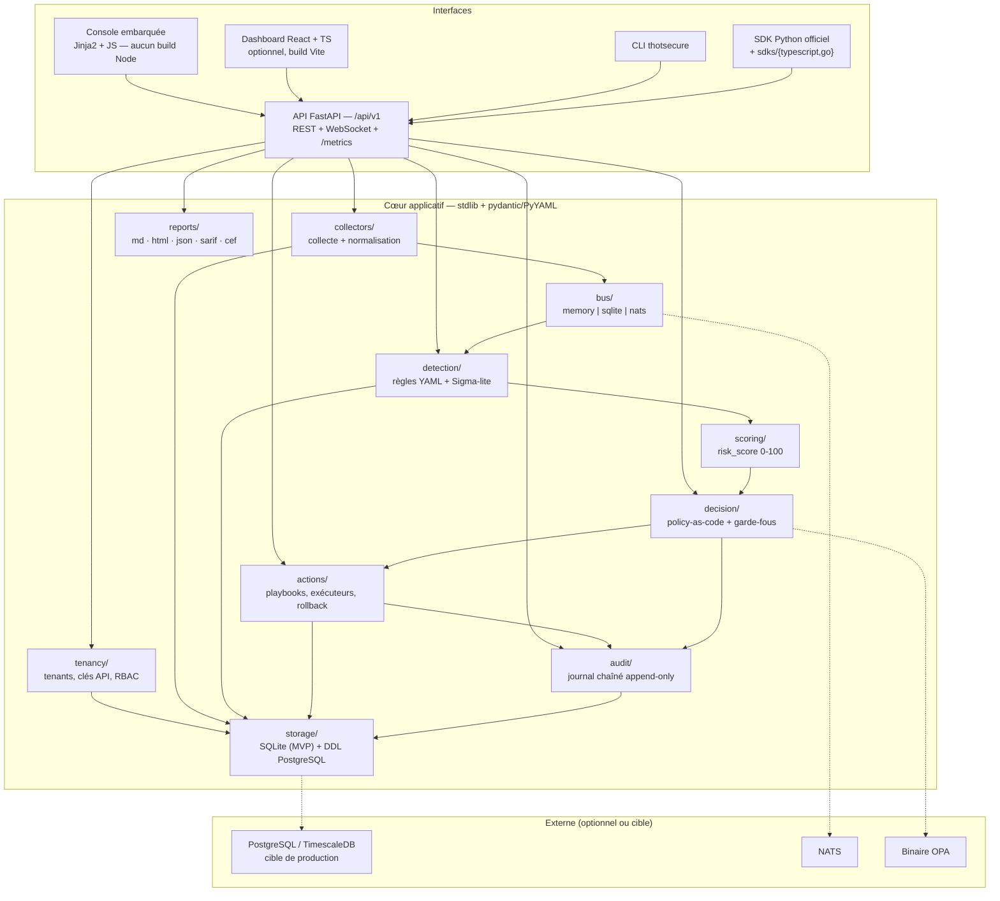
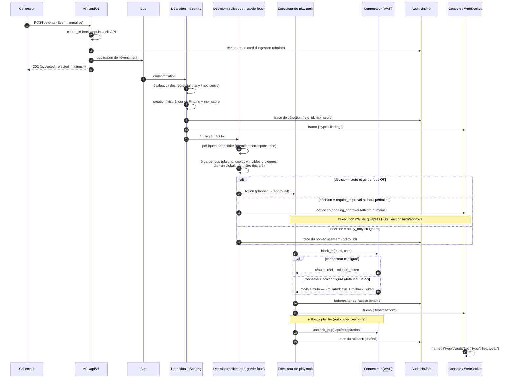
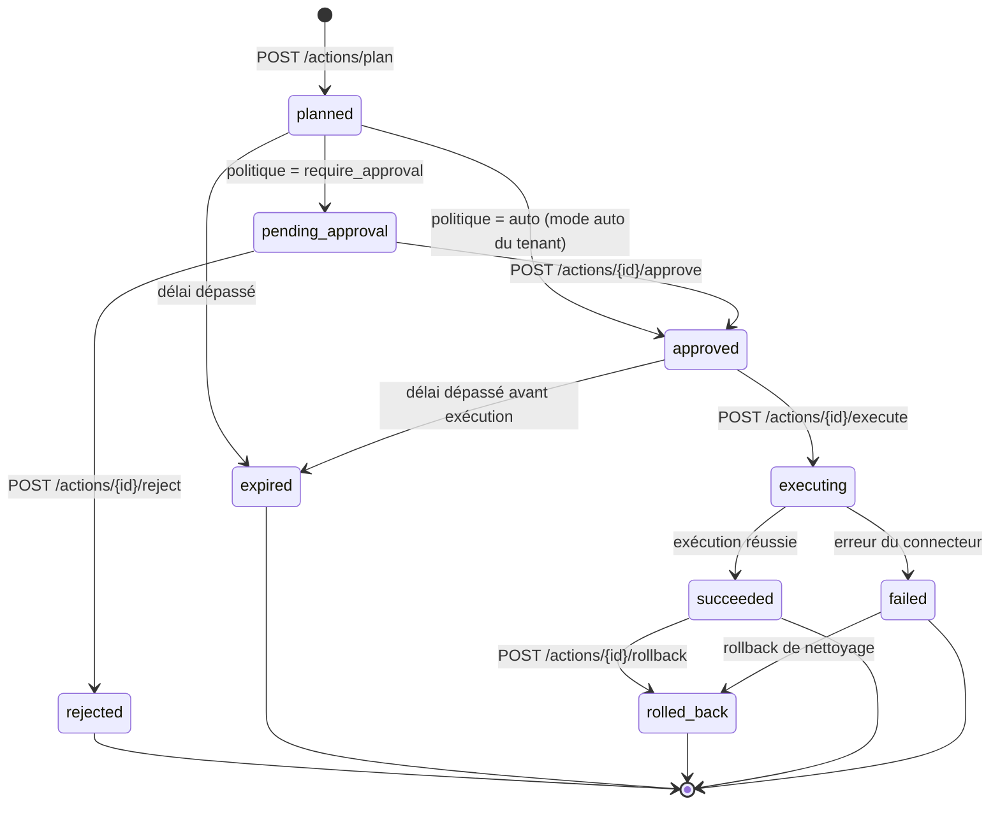
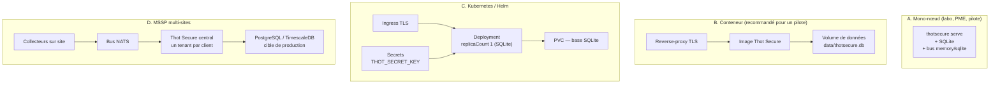

# Architecture — vue d'ensemble

*Comment Thot Secure est construit : contexte, conteneurs, composants du pipeline, séquence d'une mitigation automatique, cycle de vie d'une action et modèles de déploiement.*

Cette page explique le **fonctionnement**. Elle ne redéfinit **aucun** schéma de données, **aucune**
route et **aucune** variable : la référence normative est le
[contrat d'interface](api-contract.md) (gelé pour le sprint 1), complété par le
[modèle de données](data-model.md) pour les tables et le DDL. Quand une information n'est pas
fixée par le contrat, elle est signalée comme telle plutôt que devinée.

## Principes de conception

| Principe | Traduction concrète |
|---|---|
| **Défensif par construction** | Il n'existe pas de code d'attaque dans le produit : pas de scan agressif, pas de brute force, pas de hack-back. Voir l'[ADR 0006](../adr/0006-zero-capacite-offensive-comme-invariant.md). |
| **Sûr par défaut** | `DRY_RUN=true`, `AUTONOMY=supervised`, connecteurs non configurés en **mode simulé**, cibles protégées déclarées. |
| **Réversible** | Tout playbook est accompagné d'un rollback ; `POST /actions/{id}/rollback` doit réussir tant que le rollback n'a pas expiré. |
| **Traçable** | Journal **append-only chaîné par hash** ; chaque décision référence sa `policy_id`, chaque action son `audit_seq`. |
| **Isolé** | Tout objet porte un `tenant_id` ; toute requête SQL filtre dessus ; un test dédié le vérifie en CI. |
| **Portable** | Le cœur (`thotsecure.core`) ne dépend que de la **stdlib** + `pydantic`/`PyYAML`. FastAPI, Jinja2 et uvicorn sont des dépendances de la couche API. |
| **Enfichable** | Bus `memory` \| `sqlite` \| `nats` ; persistance SQLite au MVP, PostgreSQL/TimescaleDB comme cible de production ; Rego/OPA en option. |

## 1. Contexte (C4 niveau 1)

Qui utilise Thot Secure, et avec quoi il interagit. Rien de ce qui est à droite n'est attaqué :
ce sont soit des **sources** de signaux, soit des **destinations** d'actions autorisées.

!!! warning "Lire ce schéma correctement"

    Les flèches sortantes ne signifient pas « Thot Secure peut agir partout ». Une action n'est
    exécutée que si **cinq garde-fous** l'autorisent : plafond horaire par tenant, cooldown
    par couple (playbook, cible), cibles protégées jamais modifiées, dry-run global
    prioritaire, et approbation obligatoire hors périmètre déclaré. Voir
    [les 5 garde-fous](../decision/policies.md#les-5-garde-fous-non-contournables).

## 2. Conteneurs (C4 niveau 2)

Les briques exécutables et leur responsabilité. Les noms de modules correspondent à
l'arborescence cible du contrat (section 2).

### Responsabilités par module

| Module | Rôle | Points d'attention |
|---|---|---|
| `core/` | Configuration, modèles, erreurs, utilitaires | Ne dépend que de la stdlib + `pydantic`/`PyYAML` (invariant) |
| `storage/` | Persistance SQLite, DDL, rétention | Un seul écrivain avec SQLite → voir [dimensionnement](../operations/deployment.md) |
| `bus/` | Transport des événements | `memory` ne persiste **rien** ; `nats` ajoute une dépendance à exploiter |
| `audit/` | Journal chaîné, vérification, export | Append-only : aucune mise à jour, aucune suppression applicative |
| `tenancy/` | Tenants, clés API (hachées scrypt), capacités | Frontière d'isolation de tout le produit |
| `collectors/` | Collecte défensive + normalisation en `Event` | `probe` n'audite que les cibles déclarées du tenant |
| `detection/` | Moteur de règles YAML, seuils, dédup, Sigma-lite | Une règle invalide est rejetée avec diagnostic, sans casser le chargement |
| `scoring/` | Score de risque borné (sévérité, confiance, criticité d'actif) | Monotonie et bornes testées |
| `decision/` | Policy-as-code + gate d'approbation + garde-fous | Aucune politique ne contourne un garde-fou |
| `actions/` | Playbooks, exécuteurs, connecteurs, rollback | Mode simulé par défaut ; rollback obligatoire |
| `reports/` | Artefacts `md`, `html`, `json`, `sarif`, `cef` | SARIF 2.1.0 exploitable par GitHub Code Scanning |
| `api/` | REST v1, WebSocket, `/metrics`, RBAC | Exige `X-API-Key` ; le WS accepte `?api_key=` |
| `ui/` | Console embarquée sans étape de build | Utile en air-gap et sur un serveur sans Node |
| `cli.py` | Interface d'exploitation et d'automatisation | Codes de sortie 0/1/2/3, `--json` partout |

## 3. Composants du pipeline

Le trajet d'un fait brut jusqu'à la trace d'audit. Chaque flèche est un point où l'on peut
**observer** (métriques, journaux, WebSocket) et **rejouer** (idempotence, rollback).

```mermaid
flowchart LR
  SRC["Sources<br/>HTTP · logs · TLS · deps · config"] --> COL["Collecteurs<br/>défensifs"]
  COL --> NORM["Normalisation<br/>schema_version, tenant_id"]
  NORM --> BUS2["Bus<br/>memory · sqlite · nats"]
  BUS2 --> DET2["Détection<br/>règles YAML + Sigma-lite"]
  DET2 --> SCO2["Scoring<br/>risk_score 0-100"]
  SCO2 --> DEC2["Décision<br/>politiques par priorité"]
  DEC2 --> GF{"5 garde-fous"}
  GF -->|refus| AUD2["Audit<br/>trace du refus"]
  GF -->|auto| EXE["Exécution<br/>playbook"]
  GF -->|require_approval| APPR["Approbation<br/>humaine"]
  APPR -->|approved| EXE
  APPR -->|rejected| AUD2
  GF -->|notify_only| NOT["Notification<br/>webhook · ticket"]
  EXE --> CONN["Connecteurs<br/>WAF · EDR · IAM · ticketing<br/>ou mode simulé"]
  CONN --> RB["Rollback<br/>disponible, expiration"]
  RB --> AUD2
  NOT --> AUD2
  AUD2 --> EXP["Export<br/>jsonl · cef"]
  AUD2 --> REP2["Rapports<br/>md · html · json · sarif"]
```

| Étape | Entrée | Sortie | Où c'est défini |
|---|---|---|---|
| Collecte | Système source | `Event` normalisé | [Contrat §3.1](api-contract.md#31-event) |
| Détection | `Event` + règles | `Finding` | [Contrat §5](api-contract.md#5-format-des-regles-de-detection-yaml) · [guide des règles](../detection/rules.md) |
| Scoring | `Finding` | `risk_score` ∈ [0, 100] | [Contrat §5](api-contract.md#5-format-des-regles-de-detection-yaml) (`risk.base`) |
| Décision | `Finding` + politiques + tenant | `Decision` | [Contrat §6](api-contract.md#6-format-des-politiques-policy-as-code) · [politiques](../decision/policies.md) |
| Action | `Decision` | `Action` + rollback | [Contrat §3.4](api-contract.md#34-action) · [playbooks](../actions/playbooks.md) |
| Audit | Toute transition | `AuditRecord` chaîné | [Contrat §3.5](api-contract.md#35-auditrecord) |

## 4. Séquence d'une mitigation automatique

Le cas nominal : une attaque web détectée sur un actif critique, une politique `auto`, un
connecteur réel, puis un rollback automatique après expiration.

| Point de contrôle | Ce que le contrat garantit |
|---|---|
| `tenant_id` | **Forcé depuis la clé API**, jamais depuis le corps de la requête |
| Réponse d'ingestion | `202` avec `accepted`, `rejected`, `event_ids` et la liste des findings produits (avec leur `decision`) |
| Idempotence d'exécution | `execute` est idempotent via `idempotency_key` |
| Approbation manquante | `execute` sur une action `pending_approval` non approuvée → **`409`** |
| Rollback | Refusé si déjà `rolled_back` → **`409`** ; il doit réussir tant que le rollback n'a pas expiré |
| Traçabilité | Chaque décision porte `policy_id` ; chaque action porte `audit_seq` |

!!! note "Détails laissés à l'implémentation"

    Le contrat fixe les **transitions et les contrats d'interface**, pas l'ordonnancement
    interne (écriture de l'audit avant ou après l'appel au connecteur, exécution synchrone
    ou en tâche de fond, comportement exact en cas d'échec partiel d'un playbook). Ces
    points se lisent dans `src/thotsecure/actions/` et `src/thotsecure/decision/` : la page
    [playbooks](../actions/playbooks.md) décrit le comportement attendu et signale les zones
    à confirmer.

## 5. Cycle de vie d'une Action

Les neuf états du contrat (section 3.4) et leurs transitions. Le détail opérationnel, les
codes d'erreur et les routes est dans [Playbooks et connecteurs](../actions/playbooks.md).

| État | Signification | Sortie possible |
|---|---|---|
| `planned` | Action préparée, **aucun effet de bord** | `pending_approval`, `approved`, `expired` |
| `pending_approval` | En attente d'un humain | `approved`, `rejected` |
| `approved` | Autorisée, pas encore exécutée | `executing`, `expired` |
| `rejected` | Refusée — **terminal** | — |
| `executing` | En cours d'exécution | `succeeded`, `failed` |
| `succeeded` | Appliquée (réellement ou en simulation, selon `dry_run`/`simulated`) | `rolled_back` |
| `failed` | Échec d'exécution | `rolled_back` (nettoyage) |
| `expired` | Fenêtre d'exécution dépassée | — |
| `rolled_back` | Annulée — **terminal** | — |

!!! warning "Une action `executing` qui ne se termine jamais est un incident"

    C'est le cas le plus insidieux : le connecteur a peut-être appliqué la contre-mesure alors
    qu'Thot Secure croit encore l'action en cours. Procédure :
    [action bloquée en `executing`](../operations/runbook.md#6-action-bloquee-en-executing).

## 6. Modèle de déploiement

| Modèle | Adapté à | Limite à connaître |
|---|---|---|
| **A. Mono-nœud** | Découverte, labo, PME | Un seul écrivain (SQLite) ; pas de haute disponibilité |
| **B. Conteneur** | Pilote, déploiement reproductible | TLS délégué au reverse-proxy ; état sur un volume |
| **C. Kubernetes** | Industrialisation, GitOps | **`replicaCount: 1`** tant que la base est SQLite (pas de PVC partagé) |
| **D. MSSP multi-sites** | Plusieurs clients | Nécessite NATS ; PostgreSQL/TimescaleDB pour tenir la charge (roadmap) |

!!! info "Roadmap"

    La haute disponibilité active (plusieurs réplicas applicatifs, bascule automatique) et le
    stockage PostgreSQL/TimescaleDB en production ne font pas partie du MVP v0.1.0 : le DDL
    PostgreSQL est fourni **comme cible** dans le [modèle de données](data-model.md), mais
    l'exploitation reste mono-nœud. Voir [Déploiement](../operations/deployment.md) et la
    [feuille de route](../roadmap.md).

## Pour aller plus loin

| Sujet | Où |
|---|---|
| Toutes les routes, schémas et variables (référence normative) | [Contrat d'interface](api-contract.md) |
| Tables, index, DDL SQLite et PostgreSQL | [Modèle de données](data-model.md) |
| Menaces, abuse cases, invariants de conception | [Modèle de menaces (STRIDE)](threat-model.md) |
| Pourquoi ces choix techniques (et leurs inconvénients) | [ADR](../adr/0001-record-architecture-decisions.md) |
| Politiques et garde-fous | [Politiques de décision](../decision/policies.md) |
| Playbooks, connecteurs, mode simulé | [Playbooks et connecteurs](../actions/playbooks.md) |
| Dimensionnement, sauvegarde, supervision | [Déploiement](../operations/deployment.md) |

<!-- Métadonnées: statut=stable, version=0.1.0 (MVP), dernière revue=2026-09-13 -->
