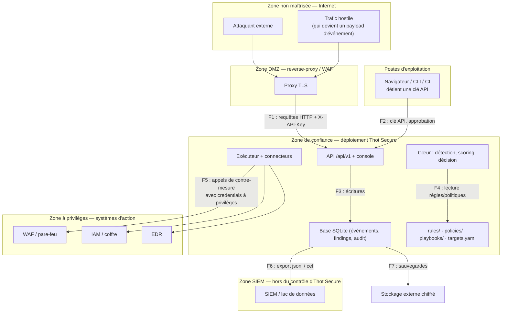

# Modèle de menaces (STRIDE)

*Analyse systématique de ce qui peut mal tourner avec Thot Secure — y compris quand l'outil de défense devient lui-même le problème.*

Un SOAR n'est pas un logiciel comme un autre : il **lit** des données de sécurité, il **décide**,
et surtout il **agit sur l'infrastructure**. Une compromission ne se limite donc pas à une fuite
d'information : elle peut devenir un moyen de couper la production, de bloquer des clients
légitimes ou de faire disparaître les traces d'une intrusion. C'est précisément ce document qui
sépare un outil crédible d'un script dangereux.

!!! warning "Statut des contre-mesures : « implémentée » signifie « exigée par le contrat »"

    La colonne « contre-mesure **implémentée** » liste ce que le [contrat d'interface](api-contract.md)
    **exige** (sections 1, 6, 7, 10) et ce que les tests attendus (section 11) doivent vérifier.
    Elle ne remplace pas une revue de code : à la date de rédaction, plusieurs points restent
    **à confirmer par lecture de `src/thotsecure/`** — ils sont signalés explicitement.
    La colonne « **planifiée / à faire** » liste ce qui **n'existe pas** dans le MVP v0.1.0 :
    ne comptez pas dessus en production (voir la [feuille de route](../roadmap.md)).

## 1. Périmètre, méthode et hypothèses

### Ce que ce modèle couvre

| Couvert | Détail |
|---|---|
| Le produit Thot Secure | API REST, CLI, console embarquée, moteur de détection, moteur de décision, exécuteur de playbooks et connecteurs, journal d'audit, persistance |
| Son exploitation | Déploiement, configuration, secrets, bus, déploiement en MSSP multi-clients |
| L'usage détourné | Ce qu'un attaquant (ou un opérateur négligent) peut faire **avec** Thot Secure contre l'infrastructure qu'il protège |
| Les données traitées | Événements, findings, actions, journal d'audit — et les données personnelles qu'ils contiennent |

### Ce que ce modèle ne couvre pas

* La sécurité de l'hébergeur, du système d'exploitation, du reverse-proxy et du réseau : ce
  sont des prérequis d'exploitation (voir [Déploiement](../operations/deployment.md)).
* Les failles des **systèmes cibles** (WAF, EDR, IAM) : Thot Secure les pilote, il ne les sécurise pas.
* La sécurité de la chaîne logistique **au-delà** du dépôt (miroir PyPI interne compromis,
  registre d'images compromis) : traitée ici au niveau des principes, pas exhaustivement.
* La conformité réglementaire en tant que telle (voir [RGPD](../compliance/rgpd.md) et
  [SOC 2 / ISO 27001](../compliance/soc2-iso27001.md)).

### Méthode

1. **Actifs** : ce qui a de la valeur (section 2).
2. **Frontières de confiance** : où le niveau de confiance change (section 3).
3. **Acteurs adverses** et hypothèses (section 4).
4. **Matrice STRIDE** par composant (section 5).
5. **Menaces détaillées** par catégorie STRIDE, avec impact et vraisemblance (section 6).
6. **Abuse cases** propres à un SOAR — les scénarios où l'outil devient l'arme (section 7).
7. **Invariants de conception** qui répondent aux menaces (section 8).
8. **Risques résiduels acceptés** et tests associés (sections 9 et 10).

### Échelle d'évaluation

| Vraisemblance | Signification |
|---|---|
| **Faible** | Nécessite une combinaison improbable de conditions, ou un accès déjà très privilégié |
| **Moyenne** | Réaliste pour un attaquant motivé disposant d'un accès réseau ou d'un compte valide |
| **Élevée** | Se produit en pratique sans effort particulier : erreur de configuration, compte négligé, source de logs non maîtrisée |

| Impact | Signification |
|---|---|
| **Faible** | Gêne opérationnelle, perte d'information mineure |
| **Moyen** | Indisponibilité partielle, données sensibles exposées à un cercle restreint, confiance dégradée |
| **Élevé** | Action non désirée sur l'infrastructure, fuite de données personnelles, rupture de traçabilité |
| **Critique** | Atteinte à la disponibilité de la production, perte de preuve d'audit, perte de contrôle de l'automatisation |

## 2. Actifs à protéger

| Actif | Où il vit | Pourquoi il est critique | Protection attendue |
|---|---|---|---|
| **Clés API** (`ao_…`) | Base (`api_keys`, hachées scrypt) + copies chez les clients (CI, `.env`, scripts) | Une clé = une identité, donc des capacités (`execute:actions`, `approve:actions`, `admin:*`) | Stockage **haché** jamais en clair, affichage unique, `last_used_at`/`revoked_at`, révocation immédiate, une clé par usage et par rôle |
| **Base SQLite** (`sqlite:///./data/thotsecure.db`) | Système de fichiers | Contient **tout** : événements, findings, actions, journal d'audit | Disque chiffré, droits `0600`, sauvegardes chiffrées, `journal_mode=WAL`, accès réseau nul |
| **Journal d'audit** (`audit_log`) | Table append-only chaînée par hash | C'est la **preuve** : qui a décidé quoi, quand, et qui a approuvé | Chaîne de hash, append-only, vérification `audit/verify`, **export SIEM externe** |
| **Règles de détection** (`rules/`) | Fichiers YAML versionnés | Ce qui est vu… et ce qui ne l'est pas. Une règle supprimée = un angle mort | Versionnement Git, revue en PR, `rules/validate`, rechargement explicite, droits d'écriture restreints |
| **Politiques de décision** (`policies/`) | Fichiers YAML (+ Rego optionnel) | Ce qui décide d'agir **sans humain** | Revue obligatoire, garde-fous hors politique, priorité visible via `GET /policies` |
| **Playbooks** (`playbooks/`) | Fichiers YAML | Ce que le produit **fait** concrètement : c'est une capacité d'action | Revue obligatoire, rollback exigé, `dry_run_capable: true`, mode simulé par défaut |
| **Connecteurs d'action et leurs credentials** (Cloudflare, AWS WAF, ModSecurity, Nginx local, EDR, IAM/Vault, ticketing) | Configuration de déploiement + coffre | Un jeton de blocage WAF ou de révocation IAM est un **pouvoir réel sur la production** | Moindre privilège (jeton dédié, portée limitée), rotation, jamais dans le dépôt. *Le contrat ne définit **aucune** variable `THOT_*` par connecteur : leur emplacement exact est à confirmer par le code* |
| **`THOT_SECRET_KEY`** | Environnement / coffre | Pepper des clés API + signature. Sa perte casse l'authentification ; sa fuite facilite le cassage hors ligne de hashes | Longueur suffisante, coffre, sauvegarde **séparée** de la base, rotation maîtrisée |
| **Clé de pseudonymisation** (si mise en œuvre) | Coffre, **hors** base et distincte de `THOT_SECRET_KEY` | Elle transforme une IP pseudonymisée en donnée personnelle réversible | Coffre, accès restreint, procédure de destruction documentée (voir [RGPD](../compliance/rgpd.md)) |
| **Flux d'événements** | Bus (`memory` \| `sqlite` \| `nats`) | Falsifier un flux, c'est piloter ce que l'outil croit voir | Cloisonnement réseau, authentification/TLS NATS, `tenant_id` forcé depuis la clé |
| **`config/targets.yaml`** | Dépôt / hôte | Définit le **périmètre** : ce sur quoi une action automatique peut porter | Revue, droits d'écriture restreints, jamais élargi « pour que ça marche » |

## 3. Frontières de confiance

| # | Frontière | Ce qui la traverse | Contrôle | Risque si le contrôle lâche |
|---|---|---|---|---|
| **F1** | Internet → API | Trafic hostile, mais aussi **payloads d'attaque** stockés puis affichés | TLS, RBAC par clé API, rate limit `THOT_RATE_LIMIT_PER_MIN`, limite de taille de corps, échappement à l'affichage | Déni de service, XSS stocké, saturation disque |
| **F2** | Poste → API | Clé API, décisions d'approbation humaines | Clé nominative, rôle minimal, capacités `approve:actions`/`execute:actions` | Action prise sous une identité non traçable, approbation de complaisance |
| **F3** | API → base | Toute écriture métier + audit | Filtre `tenant_id` systématique, requêtes paramétrées, append-only sur `audit_log` | Fuite inter-tenant, falsification de l'audit |
| **F4** | Hôte → règles/politiques/playbooks | Fichiers YAML qui pilotent détection et action | Droits d'écriture restreints, versionnement, revue | Angle mort de détection, exécution automatique non voulue |
| **F5** | Thot Secure → systèmes d'action | **Contre-mesures réelles** avec des credentials à privilèges | 5 garde-fous, dry-run par défaut, rollback, cibles protégées | Coupure de production, déni de service interne |
| **F6** | Base → SIEM | Copie de données (audit, findings, données personnelles) | Capacité `read:audit`, export explicite, contrat avec le destinataire | Exfiltration silencieuse, transfert non encadré (RGPD) |
| **F7** | Base → sauvegarde | Image complète du système | Chiffrement, clé stockée séparément, test de restauration | Fuite massive, ou perte de la preuve d'audit |

!!! danger "La frontière la plus dangereuse est F5"

    Toutes les autres frontières protègent **l'information**. F5, elle, donne le pouvoir de
    **modifier la production**. C'est pourquoi les garde-fous y sont structurels (dans le
    moteur de décision, pas dans les politiques) et pourquoi le dry-run est le défaut.

## 4. Acteurs adverses et hypothèses

| Acteur | Motivation | Capacité | Menaces principales |
|---|---|---|---|
| **Attaquant externe** | Intrusion, déni de service | Requêtes HTTP, payloads malveillants, éventuellement compte volé | Poisoning de détection, XSS stocké, saturation d'ingestion, déclenchement de blocages |
| **Attaquant opportuniste** | Scan, recherche de faiblesse | Connaît les défauts d'installation (`ao_dev_local_change_me`, `0.0.0.0`) | Prise de contrôle administrative, actions arbitraires |
| **Initié malveillant** | Sabotage, dissimulation, vengeance | Compte valide à faible privilège, parfois lecture des fichiers | Suppression de règle, suppression de trace, approbation abusive |
| **Opérateur négligent** | Gagner du temps | Accès légitime complet | `DRY_RUN=false` prématuré, `AUTONOMY=auto` sans revue, périmètre élargi, secrets committés |
| **Source de logs non maîtrisée** | — | Émet du contenu qu'elle contrôle (User-Agent, chemin, corps) | Injection de contenu affiché, ReDoS, saturation |
| **Destinataire d'export (SIEM)** | Curiosité, compromission | Reçoit des copies de données | Fuite de données personnelles hors périmètre |
| **Dépendance compromise** | Supply chain | Exécution de code dans le processus Thot Secure | Élévation complète, exfiltration, modification des règles |
| **MSSP curieux / maladroit** | Rentabilité, erreur d'exploitation | Accès légitime à plusieurs tenants | Débordement entre tenants, action sur le mauvais client |

**Hypothèses assumées**

1. Le système d'exploitation, le disque et le réseau de l'hôte sont correctement administrés
   (sinon le modèle s'effondre — un attaquant root peut tout réécrire, y compris l'audit).
2. Les utilisateurs détenteurs de clés `responder`/`admin` sont des personnes de confiance,
   sensibilisées et identifiables (une clé partagée détruit la valeur probante de l'audit).
3. Le dépôt Git et la chaîne de build sont protégés par une revue par les pairs.
4. Les cibles déclarées dans `config/targets.yaml` appartiennent réellement au tenant.
5. Une compromission **complète** de l'hôte (root) est **hors de portée** de ce que le produit
   peut détecter : l'audit chaîné devient alors seulement *informatif* (voir T1).

## 5. Matrice STRIDE par composant

`●` = risque principal · `○` = risque secondaire · `—` = risque marginal

| Composant | **S** | **T** | **R** | **I** | **D** | **E** |
|---|---|---|---|---|---|---|
| API REST / WebSocket | ● | ● | ● | ● | ● | ● |
| Authentification, clés, RBAC | ● | ● | ● | ● | ○ | ● |
| Moteur de détection (règles) | ○ | ● | ○ | ○ | ● | ● |
| Scoring | — | ○ | — | — | — | ○ |
| Moteur de décision (politiques, garde-fous) | ● | ● | ● | ○ | ● | ● |
| Exécuteur de playbooks et connecteurs | ○ | ● | ● | ● | ● | ● |
| Journal d'audit | ○ | ● | ● | ● | ● | ● |
| Persistance (SQLite) | ○ | ● | ○ | ● | ● | ● |
| Bus d'événements | ● | ● | ○ | ● | ● | ○ |
| Console embarquée / dashboard | ○ | ● | — | ● | ○ | ● |
| Configuration (`config/`, variables) | ○ | ● | — | ● | ○ | ● |
| Chaîne de dépendances et build | ○ | ● | — | ● | ○ | ● |

## 6. Menaces détaillées

### 6.1 Spoofing (usurpation d'identité)

| Réf | Composant | Scénario | Impact | Vraisemblance | Contre-mesure **implémentée** (exigée par le contrat) | Reste à faire / **planifié** |
|---|---|---|---|---|---|---|
| **S1** | Clés API | Une clé `admin` traîne dans un `.env`, une image de conteneur ou une variable CI d'un pipeline public | **Critique** — pouvoir d'exécution et d'administration sur l'infrastructure | **Élevée** (c'est l'accident le plus courant) | Clés **hachées scrypt** jamais réaffichables ; révocation immédiate `DELETE /api/v1/keys/{key_id}` → `204` ; `last_used_at`/`revoked_at` visibles ; capacités par rôle ; journal `actor` | Secrets dans un coffre, rotation automatique, restriction par source réseau, **MFA/SSO au niveau du reverse-proxy** (roadmap) |
| **S2** | Ingestion | Une source non maîtrisée émet des événements falsifiés pour **déclencher** une action (poisoning) ou pour **noyer** une vraie alerte | **Élevé** — action non désirée, angle mort | Moyenne | `tenant_id` **forcé depuis la clé API** (jamais depuis le corps) ; rate limit `THOT_RATE_LIMIT_PER_MIN` ; taille de corps limitée ; seuils et `dedup` qui rendent le bruit coûteux | Authentification des collecteurs (mTLS ou signature), marquage de confiance de la source, détection d'anomalie de volume (roadmap) |
| **S3** | WebSocket | `?api_key=…` accepté parce qu'un navigateur ne pose pas d'en-tête sur `ws://` : la clé se retrouve dans les journaux d'accès du proxy ou l'historique | **Moyen** — fuite d'une clé en lecture | Moyenne | Capacité `read:events` requise ; TLS ; clé dédiée possible | Ticket WebSocket éphémère (courte durée de vie), journalisation filtrée côté proxy (roadmap) |
| **S4** | Authentification | Un opérateur partage une clé « commune » d'équipe pour aller plus vite | **Élevé** — l'audit ne permet plus d'attribuer une action à une personne | **Élevée** | `actor` et `actor_role` journalisés ; `label` par clé (`--label ci`) ; une clé par usage recommandée | Politique d'exploitation : interdiction des clés partagées, revue d'accès périodique |

### 6.2 Tampering (falsification)

| Réf | Composant | Scénario | Impact | Vraisemblance | Contre-mesure **implémentée** | Reste à faire / **planifié** |
|---|---|---|---|---|---|---|
| **T1** | Journal d'audit | Un attaquant avec accès en écriture au fichier SQLite modifie un enregistrement, ou **réécrit toute la chaîne** depuis le genesis pour rester cohérent | **Critique** — perte de la valeur probante | Moyenne | Chaîne de hash §3.5, append-only, triggers `RAISE(ABORT)` en défense en profondeur, `GET /audit/verify` → `broken_at`, code de sortie `3`, export JSONL/CEF | **Ancrage externe** (Merkle périodique, horodatage, WORM, SIEM immuable) — c'est la seule vraie parade à une réécriture complète (voir [Menaces liées à l'audit](#menaces-liees-a-laudit)) |
| **T2** | Règles de détection | Modification d'une règle YAML : seuil relevé, `enabled: false`, `source_types` restreints → **angle mort silencieux** | **Élevé** — attaque invisible | Moyenne (accès fichier ou compte `admin:rules`) | Versionnement Git + revue, `POST /rules/validate`, rechargement **explicite** (`rules/reload`), capacité `admin:rules`, journalisation des rechargements | Contrôle d'intégrité des règles (signature, hachage de référence), revue périodique de la couverture, alerte sur désactivation de règle `stable` |
| **T3** | Politiques | Passage d'une politique en `decision: auto` / `dry_run: false` pour « que ça marche enfin » | **Critique** — automatisation non gouvernée | Moyenne | Les 5 garde-fous sont **hors** de la politique ; dry-run global prioritaire ; `admin:policies` ; ordre de priorité visible | Approbation à deux personnes sur les politiques `auto`, revue obligatoire, journalisation renforcée |
| **T4** | Périmètre | Élargissement de `config/targets.yaml` (ajout d'un CIDR trop large, d'un domaine d'hébergeur) | **Critique** — l'automatisation peut viser des systèmes tiers | Moyenne | Toute cible hors périmètre → `require_approval` ; cibles protégées jamais modifiées ; périmètre déclaré explicitement | Contrôle d'intégrité du fichier, alerte sur modification, revue trimestrielle |
| **T5** | Base de données | Écriture directe dans la table `actions` pour passer une action en `approved` sans passer par l'API | **Élevé** — contournement du RBAC et de l'approbation | Faible à moyenne (nécessite un accès fichier) | Transitions contrôlées par l'API ; audit de chaque transition avec `before`/`after` ; incohérence détectable (transition sans trace d'audit) | Contraintes d'état en base (trigger de transition), réconciliation périodique actions ↔ audit |
| **T6** | Exécution | Faire passer une exécution simulée pour réelle (ou l'inverse) dans un rapport | **Élevé** — fausse impression de protection ou de maîtrise | Faible | `dry_run` porté par l'`Action`, mode simulé tracé (`simulated: true`), `rollback_token` retourné, mode d'autonomie exposé par `/version`, `/whoami` et `stats/overview` | Vérification automatique de cohérence entre `dry_run`, `simulated` et le connecteur réellement appelé |

#### Menaces liées à l'audit

Le journal d'audit est l'actif le plus subtil, parce que sa **valeur est entièrement dans son
intégrité**. Quatre propriétés sont nécessaires, et le MVP n'en garantit que trois :

| Propriété | Garantie au MVP ? | Détail |
|---|---|---|
| **Append-only** | Oui | Aucune mise à jour, aucune suppression applicative ; triggers `BEFORE UPDATE`/`BEFORE DELETE` qui refusent l'opération |
| **Chaîné** | Oui | `hash = sha256("{seq}|{ts}|{tenant_id}|{actor}|{actor_role}|{action}|{canonical(target)}|{canonical(before)}|{canonical(after)}|{prev_hash}")`, genesis `sha256:genesis` |
| **Vérifiable** | Oui | Recalcul complet par `GET /api/v1/audit/verify` → `{"valid":…,"records":n,"broken_at":…}` ; `thotsecure audit verify` avec code de sortie `3` |
| **Ancré à l'extérieur** | **Non (roadmap)** | Sans copie hors système, une réécriture complète et cohérente de la chaîne reste indétectable. La parade est l'**export régulier** (`/audit/export?format=jsonl\|cef`) vers un SIEM, un stockage WORM ou un ancrage d'horodatage |

Trois pièges opérationnels à connaître :

* **La vérification coûte O(n)** : elle relit toute la chaîne. Sur un historique volumineux,
  prévoyez une vérification par plage et non à chaque minute (l'implémentation incrémentale
  reste à confirmer par `src/thotsecure/audit/`).
* **Une restauration de sauvegarde peut créer une divergence de chaîne.** Restaurer une base
  plus ancienne que le dernier export SIEM produit deux histoires incompatibles : c'est un
  incident à traiter, pas une simple opération de maintenance
  (voir [Runbook : audit verify échoue](../operations/runbook.md#3-audit-verify-echoue)).
* **L'immuabilité s'oppose au droit à l'effacement.** On ne supprime pas une entrée d'audit :
  on pseudonymise à la source. Le compromis est expliqué honnêtement dans
  [RGPD](../compliance/rgpd.md#droits-des-personnes-et-immuabilite-de-laudit).

### 6.3 Repudiation (contestation)

| Réf | Composant | Scénario | Impact | Vraisemblance | Contre-mesure **implémentée** | Reste à faire / **planifié** |
|---|---|---|---|---|---|---|
| **R1** | Approbation | Un opérateur nie avoir approuvé un blocage qui a coupé un service | **Élevé** — responsabilité non établie | Moyenne | `audit.approve` avec `actor`, `actor_role`, `before`/`after` (`pending_approval` → `approved`), `approved_by`/`approved_at` sur l'action ; capacité `approve:actions` | Clés nominatives obligatoires, MFA, revue d'accès, rétention d'audit plus longue que les événements |
| **R2** | Suppression de détection | Un analyste utilise `POST /findings/{id}/suppress` pour faire taire une alerte gênante plutôt que la traiter | **Moyen** — angle mort volontaire non justifié | Moyenne | Suppression tracée (`reason`, `duration_seconds`), liée à une règle, expirable, écrite dans l'audit ; alternative propre : `close` avec `resolution` (`true_positive`/`false_positive`/`mitigated`) | Revue périodique des suppressions actives, alerte sur suppression longue durée, rapport « qui a fait taire quoi » |
| **R3** | Non-agissement | Personne ne peut expliquer pourquoi une alerte critique n'a déclenché aucune action | **Moyen** — perte de confiance, trou dans le récit d'incident | Moyenne | Toute décision est journalisée avec sa `policy_id` ; `notify_only` par défaut si aucune politique ne matche ; `ignore` exige une politique explicite ; `reason` de la décision conservé | Rapport « décisions sans suite », rappel automatique des findings `open` (roadmap) |
| **R4** | Console | Modification d'un finding par l'interface sans trace équivalente | **Moyen** — écart entre ce que montre l'UI et l'audit | Faible | La console s'appuie sur l'API : mêmes capacités, mêmes traces | Test d'exhaustivité « toute mutation via l'UI produit un enregistrement d'audit » |

### 6.4 Information disclosure (divulgation d'information)

| Réf | Composant | Scénario | Impact | Vraisemblance | Contre-mesure **implémentée** | Reste à faire / **planifié** |
|---|---|---|---|---|---|---|
| **I1** | Base de données | Copie du fichier SQLite (sauvegarde non chiffrée, snapshot VM, poste de développement) | **Élevé** — événements et IP = données personnelles ; cartographie complète du SI exposée | Moyenne | Droits restreints, disque chiffré **documenté**, pas d'exposition réseau de la base, `THOT_SECRET_KEY` hors base | Chiffrement applicatif de champs sensibles, sauvegardes chiffrées avec clé séparée (voir [Déploiement](../operations/deployment.md)) |
| **I2** | Pseudonymisation | Fuite de la clé de pseudonymisation : les IP hachées redeviennent identifiantes par recalcul | **Élevé** — réidentification des personnes | Faible à moyenne | Clé **hors base**, distincte de `THOT_SECRET_KEY`, dans un coffre ; destruction documentée | Rotation de clé, séparation des rôles (celui qui exploite ne détient pas la clé) |
| **I3** | Export SIEM | Export massif de l'audit ou des findings vers un destinataire non encadré (voir [abuse case A3](#a3-exfiltration-via-lexport-siem)) | **Élevé** — exfiltration discrète et légitime en apparence | Moyenne | Capacité `read:audit`/`read:findings`, export explicite et donc journalisable, format maîtrisé | Limitation de débit/volume sur l'export, alerte sur volume anormal, scoping par tenant, contrat de sous-traitance |
| **I4** | Observabilité | `/metrics` exposé sur Internet : il est déclaré « public (réseau interne) » par le contrat | **Moyen** — cartographie de l'activité, volumes, top règles | **Élevée** (erreur de reverse-proxy) | Documentation explicite, réseau interne attendu, `/metrics` séparé des routes authentifiées | Authentification optionnelle des métriques, contrôle automatisé de l'exposition |
| **I5** | Journaux applicatifs | `THOT_LOG_LEVEL=DEBUG` laissé en production : payloads, chemins, éventuels identifiants écrits en clair dans les journaux | **Moyen** — fuite par les journaux, souvent copiés vers un SIEM | **Élevée** | Défaut `INFO`, format `json`, `THOT_ENV=prod` masque les erreurs détaillées | Masquage automatique de champs sensibles, revue de niveau en production, alerte si `DEBUG` actif |
| **I6** | Console embarquée | Un payload d'attaque contenant du HTML/JS est affiché tel quel dans la console ou un rapport HTML | **Élevé** — XSS stocké, vol de session/clé | Moyenne | Échappement par le moteur de template (Jinja2), CSP à définir | Voir [abuse case A5](#a5-xss-via-un-payload-dattaque-affiche-en-console) : tests d'échappement systématiques, CSP stricte, en-têtes de sécurité |
| **I7** | Rapports | Un rapport `html` ou `json` partagé par courriel contient des IP, chemins, `user_agent` non pseudonymisés | **Moyen** — diffusion de données personnelles hors du périmètre prévu | Moyenne | Formats maîtrisés (`md`/`html`/`json`/`sarif`), génération à la demande | Pseudonymisation à l'export, marquage de confidentialité, sensibilisation des analystes |

### 6.5 Denial of service (déni de service)

| Réf | Composant | Scénario | Impact | Vraisemblance | Contre-mesure **implémentée** | Reste à faire / **planifié** |
|---|---|---|---|---|---|---|
| **D1** | Ingestion | `POST /events` inondé (accidentel ou volontaire) : saturation du disque, du CPU de détection et du bus | **Élevé** — l'outil de détection devient indisponible | **Élevée** | `THOT_RATE_LIMIT_PER_MIN` (défaut 600), limite de taille de corps, lots ≤ 500 événements, `payload` ≤ 32 Kio tronqué avec `raw_ref` | Quotas par tenant, backpressure explicite, échantillonnage d'urgence, alerte sur taux de rejet |
| **D2** | Moteur de détection | **ReDoS** : une règle contenant un motif à backtracking catastrophique (ou injectée par un compte `admin:rules`) fige le moteur | **Élevé** — plus aucune détection | Moyenne | Les regex de règle sont compilées **avec un timeout d'exécution** (exigence §10), pas d'`eval` de template utilisateur | Analyse statique des motifs à l'entrée (`rules/validate`), rejet des constructions connues comme dangereuses, budget CPU par évaluation |
| **D3** | Automatisation | **Déni de service interne** : une action de blocage détournée coupe l'accès légitime (voir [abuse case A1](#a1-action-de-blocage-detournee-en-deni-de-service-interne)) | **Critique** — production inaccessible | Moyenne | Plafond `max_actions_per_hour` (défaut 20), `cooldown` par (playbook, cible), **cibles protégées jamais modifiées**, dry-run par défaut, hors périmètre → approbation | Simulation d'impact avant application, garde-fou sur la **taille** d'un CIDR bloqué, plafond d'actions simultanées par cible distincte |
| **D4** | Disque | Rétention mal réglée, WAL qui gonfle, ou purge jamais exécutée | **Élevé** — base corrompue ou service arrêté | **Élevée** | `THOT_RETENTION_DAYS` (défaut 30) purge les événements ; `journal_mode=WAL` ; volumétrie documentée dans le [modèle de données](data-model.md) | Alerte de seuil disque, purge planifiée et supervisée, `VACUUM`/checkpoint automatisés, quota d'ingestion |
| **D5** | Bus | NATS indisponible (`THOT_BUS=nats`) : plus de flux distribué, `/readyz` passe à `503` | **Moyen** — collecte interrompue, temps réel perdu | Moyenne | `/readyz` vérifie base + bus + règles et signale l'indisponibilité ; bascule possible vers `memory` ou `sqlite` | NATS en cluster, supervision du bus, file d'attente locale de collecte |
| **D6** | Persistance | Verrou d'écriture SQLite : un écrivain unique, des collecteurs qui se marchent dessus | **Moyen** — latence et rejets en rafale | Moyenne | Un seul nœud assumé, dimensionnement documenté, `journal_mode=WAL` | PostgreSQL/TimescaleDB (cible de production), file d'ingestion découplée |

### 6.6 Elevation of privilege (élévation de privilèges)

| Réf | Composant | Scénario | Impact | Vraisemblance | Contre-mesure **implémentée** | Reste à faire / **planifié** |
|---|---|---|---|---|---|---|
| **E1** | RBAC | Un rôle `viewer` ou `analyst` parvient à exécuter une action (capacité non vérifiée sur une route) | **Critique** — action réelle par un compte non habilité | Faible à moyenne (dépend de la rigueur d'implémentation) | Capacités vérifiées par dépendance FastAPI **et** dans le core ; `execute:actions` et `approve:actions` distincts ; tests d'autorisation attendus | Tests exhaustifs route × rôle (matrice d'autorisation), revue automatisée à chaque nouvelle route |
| **E2** | Isolation multi-tenant | Un appelant atteint les données d'un autre tenant (paramètre oublié, jointure sans filtre) | **Critique** — rupture de confidentialité majeure pour un MSSP | Faible à moyenne | Tout objet porte `tenant_id` ; toute requête SQL filtre dessus ; `tenant_id` forcé depuis la clé ; **test dédié en CI** | Row Level Security côté PostgreSQL (roadmap), tests d'isolation sur chaque nouvelle route, revue obligatoire |
| **E3** | Chargement des règles | **Règle YAML malveillante** exécutant du code au chargement (voir [abuse case A4](#a4-injection-via-une-regle-yaml-malveillante)) | **Critique** — exécution de code dans le processus | Faible si le chargement est sûr | Le contrat exige l'absence d'`eval` de template utilisateur ; une règle invalide est **rejetée avec diagnostic** sans casser le chargement | **À vérifier dans `src/thotsecure/detection/`** : le chargement YAML doit utiliser un analyseur **sûr** (`safe_load`) et jamais reconstruire d'objet arbitraire. Validation de schéma stricte des règles (roadmap) |
| **E4** | Politiques Rego/OPA | Politique Rego permissive, ou binaire OPA compromis/remplacé | **Critique** — décisions d'action détournées | Faible | OPA est **optionnel** (`THOT_OPA_BIN` + binaire présent) ; retour au YAML sinon ; les 5 garde-fous s'appliquent **en dehors** de la politique | Signature/vérification du binaire OPA, revue obligatoire des politiques Rego, journalisation du moteur utilisé |
| **E5** | Ajout de playbook / connecteur | Ajout d'un playbook qui exécute autre chose que ce que son nom annonce (capacité d'action déguisée) | **Critique** — pouvoir d'action illimité sur l'infrastructure | Faible (nécessite un accès fichier ou une PR fusionnée) | Playbooks versionnés avec le code, revue par les pairs, rollback obligatoire, mode simulé par défaut | Validation de schéma au chargement (`params_schema`), refus des playbooks sans rollback, revue de sécurité dédiée pour `playbooks/` |
| **E6** | Chaîne d'approvisionnement | Une dépendance Python compromise s'exécute dans le processus (accès clés, base, connecteurs) | **Critique** — compromission complète | Moyenne | Le cœur ne dépend que de la **stdlib + `pydantic`/`PyYAML`** : surface volontairement minuscule ; couche API séparée | Verrouillage par hachages (`--require-hashes`), SBOM, build reproductible, binaires signés cosign, veille sur les avis (voir [Installation](../installation.md)) |
| **E7** | Configuration | `THOT_HOST=0.0.0.0` avec `THOT_BOOTSTRAP_API_KEY` par défaut : prise de contrôle administrative triviale | **Critique** — l'attaquant devient administrateur d'Thot Secure, donc de l'automatisation | **Élevée** si exposé | Valeur par défaut **publiquement connue et signalée comme à changer** ; avertissement à la génération de `THOT_SECRET_KEY` | Refus de démarrage en `THOT_ENV=prod` si la clé d'amorçage est le défaut, `thotsecure doctor` bloquant, contrôle de configuration en CI |

## 7. Abuse cases : quand le SOAR devient l'arme

Les menaces ci-dessus concernent la compromission du produit. Les abuse cases ci-dessous sont
plus spécifiques et plus insidieux : **l'attaquant n'a pas besoin de compromettre Thot Secure** —
il lui suffit de le faire agir comme prévu, mais sur la mauvaise cible.

### A1. Action de blocage détournée en déni de service interne

| | |
|---|---|
| **Scénario** | Un attaquant (ou un faux positif) provoque un blocage d'adresse large : une plage entière au lieu d'une IP, l'adresse du reverse-proxy, celle du NAT d'entreprise, celle d'un CDN partagé, ou un préfixe incluant les administrateurs. Les utilisateurs légitimes sont bloqués — c'est **vous** qui êtes hors ligne. |
| **Prérequis** | Une politique `auto` sur un playbook de blocage ; un paramètre `target` dérivé d'un champ contrôlé par l'attaquant (ex. `X-Forwarded-For` usurpable) ; une cible non protégée. |
| **Chemin d'attaque** | Émettre des requêtes portant une IP usurpée dans un en-tête de proxy → la règle produit un finding `high` → la politique décide `auto` → le playbook bloque l'IP… qui est celle du proxy, du bureau ou du CDN. |
| **Impact** | **Critique** — indisponibilité de production, effet inverse de l'objectif de sécurité, incident majeur causé par l'outil censé le prévenir. |
| **Contre-mesures implémentées** | Plafond `max_actions_per_hour` par tenant ; `cooldown` par `(tenant, playbook, cible)` ; **cibles protégées de l'`autonomy_allowlist` jamais modifiées** ; toute cible **hors périmètre déclaré** → `require_approval` ; dry-run global prioritaire ; `duration_seconds` borné (`min: 60`, `max: 604800`) donc **toute action de blocage expire** ; rollback disponible. |
| **Contre-mesures planifiées** | Garde-fou sur la **taille** d'un CIDR (refus au-delà d'un seuil), simulation d'impact avant application, interdiction de bloquer l'IP source du proxy ou une adresse de sortie déclarée, plafond d'actions simultanées sur des cibles distinctes, revue obligatoire des playbooks de blocage. |
| **Invariants qui répondent** | 1 (dry-run), 2 (réversibilité + expiration), 5 (garde-fous : plafond, cooldown, cibles protégées, périmètre), 6 (aucune escalade contre un tiers). |

**Recommandation opérationnelle :** la première fois qu'un playbook de blocage est activé en
`auto`, faites-le sur **une seule IP**, sur **un tenant**, avec un plafond bas et une astreinte
prévenue.

### A2. Faux positif massif bloquant la production

| | |
|---|---|
| **Scénario** | Une règle trop large (motif regex permissif, seuil trop bas, `source_types` trop larges) matche du trafic légitime : navigation normale, sondes de supervision, intégration B2B, robot d'indexation. Chaque match produit un finding, chaque finding déclenche la politique, et la politique exécute un blocage. En quelques minutes, des dizaines de sources légitimes sont coupées. |
| **Prérequis** | Règle non éprouvée en production ; politique `auto` avec un seuil de risque bas ; mode `auto` activé avant observation. |
| **Impact** | **Critique** — incident de disponibilité provoqué en interne ; perte de confiance dans l'automatisation pour des mois. |
| **Contre-mesures implémentées** | Défaut `supervised` + `DRY_RUN=true` : on **observe** avant d'agir ; `require_approval` pour les cas sensibles ; plafond horaire qui borne mécaniquement l'ampleur des dégâts ; `dedup` (`key`, `ttl_seconds`) qui regroupe au lieu de répéter ; `threshold.count`/`window_seconds` qui exigent une répétition ; champ `false_positives` **obligatoire dans la bonne pratique** de rédaction de règle ; rollback pour revenir en arrière ; `notify_only` par défaut quand aucune politique ne matche. |
| **Contre-mesures planifiées** | Déploiement progressif des règles (`draft` → `test` → `stable`), mode « canari » par tenant, alerte sur pic d'actions automatiques (comptée parmi les alertes de [Déploiement](../operations/deployment.md)), plafond d'actions par règle, revue trimestrielle de la dette de détection. |
| **Invariants qui répondent** | 1 (dry-run), 2 (réversibilité), 5 (plafond, cooldown), 3 (audit : on sait exactement quelles règles ont produit quelles actions). |

Procédure d'arrêt : [Runbook — pic d'actions automatiques](../operations/runbook.md#2-pic-dactions-automatiques-faux-positif-massif).

### A3. Exfiltration via l'export SIEM

| | |
|---|---|
| **Scénario** | L'export est une fonctionnalité **légitime** : `GET /api/v1/audit/export?format=jsonl\|cef`. Un compte `read:audit` (ou `read:findings`) l'utilise pour aspirer l'intégralité de l'historique — ou pour envoyer les données vers un destinataire non encadré (SIEM personnel, service cloud hors UE, dépôt de test). Rien n'a été « piraté » : les journaux montreront une requête autorisée. |
| **Prérequis** | Une clé valide avec capacité de lecture ; éventuellement un changement discret de la destination d'export. |
| **Impact** | **Élevé** — fuite de données personnelles (IP, chemins, agents), cartographie complète du SI, transfert non conforme au RGPD. |
| **Contre-mesures implémentées** | Capacité explicite (`read:audit`) ; export passant par l'API, donc **journalisable** ; isolation par tenant ; formats maîtrisés ; l'audit reste la source, l'export n'est qu'une **copie** dont le destinataire doit être encadré contractuellement. |
| **Contre-mesures planifiées** | Limitation de débit et de volume sur l'export, alerte sur un volume anormal ou un premier export massif, marquage de confidentialité dans les artefacts, scoping par tenant et par période, revue périodique des clés disposant de `read:audit`, DPA avec le destinataire. |
| **Invariants qui répondent** | 3 (audit chaîné : l'export lui-même est tracé), 4 (isolation : un tenant n'exporte que son périmètre). |

### A4. Injection via une règle YAML malveillante

| | |
|---|---|
| **Scénario** | Une règle de détection est du **contenu** — souvent contribué par des utilisateurs, parfois chargé depuis un dossier partagé. Si le chargement YAML est permissif, un document soigneusement construit peut instancier des objets arbitraires et **exécuter du code** dans le processus Thot Secure : accès aux clés, à la base, aux connecteurs à privilèges. Variante moins spectaculaire : une règle légitime en apparence mais écrite pour **ne jamais matcher** (angle mort), ou avec un motif ReDoS (voir D2). |
| **Prérequis** | Accès en écriture à `THOT_RULES_DIR` (partage réseau, contribution fusionnée sans revue, compte `admin:rules`). |
| **Impact** | **Critique** — compromission complète du nœud, donc de l'automatisation et des credentials de connecteurs. |
| **Contre-mesures implémentées** | Le contrat exige l'absence d'`eval` de template utilisateur et le **timeout** d'exécution des regex ; une règle invalide est **rejetée avec un diagnostic** sans casser le chargement ; `rules/validate` et `admin:rules` ; règles versionnées dans Git, revue en PR ; le dossier de règles est un chemin de configuration (`THOT_RULES_DIR`) à protéger. |
| **Contre-mesures planifiées / à vérifier** | **Vérification à faire dans le code** : utilisation d'un analyseur YAML **sûr** (`safe_load`) et refus de toute construction d'objet ; validation de schéma stricte (types, opérateurs autorisés, bornes de seuils) ; refus des motifs à backtracking catastrophique ; signature des règles ; chargement en lecture seule ; bac à sable d'évaluation. |
| **Invariants qui répondent** | 5 (une règle produit un finding, jamais une action), 6 (aucune capacité offensive déguisée en règle), 9 (pas d'exécution de code utilisateur). |

!!! warning "Le point à vérifier en priorité absolue dans le code"

    `yaml.safe_load` **versus** `yaml.load` n'est pas anodin : le second accepte des balises
    capables d'instancier des objets Python arbitraires. Le contrat exige l'absence d'`eval`
    de template utilisateur, ce qui couvre l'esprit de la règle, mais ce modèle de menaces
    recommande explicitement une **validation par lecture de `src/thotsecure/detection/`** —
    c'est un test de sécurité à écrire, pas une hypothèse à supposer.

### A5. XSS via un payload d'attaque affiché en console

| | |
|---|---|
| **Scénario** | Le contenu affiché dans la console provient **de l'attaquant** : chemin d'URL, `User-Agent`, corps de requête, ligne de log. Un payload du type `` ou un SVG piégé, stocké comme `labels`/`payload` puis affiché sans échappement dans la console embarquée (Jinja2 + JS) ou dans un rapport `html`, s'exécute dans le navigateur de **l'analyste** — la personne la plus privilégiée de l'installation. |
| **Prérequis** | Un rendu non échappé (filtre `\| safe`, injection `innerHTML`, insertion DOM par concaténation) ; un analyste qui ouvre le finding. |
| **Impact** | **Élevé** — vol de session, exécution d'actions au nom de l'analyste (approbations, exécutions), rebond vers l'API interne, exfiltration de l'historique affiché. |
| **Contre-mesures implémentées** | Le rendu passe par Jinja2 dont l'échappement automatique est le comportement par défaut ; le contenu non fiable (`payload`, `labels`, `raw_ref`) est traité comme **données**, jamais comme balisage ; la console ne fait pas de build Node, donc peu de dépendances front à compromettre. |
| **Contre-mesures planifiées / à vérifier** | **Tests d'échappement systématiques** sur tous les champs contrôlés par l'attaquant (corpus de payloads XSS dans la suite de tests) ; **CSP stricte** (`default-src 'self'`) et en-têtes de sécurité (`X-Content-Type-Options`, `Referrer-Policy`) ; interdiction du filtre `\| safe` sur des données d'événement ; en-tête `Content-Disposition` sur les rapports HTML ; téléchargement des rapports plutôt qu'affichage en ligne ; compilation des rapports dans un contexte isolé. |
| **Invariants qui répondent** | 7 (moindre privilège : l'analyste n'a que ce dont il a besoin), 9 (pas d'exécution de contenu non fiable), 10 (ce qui est affiché doit refléter fidèlement l'état, sans transforme le contenu en code). |

### A6. Détournement d'un connecteur à hauts privilèges (EDR / IAM)

| | |
|---|---|
| **Scénario** | Le jeton du connecteur EDR permet d'**isoler un hôte** ; celui d'IAM/Vault de **révoquer des sessions** ou de **faire tourner un secret**. Une règle mal calibrée, ou un finding forgé, suffit à isoler un contrôleur de domaine, un serveur de production ou un poste d'astreinte — ou à provoquer une panne d'authentification en révoquant un secret partagé. |
| **Prérequis** | Un jeton trop large (droits globaux plutôt que périmètre de test), un playbook `isolate-host`/`revoke-session`/`rotate-secret` en `auto`. |
| **Impact** | **Critique** — indisponibilité majeure, effet de bord en cascade (réseau, authentification, sauvegardes). |
| **Contre-mesures implémentées** | Toute action est tracée et **réversible** (`isolate-host` a sa contrepartie) ; `rotate-secret` ne s'applique pas sans approbation hors périmètre ; dry-run par défaut et mode simulé si aucun connecteur n'est configuré ; plafond horaire ; `patch-dependency` **ouvre une PR et ne merge jamais automatiquement**. |
| **Contre-mesures planifiées** | Jetons **dédiés et à portée restreinte** par connecteur, rotation régulière, séparation des playbooks à haut impact (exigence d'approbation **non contournable**, même en `auto`), liste d'exclusion d'actifs non-isolables (contrôleurs, hyperviseurs, sauvegardes), tests à blanc réguliers. |
| **Invariants qui répondent** | 2 (réversibilité), 5 (garde-fous), 7 (moindre privilège), 8 (le connecteur est un moyen, pas une autorisation). |

### A7. Empoisonnement de la détection (faire voir ce qui n'existe pas, cacher ce qui existe)

| | |
|---|---|
| **Scénario** | Deux variantes symétriques. **Bruit** : inonder une règle sensible avec du trafic anodin pour saturer le plafond horaire d'actions et **empêcher** la réponse à une vraie attaque qui suit. **Silence** : connaître la liste des règles (elle est livrée avec le produit, donc publique par nature) et adapter son comportement pour passer dessous les seuils, ou provoquer une suppression de finding par un analyste débordé. |
| **Prérequis** | Connaissance des règles (documentation ouverte) ; capacité à générer du volume. |
| **Impact** | **Élevé** — angle mort temporaire ou permanent, sans effraction ni alerte. |
| **Contre-mesures implémentées** | Plafond horaire **et** `cooldown` : le bruit consomme un budget visible, journalisé et alertable ; seuils et fenêtres qui rendent l'attaque « par bruit » coûteuse ; suppressions expirantes et tracées (`reason`, `created_by`, `expires_at`) ; la chaîne d'audit conserve la trace des décisions `ignore`/`notify_only`. |
| **Contre-mesures planifiées** | Alerte sur saturation du plafond horaire, rapport des suppressions actives, revue de couverture ATT&CK, corrélation multi-sources, tests d'évasion périodiques sur ses propres règles. |
| **Invariants qui répondent** | 3 (traçabilité), 5 (garde-fous), 10 (le mode d'autonomie et le volume d'actions sont visibles, donc anormaux détectables). |

## 8. Invariants de conception et menaces qu'ils couvrent

Ces invariants ne sont pas des bonnes intentions : ils sont **structurels** (il n'existe pas
d'API pour faire autrement) et c'est ce qui les rend crédibles.

| # | Invariant | Formulation | Menaces couvertes |
|---|---|---|---|
| **1** | **Dry-run par défaut** | `THOT_DRY_RUN=true` ; aucune action réelle sans levée explicite ; un connecteur non configuré répond en mode simulé (`simulated: true`) | A1, A2, D3, T3, T6, D5 (détection de la panne avant qu'elle n'agisse) |
| **2** | **Réversibilité** | Tout playbook a son rollback ; `POST /actions/{id}/rollback` doit réussir tant que le rollback n'a pas expiré ; `rollback` sur `rolled_back` → `409` | A1, A2, A6, D3 |
| **3** | **Audit chaîné append-only** | Chaîne de hash sur champs canoniques, `prev_hash`, vérification `audit/verify`, export SIEM, triggers anti-mise à jour | T1, T5, R1, R2, R3, A3, A7 |
| **4** | **Isolation multi-tenant** | `tenant_id` sur tout objet, filtre SQL systématique, `tenant_id` forcé depuis la clé, test d'isolation en CI | E2, S2, I1, A3, I4 |
| **5** | **Garde-fous non contournables** | Plafond horaire, cooldown, cibles protégées, dry-run global prioritaire, hors périmètre → approbation. **Aucune** politique ne les contourne | A1, A2, A6, A7, D3, T3, T4, E4 |
| **6** | **Zéro capacité offensive** | Pas de scan agressif, pas de brute force, pas de hack-back, pas de DoS, pas d'exploitation ; `probe` limité aux cibles déclarées du tenant | A1, A4, E5, D3, plus le risque juridique et réputationnel |
| **7** | **Moindre privilège** | Capacités fines par rôle (`viewer` < `analyst` < `responder` < `admin`), une clé par usage, clés hachées (scrypt) jamais réaffichables, jetons de connecteurs à portée limitée | S1, S3, S4, E1, E6, A3, A6, I3 |
| **8** | **Le connecteur est un moyen, pas une autorisation** | Un connecteur ne peut pas décider d'agir : la décision appartient au moteur, sous garde-fous ; l'absence de connecteur n'empêche pas de détecter | A6, E4, E5, D5 |
| **9** | **Aucune exécution de code non fiable** | Pas d'`eval` de template utilisateur ; regex compilées avec timeout ; contenu d'événement traité comme donnée, jamais comme balisage ; analyseur YAML sûr (**à vérifier en priorité**) | A4, A5, D2, E3 |
| **10** | **Le visible par défaut** | Mode d'autonomie exposé par `/version`, `/whoami` et `stats/overview` ; `dry_run` porté par l'`Action` ; `simulated: true` journalisé ; volume d'actions et MTTA/MTTR mesurés | T6, A2, A7, D3, I4 (le mode visible permet d'alerter sur une dérive) |

## 9. Risques résiduels acceptés

| Risque | Pourquoi il est accepté au MVP | Mitigation compensatoire | Quand il sera traité |
|---|---|---|---|
| **SQLite : un seul écrivain, pas de haute disponibilité** | Choix assumé d'installation simple (ADR 0002) | Nœud unique, sauvegardes testées, `/readyz`, supervision disque | PostgreSQL/TimescaleDB (roadmap) |
| **Pas d'ancrage externe de l'audit par défaut** | Coût d'infrastructure ; l'air-gap est un cas d'usage cible | **Export régulier vers un SIEM** à la charge de l'exploitant ; `audit verify` planifié | Ancrage Merkle / horodatage / WORM (roadmap) |
| **Pas de MFA/SSO intégré** | Hors périmètre d'un MVP ; complexité d'intégration | Placer Thot Secure derrière un proxy authentifiant, clés dédiées par usage | Authentification renforcée au niveau du proxy ou intégrée (roadmap) |
| **Pas de pseudonymisation automatique** | Le contrat ne prévoit pas de fonction intégrée | Pseudonymisation en amont (collecteur/proxy d'ingestion) — voir [RGPD](../compliance/rgpd.md) | Traitement de normalisation configurable (roadmap) |
| **`/metrics` public sur le réseau interne** | Simplicité de supervision | Cloisonnement réseau, reverse-proxy qui n'expose pas `/metrics` | Authentification optionnelle des métriques (roadmap) |
| **Analyse YAML sûre non vérifiée au moment de la rédaction** | Le contrat exige l'absence d'`eval`, pas explicitement `safe_load` | **Test de sécurité à écrire** : charger une règle hostile doit échouer sans exécution | Validation de schéma stricte (roadmap) — **priorité haute** |
| **Dépendances Python non verrouillées par hachage** | Le fichier de verrouillage n'est pas encore produit | Cœur à surface minimale (stdlib + pydantic/PyYAML), binaires signés visés | Verrouillage par hachages, SBOM, build reproductible (roadmap) |
| **Réversibilité partielle de certaines contre-mesures** | Une PR de correctif ou une rotation de secret ne « s'annule » pas à l'identique | Playbooks réversibles par défaut ; `patch-dependency` ouvre une PR **sans merge automatique** ; approbation obligatoire à haut impact | Catalogue de playbooks avec niveau de réversibilité explicite (roadmap) |

## 10. Tests attendus et traçabilité des contre-mesures

Chaque contre-mesure annoncée « implémentée » doit être **prouvée par un test**. Ce tableau
relie menaces et tests attendus (contrat, section 11) : c'est le document à montrer à un
auditeur, et la liste des tests à écrire s'ils n'existent pas encore.

| Test attendu | Menaces couvertes |
|---|---|
| `tests/test_audit_chain.py` — chaîne valide, **détection de falsification**, export CEF | T1, T5, R1, R3, A3 |
| `tests/test_api.py` — auth `401`/`403`, RBAC, **isolation entre tenants**, parcours ingestion → finding → action → rollback, WebSocket | E1, E2, S1, S3, I4, D1 |
| `tests/test_decision.py` — `auto` vs `require_approval`, **cooldown, plafond horaire, cibles protégées** | A1, A2, A7, D3, T3, T4 |
| `tests/test_actions_rollback.py` — dry-run **sans effet de bord**, exécution, rollback, **idempotence**, expiration | A1, A2, A6, D3, T6 |
| `tests/test_rules_engine.py` — tous les opérateurs, `all`/`any`/`not`, seuils, Sigma-lite, **règle invalide rejetée** | A4, D2, E3 |
| `tests/test_storage.py` — CRUD, **isolation tenant**, purge de rétention | E2, D4, I1 |
| `tests/test_config.py` — **défauts sûrs**, surcharge par environnement, `dry_run` | A2, E7, T3 |
| `tests/test_bus.py` — bus mémoire (fanout) et SQLite (durabilité) | D5, D6, S2 |
| `tests/test_reports.py` — SARIF 2.1.0 valide, Markdown/HTML/JSON, CEF | A5, I6, I7 |
| `tests/test_collectors.py` — `http_probe` sur serveur local, `dependency_scan`, `config_audit` | D1, S2 |
| `tests/test_cli.py` — `doctor`, `rules validate`, `ingest`, `findings list`, **code de sortie 3** | T1, E7 |
| **Test à ajouter (non listé au contrat)** — chargement d'une règle YAML hostile : doit échouer **sans exécution de code** | A4, E3 |
| **Test à ajouter (non listé au contrat)** — corpus de payloads XSS dans `labels`/`payload` : aucun n'est rendu comme balisage | A5, I6 |

## 11. Comment maintenir ce document

Un modèle de menaces qui n'est pas mis à jour est un document décoratif. Trois règles :

1. **Toute nouvelle surface d'attaque déclenche une revue** : nouvelle route, nouveau collecteur,
   nouveau connecteur, nouveau playbook, nouveau format de rapport, nouveau mode d'authentification.
2. **Toute contre-mesure « implémentée » doit avoir son test**, et l'onglet « planifiée » doit
   se vider au fil des versions (sinon la mention devient un alibi).
3. **Les compromis négatifs assumés restent écrits noir sur blanc** : c'est ce qui distingue une
   analyse d'un argumentaire commercial.

!!! info "Roadmap"

    Les éléments marqués « planifié » dans ce document (ancrage externe de l'audit, MFA,
    analyse statique des règles, ancrage/tarification des exports, chiffrement applicatif,
    haute disponibilité) ne font **pas** partie du MVP v0.1.0. Ils sont listés dans la
    [feuille de route](../roadmap.md) et ne doivent pas être présentés comme disponibles.

<!-- Métadonnées: statut=stable, version=0.1.0 (MVP), dernière revue=2026-09-13 -->
