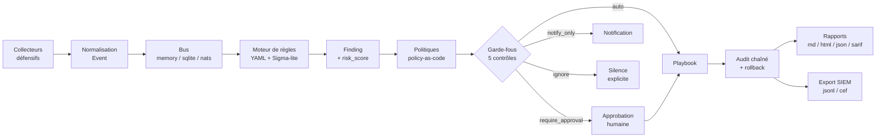

# Thot Secure

*Thot Secure est une plateforme SOAR/CSPM **100 % défensive** : elle collecte des signaux de sécurité, détecte, score, décide — puis applique une contre-mesure **réversible et journalisée**, ou demande une approbation humaine.*

Thot Secure est publié sous licence **Apache-2.0**. Il s'installe en une poignée de minutes, sur votre infrastructure, et il est **sûr à brancher avant même d'avoir des identifiants** : par défaut, il ne fait que simuler.

!!! danger "Thot Secure n'est pas un outil offensif"

    Thot Secure **n'attaque rien, jamais**. Il n'exécute aucun scan agressif, aucune tentative
    d'authentification, aucun brute force, aucun déni de service, aucune exploitation de
    vulnérabilité, et **aucune action de rétorsion** (« hack-back ») contre un tiers.

    La commande `thotsecure probe` n'audite **que** des cibles que le tenant possède et a
    explicitement déclarées comme siennes : c'est un audit de sa propre surface, pas une
    reconnaissance, et c'est une exigence du contrat d'interface (zéro capacité offensive).
    Toute action visant une cible hors du périmètre déclaré bascule automatiquement en
    demande d'approbation, et les cibles protégées ne sont **jamais** modifiées.

---

## Le problème que nous connaissons tous

| Symptôme | Conséquence opérationnelle | Ce qui manque |
|---|---|---|
| Les alertes arrivent tard | Le **MTTD** se compte en heures ou en jours | Une détection continue, corrélée et peu bruyante |
| La réponse est manuelle et hétérogène | Le **MTTR** dépend de la personne d'astreinte et de l'heure | Des procédures nommées, exécutables et répétables |
| Les règles de détection s'accumulent sans être revues | **Dette de détection** : du bruit qui noie le signal utile | Un format de règle versionné, testable, avec faux positifs documentés |
| L'action est prise « à la main », dans une console, sans trace | **Actions non tracées** : impossible de prouver qui a fait quoi, ni d'annuler proprement | Un journal d'audit inviolable et une **réversibilité** de principe |
| Un correctif automatique mal calibré coupe la production | Un faux positif devient un incident majeur | Un **dry-run par défaut** et une approbation humaine sur les cas sensibles |

Thot Secure ne prétend pas résoudre la sécurité à lui seul : il supprime la partie répétitive, la rend **traçable**, et surtout **annulable**.

## Ce que fait Thot Secure

| Étape | Ce qui se passe |
|---|---|
| **Collecte** | Des collecteurs défensifs normalisent les faits bruts (requêtes HTTP, lignes de log, certificats TLS, dépendances, audits de configuration) en **événements** immuables, rattachés à un tenant. |
| **Bus** | Les événements circulent sur un bus enfichable : `memory` (défaut, zéro dépendance), `sqlite` (durable) ou `nats` (distribué). |
| **Détection** | Un moteur de règles **YAML** (18 opérateurs, seuils, `group_by`, déduplication) transforme des événements en **findings** ; un sous-ensemble de règles **Sigma** est accepté. |
| **Scoring** | Chaque finding reçoit un score de risque borné (0-100) modulé par la sévérité, la confiance et la criticité de l'actif. |
| **Décision** | Des **politiques en code** (`policy-as-code` YAML, Rego/OPA en option) décident : `auto`, `require_approval`, `notify_only` ou `ignore` — sous **cinq garde-fous non contournables**. |
| **Action** | Un **playbook** nommé (blocage d'IP, limitation de débit, quarantaine, révocation de session, rotation de secret, isolation d'hôte, correctif de dépendance, durcissement, notification, ticket) est planifié, approuvé, exécuté — et **toujours accompagné d'un rollback**. |
| **Audit** | Chaque transition est écrite dans un **journal append-only chaîné par hash**, vérifiable (`audit verify`) et exportable vers un SIEM (JSONL, CEF). |

## Les 4 garanties

=== "1. Réversibilité"

    Toute action est accompagnée d'un rollback. `POST /api/v1/actions/{id}/rollback` doit
    réussir **tant que le rollback n'a pas expiré**, et un playbook livre toujours son
    couple exécution / annulation. Un playbook sans rollback n'est pas un playbook
    acceptable : c'est un critère de revue.

=== "2. Audit chaîné"

    Le journal est **append-only** : chaque enregistrement contient le hash du précédent.
    `GET /api/v1/audit/verify` recalcule la chaîne et indique le premier point de rupture
    (`broken_at`). Une modification, même minuscule, devient détectable — et l'export
    SIEM permet de conserver une copie hors du système.

=== "3. Isolation multi-tenant"

    Chaque objet porte un `tenant_id`. Toute requête SQL filtre sur le tenant, et
    l'isolation est vérifiée par un test dédié en intégration continue : un appelant ne
    voit **jamais** les données d'un autre tenant. C'est la condition pour qu'un MSSP
    puisse héberger plusieurs clients sur une même instance.

=== "4. Dry-run par défaut"

    `THOT_DRY_RUN=true` et `THOT_AUTONOMY=supervised` sont les valeurs par défaut.
    Sans levée explicite, **aucune action réelle n'est exécutée** : les connecteurs non
    configurés répondent en mode simulé et le journal indique `simulated: true`. Vous
    pouvez donc installer Thot Secure, brancher vos sources et observer son comportement
    avant de lui donner le moindre pouvoir.

## Démarrage rapide

| Objectif | Commande | Où aller ensuite |
|---|---|---|
| Voir Thot Secure fonctionner en 5 minutes | `thotsecure demo --tenant demo` | [Démarrage rapide](quickstart.md) |
| Installer proprement | `pip install -e .` puis `thotsecure init-db` | [Installation](installation.md) |
| Régler les variables d'environnement | `.env` + `config/targets.yaml` | [Configuration](configuration.md) |
| Comprendre les choix techniques | — | [Vue d'ensemble](architecture/overview.md) · [Contrat d'interface](architecture/api-contract.md) |
| Écrire une règle | `thotsecure rules validate --path rules` | [Écrire une règle](detection/rules.md) |
| Décider automatiquement ou non | — | [Politiques](decision/policies.md) |
| Automatiser la réponse | `thotsecure actions plan --finding <id> --playbook block-source-ip` | [Playbooks](actions/playbooks.md) |
| Intégrer dans un SIEM / pipeline | `X-API-Key` + `/api/v1` | [API REST](api/usage.md) · [CLI](cli.md) |
| Exploiter en production | — | [Déploiement](operations/deployment.md) · [Runbook](operations/runbook.md) |
| Répondre à un questionnaire de sécurité | — | [Modèle de menaces](architecture/threat-model.md) · [SOC 2 / ISO 27001](compliance/soc2-iso27001.md) |

!!! tip "Pour un premier essai, ne cherchez pas à tout configurer"

    Lancez `thotsecure demo --tenant demo` : vous obtiendrez un jeu de données, des findings,
    des actions simulées et un journal d'audit vérifiable — sans écrire une seule règle.
    C'est la meilleure façon de comprendre la mécanique avant de brancher vos vraies
    sources.

## Ce qu'Thot Secure n'est pas

| Ce n'est pas | Pourquoi |
|---|---|
| Un outil offensif | Aucune capacité d'attaque, par conception et par invariant de projet. |
| Un scanner de vulnérabilités actif | Il détecte à partir de signaux, de configurations et de dépendances — pas en exploitant. |
| Un remplacement de SOC | Il automatise une partie du travail ; il ne remplace ni les analystes, ni une astreinte 24/7. |
| Un antivirus / EDR | Il peut *piloter* un EDR via un connecteur, il n'inspecte pas les postes. |
| Une boîte noire magique | La valeur vient des règles et des politiques que **vous** écrivez, dans un format lisible et versionné. |

## Documentation

* **Démarrer** : [Démarrage rapide](quickstart.md) · [Installation](installation.md) · [Configuration](configuration.md) · [Questions fréquentes](faq.md)
* **Comprendre** : [Vue d'ensemble](architecture/overview.md) · [Contrat d'interface](architecture/api-contract.md) · [Modèle de données](architecture/data-model.md) · [Modèle de menaces](architecture/threat-model.md) · [ADR](adr/0001-record-architecture-decisions.md)
* **Utiliser** : [Règles](detection/rules.md) · [Sigma-lite](detection/sigma.md) · [Politiques](decision/policies.md) · [Playbooks](actions/playbooks.md) · [API](api/usage.md) · [CLI](cli.md)
* **Exploiter** : [Déploiement](operations/deployment.md) · [Runbook d'incident](operations/runbook.md)
* **Prouver** : [RGPD](compliance/rgpd.md) · [SOC 2 / ISO 27001](compliance/soc2-iso27001.md)
* **Participer** : [Contribuer](contributing.md) · [Gouvernance](governance.md) · [Feuille de route](roadmap.md) · [Soutenir le projet](support.md)

<!-- Métadonnées: statut=stable, version=0.1.0 (MVP), dernière revue=2026-09-13 -->
